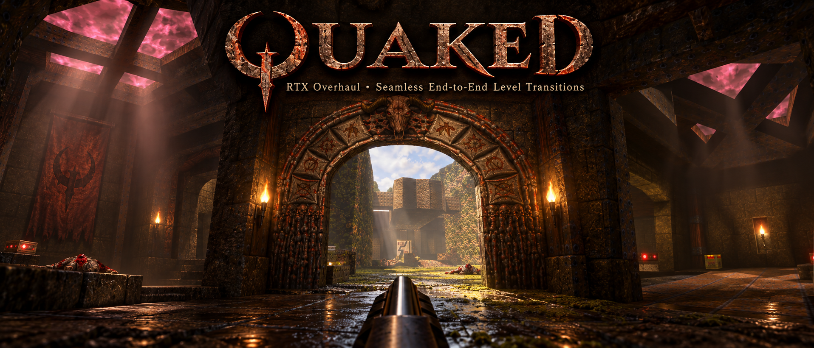

<p align="center">
  <a href="https://codemeasandwich.github.io/Quaked/">
    
  </a>
</p>

Quake in the browser, built on Three.js. Quaked is developed by [@codemeasandwich](https://github.com/codemeasandwich) and is based on [three-quake](https://github.com/mrdoob/three-quake) by [@mrdoob](https://github.com/mrdoob).

**Project repository: [codemeasandwich/Quaked](https://github.com/codemeasandwich/Quaked).** The enhancements below describe this repository's version.

### Play online

[Play Quaked](https://codemeasandwich.github.io/Quaked/) on GitHub Pages. Choose **Newer Game** for the enhancements described below.

GitHub Pages publishes the repository root from `main`. `.nojekyll` keeps the game files as plain static assets; pushes to `main` trigger a new deployment. Only committed files are published.

### Play this version locally

From the root of this checkout, serve the files over HTTP:

```sh
python3 -m http.server 8000
```

Open [localhost:8000](http://localhost:8000/) and choose **Newer Game** from the single-player menu to use the enhancements. **New Game** selects the classic presentation. Internet access is needed for the Three.js modules loaded from the CDN.

[Upstream three-quake demo](https://mrdoob.github.io/three-quake/) is a separate build; it does not demonstrate the enhancements documented here.

Confirming **Quit** opens [this project’s GitHub page](https://github.com/codemeasandwich/Quaked) in a new tab and returns the game to its main menu. Cancelling Quit stays in the game.

### Features

#### Live portals

Every teleporter surface (`*teleport`) that leads somewhere is a live camera onto its receiver. The world is rendered a second time from the destination, so the teleporter looks cut out of the wall with a slight shimmer, and what you see through it is the space you step into.

- Destinations come from the map's own entities (`trigger_teleport` → `info_teleport_destination`), so it works on any map.
- Up to 3 nearest visible portals are rendered per frame, at 75% resolution.
- `r_portals 0` in the console turns it off and restores the classic swirl.
- Teleporting is quieter: the sound stays, the white particle burst is gone, and the launch out of the teleporter is halved (300 to 150 units/s).
- In local single player, visibility includes the teleporter destination, so entities and secrets visible through its window are sent to the renderer. A remote server must also supply those entities.
- Limits: a portal seen through another portal shows the plain swirl; portals are off in WebXR. Camera portals are enabled for Newer Game and can be disabled in its feature options.

#### Newer Game options

New Game is always the original game: original lighting, water, monsters and teleporters, with no camera portals. In Newer Game, **Options > Newer Game features** switches its parts on and off one at a time: lighting, water (needs the lighting), enemies (the custom upsampled skins), camera portals (the teleporter windows and the seamless level crossings; these apply from the next level) and textures (our own higher resolution wall textures, `r_newer_textures`; see `newer/textures`, made with `tools/texture_sheets`) the shadows of enemies and items (`r_newer_shadows`; fires standing in a brazier or cauldron also darken the floor under them, and torches and fires flicker) and the status bar (`r_newer_hud`, higher resolution status bar sprites from `newer/hud`). The console variables are `r_newer_lighting`, `r_newer_water`, `r_newer_enemies`, `r_newer_portals`, `r_newer_textures`, `r_newer_hud` and `r_newer_shadows`.

#### Frame rate

Newer Game aims for 60 frames a second (`r_fps_target`). When frames take longer than that allows, the 3D picture is drawn at a lower resolution (down to half) and scaled up to fill the screen, and it creeps back up when there is room; the status bar and text stay sharp. `r_dynres 0` turns this off and always draws at full resolution.

#### Lighting and muzzle flash

Newer lighting is lit by its sources: the baked light is curved (`r_newdark`, 2.8 by default; 1 is as baked) so areas with no clear source are dark, and lights (torches, pillar lamps, glowing surfaces) light the surfaces they can see, with things in the way casting shadows. Weapons have a muzzle flash that lights the room: a brief flash of warm light around the player (light only, nothing drawn at the barrel), reduced in already bright rooms. Added light retains the colour of the surface it hits. Sun shadows use geometry from the whole map, preventing unseen walls from leaking sunlight into closed rooms. Shots leave bullet holes on walls, rockets leave scorch marks, and blood (from gibs, hits and blood spray) lands and sticks to walls and floors (Options > Newer Game features > Marks and blood, `r_decals`). These marks follow the surface lighting rather than glowing in dark rooms. A shoulder-mounted flashlight (key F, `flashlight`, or Options > Newer Game features) throws a cone of light and a faint beam that trails your aim by a fraction of a second. Corners and edges where surfaces really meet at an angle get a slight accent (inside corners darken, outer edges catch light; `r_newedges`, 0 turns it off), and never on flat faces cut into several pieces. Edge accents are suppressed underwater and through pools. Monsters glide between the game's ten-a-second steps as well as blending between their poses, so they move smoothly.

#### Lens drops, lava glow and level changes

Coming out of water leaves the view beaded with clear drops that refract and slightly blur the picture, some running down before they dry; being close to a body bursting does the same with blood. Drops clear quickly and are suppressed underwater. Lava glows and breathes, and lights what is around it. In Newer Game, loading or changing level no longer automatically opens the console. Changing level keeps the last frame on screen; it is simply the new level when it is ready.

#### Seamless levels

In Newer Game, every Episode 1 level exit that is an archway, a passageway, a walk-through portal or a pit (that includes the start hub's difficulty doors and E1M4's secret exit) is a live window onto the next level: you can see its first room through the opening, and stepping through is not a level load or a teleport. You keep your speed and heading, and the game switches levels under you. Archways are crossed at the arch itself: the tunnel behind it is not walked (the window sits where the arch is) and unlocked doors across it are removed, while a locked key door stays; pits keep their fall. Looking back, the level you came from shows through the doorway behind you, and you can walk back through it (a level you have left is kept exactly as it was: dead monsters where they fell, dropped weapons, picked-up items and opened doors; a key door across the exit you return by is removed). The windows render the destination's real sky and show the level's monsters, items, torches, doors and secret or false walls (a level you have been in as you left it). Looking down into water shows what lies under it, secrets included. A teleporter pad (any exit with a slipgate machine or the swirling teleporter surface at it, so the start hall's slipgates and the exit of E1M1 too) stays a pad: stepping on it changes level at once, with no intermission or loading screen, while the whole picture stretches upwards and splits into red, green and blue, then snaps back into place in the new level. The way back through a doorway is only offered where the level you arrive in has a doorway, archway or portal there to come back through; otherwise there is none, and you go on. Console: `sv_seamless 0` off, `1` Newer Game only (default), `2` always. Single player only.

#### New Game and Newer Game

The single player menu has two ways to start:

- **New Game** uses the classic lighting, exactly as before.
- **Newer Game** switches on the HDR lighting pipeline: emissive surfaces (lava, light panels, glowing runes, torch flames, sky) can be brighter than white and bloom, and nearby lights, emissive surfaces and dynamic lights scatter through the air as volumetric light with shafts carved out by pillars and grates.

The sky sets the mood. Its brightness, colour and pattern are read from the map's own sky textures: a bright clear sky gives a bright sunlit outdoors with little haze, a dark or stormy one gives dimmer light, faint shafts and a little more haze. Shafts follow the sky's pattern (the clouds are projected along the sun, so shafts and sunlit patches break up the way the sky does) and only build up where light is contrasted with shade, so open daylight stays clear.

Every world texture gets a generated normal map and a height map (see `src/gl_normals.js`), so bricks, cracks and grain have relief that reacts to the sun, torches and dynamic lights, with parallax that shifts the texture as you move. Nothing is shipped or painted by hand: Quake's textures are painted with their shading baked in, so brightness is used as height. It is normalised for contrast, blended across several scales so blocks read as blocks and not just noise, and made tileable. It is generated once per texture the first time Newer Game needs it (the cost depends on the map and hardware). Monster and item models, sprites, sky and water are not normal mapped.

Water and slime become see-through: the bottom of a pool shows through the surface, light is absorbed with depth (shallows stay clear, depths go dark and blue-green, slime green), and submerged floors get subdued animated caustics, strongly reduced on walls and near the surface. Visibility through water also includes entities and secrets, and looking out from inside a liquid remains clear. Lava stays opaque and glows.

Newer Game also:

- filters textures smoothly (linear and anisotropic), whatever `gl_texturemode` is set to; your own setting is left alone and comes back with the classic lighting;
- is graded 40% darker with 40% more contrast than its raw output (`r_newbright 0.6`, `r_newcontrast 1.4`; use 1 and 1 for the ungraded look);
- adds extra frames between model animation frames: Quake steps monsters and weapons through their poses ten times a second, and Newer Game blends between them so movement runs at your display's frame rate. `r_lerpmodels 0` turns it off, `1` (default) is Newer Game only, `2` forces it on in the classic lighting too. It does not blend a model that has just come into view, teleported or changed model.

- uses the custom upsampled skins for the boss, knight, ogre, soldier and wizard, fitted to the original models' skin layouts. Other enemies and head gibs keep their original Quake skins. **Options > Newer Game features > Newer enemies** (`r_newer_enemies`) switches these replacements off; New Game always uses the originals. Replacement skins also work with Newer lighting disabled.

The third-party enemy skin pack, its leftover extracted source textures and shader, and its destructive rebuild importer have been removed. The game loads replacements only from the custom-skin manifest; no pack download link or pack loader is provided. The five `newer/enemies/*/custom/diffuse.webp` files retain the latest skin alignment work unchanged. `newer/enemies/_unused/player_upscaled.webp` is preserved as an unused asset and is not loaded by the game.

`newer/enemies/index.json` is the skin manifest. To add a replacement, add its WebP file and a model entry with `dir`, `maps.diffuse`, and `flipGreen`; preserve the existing custom files and entries. Optional normal, luma and gloss maps remain supported by the existing loader. Missing entries, pending downloads and failed texture loads fall back to the original skin. The current five models each have one replacement, so `r_newer_variety` has no visible effect.

To try the result, serve the repository, reload the game, start **Newer Game**, and compare a soldier or ogre with **Newer enemies** on and off. A zombie or dog should keep its original skin in both cases. No game data or model geometry is changed.

You can switch at any time from the console: `r_hdr 0` (classic) or `r_hdr 1` (newer). `r_bloom`, `r_volumetric` and `r_caustics` set the strength of each effect.

This is a rasterised approximation, not path tracing: light does not bounce, and point-light occlusion uses on-screen depth. Sun shadows and sun shafts use the full-map shadow geometry. It needs WebGL2 float render targets; without them the classic path is used automatically, and it is off in WebXR.

#### Stability fixes

Walking into a wall corner no longer crashes when a collision trace has no plane. Lava keeps its colour and glow, and liquid rendering no longer blacks out the view when looking out from within a pool.

### Console wallpaper

The console (and the main menu backdrop shown when no game is running) uses `conback.webp` instead of the original stone `conback.lmp`. It is cropped to fill the screen without stretching. To go back to the original, delete `conback.webp`.

### Verification of the skin and Quit changes

Removal verification (2026-09-30): all 78 imported pack files, including its credits file, are absent; all six retained WebP images match the pre-removal Git version byte-for-byte and decode successfully. Independent review passed. The 14 skin/animation tests passed using a Node 24 compatibility harness because Deno was unavailable; a mocked texture loader also verified all five custom material paths, lighting independence, the enemy toggle, and New Game fallback. Browser/WebGL appearance has not been visually verified. With Deno installed, the focused suite is `deno test --allow-read tests/r_newerskins_test.js tests/r_anim_test.js`.

Seven public-menu scenarios also passed using Node with a mocked `window.open`: Escape, n and N cancel; y and Y confirm; touch supports both confirmation and cancellation. Confirmation opens this project's GitHub URL in a new tab and returns to the main menu. Actual browser navigation and popup policy were not exercised. These checks cover the menu's Quit action; console `quit` retains its existing shutdown behavior.

### Upstream background

[Original three-quake development post](https://x.com/mrdoob/status/2015076521531355583). This is upstream background; the project repository is [codemeasandwich/Quaked](https://github.com/codemeasandwich/Quaked).

### Assets

Shareware `pak0.pak` included (Episode 1).  
For the full game, replace with your own `pak0.pak` from a registered copy of Quake.

### License

Code: GPL v2

### Credits

- Quaked by [@codemeasandwich](https://github.com/codemeasandwich)
- Original game by id Software ([source](https://github.com/id-Software/Quake))
- Three.js port ([three-quake](https://github.com/mrdoob/three-quake)) by [@mrdoob](https://github.com/mrdoob) with [@claude](https://github.com/claude)
