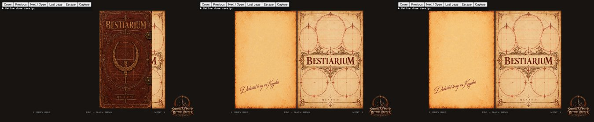

# Bestiary book: the cover turns like a page, and a turn waits for its pages

Card [7] (owner request). `src/r_bestiary_book.js`, with two small exports of `src/r_bestiary.js`.

* **The cover is a leaf.** It used to crossfade into the inner illustration. Now every turn, the cover's too, uses the one
  page-turn model (`face` and `drawTurn`): the leaf narrows about the spine, its front then (past half way) its back. The
  cover's back is the dedication, landing on the left beside the inner illustration on the right; going back, the dedication
  folds over and the cover closes the book. No supplied image's pixels change.
* **A turn waits for its pages.** Each spread's needs are listed (`needs`: the images it draws, and their art ids: the cover;
  dedication and inner illustration; parchment and contents; parchment and either the discovered page or the blank folio and
  its heading). A turn starts only when all of them are present and decoded. Until then the current spread stays, whole, with a
  quiet "Turning the page..." under the book; the turn starts on its own the moment they are there.
* **A page that fails says so.** If any of them failed to load (`R_BestiaryArtFailed`) or the wait passes 10 seconds, the note
  becomes "This page could not be loaded. Press again to try once more."; the same press asks for the failed images again
  (`R_BestiaryArtRetry`); the other way gives up waiting. A half-ready page (a blank folio without its heading, say) is never
  shown: before, it fell back to a text title.
* **One turn at a time.** Presses while a page is turning or waiting are not queued: the keyboard and touch share `flip`, so
  rapid presses never skip a spread or reveal a page that is not ready.

## Checks

* `tests/bestiary_book_test.js` (16; three new, one updated): early in the cover's turn the cover is drawn whole (no crossfade,
  alpha 1) over the inner illustration, and its back is not; past half way the dedication is, and the cover is not; open,
  dedication left and illustration right. With the destination not loaded, the turn waits (the note shown, nothing of the
  destination), presses meanwhile are not queued, and once loaded exactly one turn happens; a failed page shows the failure
  note, the same press retries it, the other way stops waiting, a 10 s wait gives the failure note; presses (keys and touch)
  during a turn are ignored. The missing-heading case now waits rather than showing a text title. Other bestiary suites pass.
* Browser, the real book (`tests/bestiary_navigation_trial.html`): the picture above.

## Not checked

A cold cache over a slow network in the browser (covered by the tests' loading and failure fixtures); high-DPI layouts were not
re-photographed (the layout code is unchanged).
