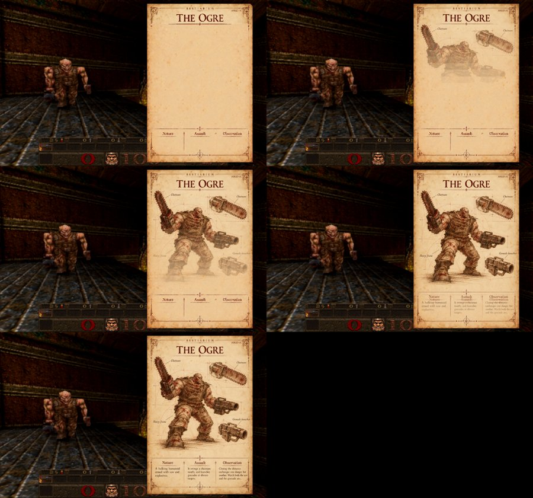
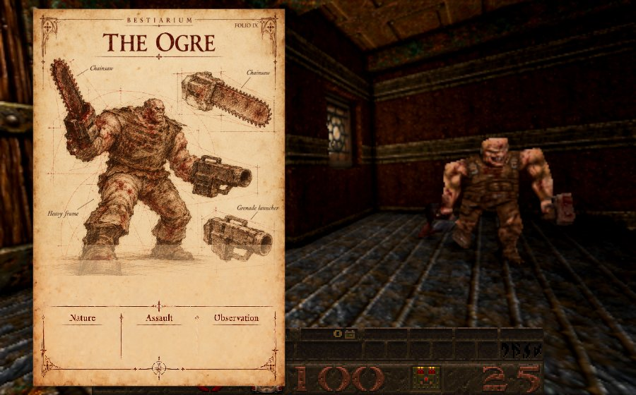

# The first-discovery page: frame first, a diagonal roll, drawn when the game stops, no matte

Cards [1] and [39] (owner requests). `R_BestiaryEncounterDraw` in `src/newer/ui/r_bestiary_book.js`.

The page now has its own clocks, taken from the encounter's phases (`BestiaryEncounter.tick` in `src/newer/ui/bestiary_state.js` gives
`t`, the seconds in the phase, and `paused`, the seconds since the game's time scale reached zero, 0.55 s into the enter phase):

* **At once**: the authored frame and title, the supplied blank folio and the entry's heading crop (the same pair a locked
  page uses).
* **While the camera moves** (the first `ROLL` = 0.65 s of the enter phase, the camera's own move): the paper rolls up
  diagonally from its lower-left corner, a shaded curl travelling to the upper right.
* **From the moment the game stops** (`paused`): the illustration and the handwriting are drawn by the owner-supplied pencil
  replay ([folio-replay-2026-10-10.md](folio-replay-2026-10-10.md), about 2.3 s) when its prepared data is ready; otherwise
  they come in line by line from the top over `REVEAL` = 1.6 s. The camera and the roll may still be moving. Art that arrives
  late is revealed only as far as it has arrived.
* **Settled**: one plain draw of the supplied page, its pixels unchanged.
* **No matte** (card [39]): the half of the screen behind the page used to be filled with a solid dark grey. Only the paper is
  drawn now, with a soft drop shadow; around it the live world goes on rendering (the game itself is paused). On the way out
  (the return phase) the paper fades as before. Each frame is drawn from the snapshot alone: a cancel, a new encounter, a map
  change or a resize leaves nothing behind.

The bounded ripple the page used to arrive with is gone (the reveal replaces it), and so is its code in the book's page draw.

## Checks

* `tests/bestiary_book_test.js` (13): for either side, only the opposite half changes, the corners of the page's half still show
  the world, there is no half-screen fill, and the last draw is the supplied page in one plain blit; at the start the blank
  folio and heading are drawn and the illustration is not; while the camera moves (game not stopped) still no illustration; mid
  roll the paper's lower-left is there and its upper-right is not (pixels); just after the game stops, the first lines only, as
  image strips; settled, one plain draw; late art is revealed only as far as it has arrived; idle draws nothing. The other
  bestiary suites pass.
* Real browser, a first sighting of an ogre on E1M5: the pictures above.

## Not checked

The roll itself in the browser: it is over before a screenshot of the running game lands (0.65 s); the test checks its pixels.
How long the roll and the writing take, and the curl's look, are the owner's to tune (`ROLL`, `REVEAL`).
