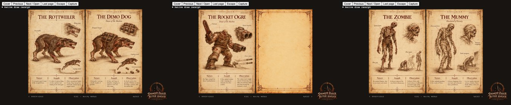

# Bestiary family spreads

Card [19] (owner request). The book's creature pages are two-page spreads: a base creature on the left and its relative on the
right, families in consecutive spreads (`BESTIARY_SPREADS` in `src/bestiary_state.js`, drawn by `src/r_bestiary_book.js`).

* **Display order only.** Discoveries stay keyed by entry id, and every entry's id, artwork and folio number is unchanged, so
  saved progress needs no migration. The front matter (cover, dedication and inner illustration, parchment and contents) is as
  before (spreads 0 to 2).
* **Pairs.** The owner's examples: the Rottweiler with the Demo Dog, the Ogre with the Multi-Grenade Ogre and then the
  Rocket Ogre. The other families follow the same rule (each base enemy with its infected, statue or blood variant); the
  remaining creatures are paired by kind (fish, floating casters, demons, the guardians, the bosses), never merging two bosses
  or the two Chthon pages into one.
* **Three deliberate blank pages** (plain parchment): beside the Rocket Ogre (there is no fourth ogre), Armagon and Chthon the
  Sleeper (no relative left).
* **Turns** follow the physical leaf: the turning leaf's front is the spread's right page, its back the next spread's left page.
* **The table of contents artwork (`newer/bestiary/contents.png`) is stale**: it lists the old order. It has not been
  rewritten; the owner will regenerate it from the mapping below (`Bestiary_SpreadMapping()` gives the same as data).

## Final mapping

| Book spread | Left page | Right page |
| --- | --- | --- |
| 3 | The Rottweiler (`dog`, folio 1) | The Demo Dog (`demo_dog`, folio 37) |
| 4 | The Grunt (`grunt`, folio 2) | The Infected Grunt (`infected_grunt`, folio 41) |
| 5 | The Enforcer (`enforcer`, folio 3) | The Infected Enforcer (`infected_enforcer`, folio 43) |
| 6 | The Knight (`knight`, folio 4) | The Infected Knight (`infected_knight`, folio 42) |
| 7 | The Statue Knight (`statue_knight`, folio 26) | Phantom Swordsman (`phantom_swordsman`, folio 21) |
| 8 | The Death Knight (`death_knight`, folio 5) | The Infected Death Knight (`infected_death_knight`, folio 44) |
| 9 | Statue Death Knight (`statue_death_knight`, folio 27) | The Ranged Death Knight (`ranged_death_knight`, folio 40) |
| 10 | The Ogre (`ogre`, folio 9) | Multi-Grenade Ogre (`multi_grenade_ogre`, folio 22) |
| 11 | The Rocket Ogre (`rocket_ogre`, folio 36) | *blank parchment* |
| 12 | The Zombie (`zombie`, folio 7) | The Mummy (`mummy`, folio 28) |
| 13 | The Rotfish (`rotfish`, folio 6) | The Electric Eel (`electric_eel`, folio 20) |
| 14 | The Scrag (`scrag`, folio 8) | The Orb (`orb`, folio 39) |
| 15 | The Wrath (`wrath`, folio 24) | The Overlord (`overlord`, folio 29) |
| 16 | The Spawn (`spawn`, folio 10) | The Hell Spawn (`hell_spawn`, folio 23) |
| 17 | The Splitting Spawn (`splitting_spawn`, folio 45) | The Spike Mine (`spike_mine`, folio 18) |
| 18 | The Fiend (`fiend`, folio 11) | The Gremlin (`gremlin`, folio 17) |
| 19 | The Vore (`vore`, folio 12) | The Centroid (`centroid`, folio 16) |
| 20 | The Shambler (`shambler`, folio 13) | The Blood Shambler (`blood_shambler`, folio 38) |
| 21 | The Guardian (`guardian`, folio 25) | The Egyptian Guardian (`egyptian_guardian`, folio 32) |
| 22 | Quake’s Guardian (`quakes_guardian`, folio 31) | Quake’s High Priest (`quakes_high_priest`, folio 33) |
| 23 | The Dragon (`dragon`, folio 34) | Hephaestus (`hephaestus`, folio 30) |
| 24 | Armagon (`armagon`, folio 19) | *blank parchment* |
| 25 | Chthon (`chthon`, folio 14) | Chthon — Vengeance (`chthon_vengeance`, folio 35) |
| 26 | Chthon — The Sleeper (`chthon_sleeper`, folio 46) | *blank parchment* |
| 27 | Shub-Niggurath (`shub`, folio 15) | Shub-Niggurath — Awakened (`shub_awakened`, folio 47) |

## Checks

* `tests/bestiary_book_test.js` (17): every spread visited with each locked creature's blank folio and heading on its own side and
  the blanks as parchment, every entry exactly once; with everything discovered, each creature's art on its own side of its own
  spread at its source aspect, nothing leaking after switching to a locked profile; forward and backward turns show the right
  page then the next spread's left page; the pairs above, the Rocket Ogre in the spread after the Ogre's, the Sleeper on its own
  spread, three blanks, entries and folios untouched, and the exported mapping. Other bestiary suites pass.
* Browser, the real book: the picture above.
