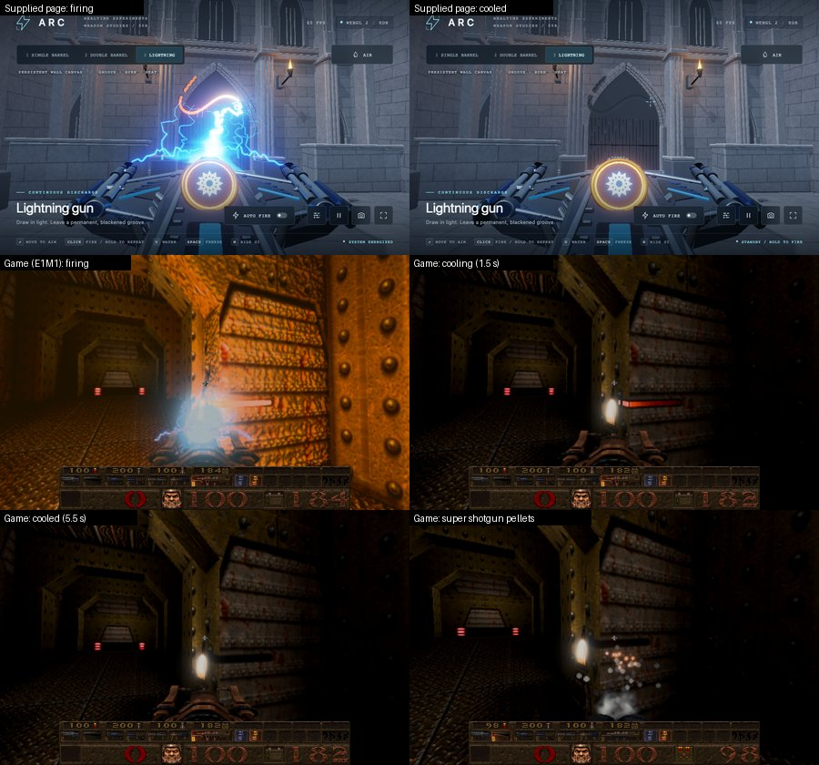

# Burn marks on the walls

Cards [30c] (the port) and [33] (this write-up). Newer Game only; Classic keeps Quake's own marks. The code is
`src/r_wallburn.js`, fed by `src/cl_tent.js` (the shotgun pellets) and `src/gl_rmain.js` (the lightning beam, set-up, each
frame, a new level).

## In short

When the lightning gun's beam touches a wall it draws on it: a white-hot line that glows orange, reddens and goes out over
about four seconds, leaving a black, charred groove that stays for the rest of the level. A shotgun pellet does the same at a
point: a hot spark that cools to a small black burn. Sweep the beam and the line follows it, unbroken while it stays on the
same wall; it breaks where the beam leaves the wall, crosses a monster, meets a pillar or a corner, or you let go.

"Groove" is a picture, not a change to the level. Nothing is cut into the geometry: walls, collisions and the BSP are exactly
as before. The groove is a darker, scorched band drawn on top of the wall's own texture and lighting.

## The supplied reference and what the game does

The owner supplied `arc-weapons-wall-canvas-shotgun.html` (sha256 `8b1569225ae56f2e53a6f5748435e77699aa7e0f1c8c0082a12cfc3d0a401adf`,
kept intact in the checkout and not copied into the game). Its `WallDrawingSurface` (lines 192-316) and brush shaders
(125-186) keep three layers for a handful of known walls in one 2048 x 2048 atlas: a permanent groove and a permanent burn
(painted with MAX blending and never faded), and a heat layer that cools. Its wall shader (around 726-776) darkens the wall
by the burn and groove, bends the wall's normal along the groove, and adds glowing light by the heat.

The game reuses that design, its shaders and its numbers. What differs, and why:

| | Supplied page | The game |
|---|---|---|
| Walls | Four known rectangles, each a whole tile of the atlas | Every face of the level, charted by its plane (below) |
| Atlas use | Fixed tiles, padding left empty | Cells taken when first marked; padding painted too, so cells meet without a seam |
| Strokes per pass | One | Up to sixteen at once (the same result: the passes take the maximum) |
| Groove and burn | Two R8 targets | The red and green of one RG8 target |
| Groove relief | The wall's normal is bent along the groove | Not reproduced: Quake's walls are lit by lightmaps, and an overlay cannot bend the normal |
| Wall colour | The wall shader mixes towards charcoal | A multiplier of the wall's colour (the charcoal, about 0.002, is taken as black) |
| Heat light | Added by the wall shader | An additive layer over the wall, taken by the game's bloom |

## How a mark is made

1. **A hit.** The beam: each frame, the end of the player's own `TE_LIGHTNING2` (`CL_PlayerLightning`, the point where the
   server's trace met the level). A pellet: each `TE_GUNSHOT` (the player's shotguns and the Grunts'), which the server places
   4 units in front of the wall it struck.
2. **The wall.** The level's own surface under the point (`R_DecalSurface`, the decals' finder: the surfaces of the leaf the
   point is in, not the sky or liquids). The beam's end arrives rounded to an eighth of a unit and can lie just inside the
   wall, so it is looked up a unit back along the beam; the contact is where the beam's line meets that wall's plane.
3. **The chart.** A chart is one side of a world plane, with fixed axes in it (U and V, the same construction as the decals'
   axes). Faces the BSP split from one wall lie on one plane, so they share one chart and a stroke crosses their seams.
   Texture coordinates are never used: the same texture repeats on many walls, but a chart position is unique.
4. **The cell.** A chart is cut into 48 x 48-unit cells. The first time something marks a cell, it takes the next of 256
   slots in the atlas (16 x 16 slots of 128 texels: the cell's 120 texels, 2.5 to a unit as in the supplied page, and 4 of
   padding each side), and the level's faces on that plane are clipped to the cell's square (`R_WallBurnClip`), which is
   what will be drawn. A cell where no face of the level lies is never taken.
5. **The brush.** The stroke is a capsule from the last contact to this one (a dot when they are the same), queued for each
   cell it reaches, and painted on the GPU at the frame (`R_WallBurnFrame`): the supplied `brush()` gives, by distance `d`
   from the capsule's centre line and an eroded radius `r` (the brush radius times `0.94 + 0.10 * noise`, the noise fixed
   on the plane so joins and retraces line up):
   * groove = `1 - smoothstep(0.42 r, 1.04 r, d)`
   * burn = `1 - smoothstep(0.65 r, 1.55 r, d)`
   * heat = `1 - smoothstep(0.55 r, 1.04 r, d)`

   The beam's brush radius is the supplied 0.14 source units, a pellet's `max(0.042, (0.030 + 0.006 x random) x 2.15)`, as
   the supplied shotgun; one source unit is 12 Quake units (the lightning beam's scale, card [30a]). So the beam's groove is
   about 3.5 units wide inside a 5-unit charred band, and a pellet's burn about 2.5 units across.
6. **The layers.** Groove and burn are MAX-blended into the permanent target, scissored to the pen's bounds: painting can only
   darken more, and nothing ever lightens them. The heat is a 16-bit value in two bytes, ping-ponged: every pass reads the
   last, takes away the same cooling step everywhere, and keeps the larger of that and the brush. The step is
   `dt / 4.2 x 65535` in whole 16-bit units, with one carry for the fractions (the supplied `_heatClock`), so white cools to
   nothing in 4.2 seconds at any frame rate, without ages per mark. The heat pass covers only the atlas rows in use.
7. **Drawn on the wall.** Each cell's pieces of the level's faces are drawn twice, a tenth of a unit off the wall with a
   polygon offset, after the opaque world:
   * the marks, as a multiplier of what is there: `(1 - clamp(0.97 burn + 0.10 groove, 0, 0.995)) x (1 - 0.35 groove)`
     (the decals' material: the colour and the albedo target are multiplied, the normal and height targets multiplied by
     one so they keep the wall's), so the wall's own lighting lights the mark and a dark wall gives a dark mark;
   * while anything is hot, the heat, as added light: the supplied thermal colour (deep red at low heat, orange, then
     white-gold at the core) times `h^2 (0.25 + 13 h^3)`, with zeros into the other targets (the Fireball's material), so
     the bloom takes the white-hot core. Neither layer writes depth.

## When a stroke breaks

The beam's pen is lifted, and the next contact starts a new dot rather than joining the last, when:

* **the trigger is released** (the server's beam is over);
* **the beam misses** (its end is not on a wall: open air, the sky, water, or a door or lift, which are not the level's
  own faces and are not marked);
* **a monster stands in the beam** (or another player). The game's own trace passes through monsters, so the server's end
  is the wall behind them; the client checks the beam against each monster's box for its current frame (so a corpse lying
  on the floor does not stop the beam marking the wall above it) and lifts the pen rather than paint the wall behind;
* **the wall changes** (another plane: round a corner, onto the floor);
* **something lies in between** the last contact and this one on the same wall (a pillar, a doorway's edge, a gap): the
  sweep between them is checked from the beam's start every 2 units (at most 32 checks), and anything that is not this same
  wall breaks the stroke.

A pellet is always its own dot: never joined to another pellet or to the beam, and it does not lift the beam's pen.

## Lifetime and limits

* **Game time.** Cooling follows the client's clock: paused, nothing cools and nothing is painted.
* **A new level** (or loading a saved game) clears every mark, cell and the beam's pen; the atlas is cleared at its next
  use. Marks are not saved with the game and are not kept when you return to a level.
* **Memory.** 25 MB of GPU memory (2048 x 2048: one RG8 for the marks, two RG8 for the heat), taken at the first mark and
  kept for the session. Losing the WebGL context loses the marks.
* **The bound.** When all 256 cells are taken, no new wall is marked: pellets fall back to the ordinary bullet-hole decal
  (which lasts 90 s), and the beam marks only cells it already has. Nothing is evicted.
* **Off** with `r_newer_wallburn 0` (pellets then make bullet-hole decals, as in Classic). The nailguns keep their
  bullet-hole decals; the burn is for the lightning gun and the shotguns, as in the supplied page.
* **Failures.** A contact with no wall, no cell or no room is dropped (a pellet then makes its decal). Without a renderer
  the queue is dropped. Diagnostics: `R_WallBurnRead( point )` reads the groove, burn and heat where a point lies (a
  blocking readback, as the supplied `readPixel`; never used by the game), `R_WallBurnState()` and `wallBurnStats`.

## Interfaces

* `R_WallBurnSetup( { scene, renderer, cl, pointInLeaf, beam, entities, trace? } )` (from `R_NewMap`): what the module needs
  from the renderer and the client; `trace` is optional (the level's own hull otherwise).
* `R_WallBurnShot( point )` (from `TE_GUNSHOT`): true if the pellet was taken, false for the caller's decal.
* `R_WallBurnFrame( time )` (each frame, after the beam): the beam's contact, the GPU passes, the drawn pieces.
* `R_WallBurnClear()` (a new level).
* `WALLBURN`: the numbers above, in one place.

## Checks

* `tests/wallburn_test.js` (7), with a small built level and a renderer that records each pass: one plane is one chart
  (a pellet on a cell boundary paints both cells; the cell over the BSP's split holds a piece of each face; a wall of the
  same texture elsewhere is its own cell; between walls, the sky and the air take nothing); the beam's strokes and every
  break above (release, miss, a standing Ogre, not a dead one or the player, a new wall, something in between, joined again
  after it); pellets as dots that never disturb the beam; the heat's 16-bit cooling (4.2 s from white, nothing while
  paused, no marks pass while cooling, scissors, no clears); passes of sixteen; the 256-cell bound with the decal fallback;
  Classic and the switch. Each of seven deliberate breaks of the code (no occluder break, no monster check, joining across
  planes, joining pellets, no cooling, no bound, no painted padding) fails it.
* Browser, E1M1 (picture above): the lightning gun swept along a wall 70 units away: the atlas read back gives groove
  0.75, burn 1 and heat 0.94 while firing, and after 5.5 s heat 0 with the groove and burn unchanged; the screenshots show
  the hot line, its reddening and the black groove left. With a Grunt moved into the beam, no stroke was painted; moved
  aside, the beam marked the wall again. The super shotgun's pellets left hot dots (13 taken). The supplied page captured
  at the same moments for comparison.

## Not checked

A door or lift in the beam's path in the browser (the module looks up only the level's own faces, so it should lift the
pen; only the unit test's sky and air cases were run), the atlas filling up in a real level, a lost WebGL context, WebXR,
and frame cost on a phone. How dark, wide and bright the marks should be is the owner's to judge.
