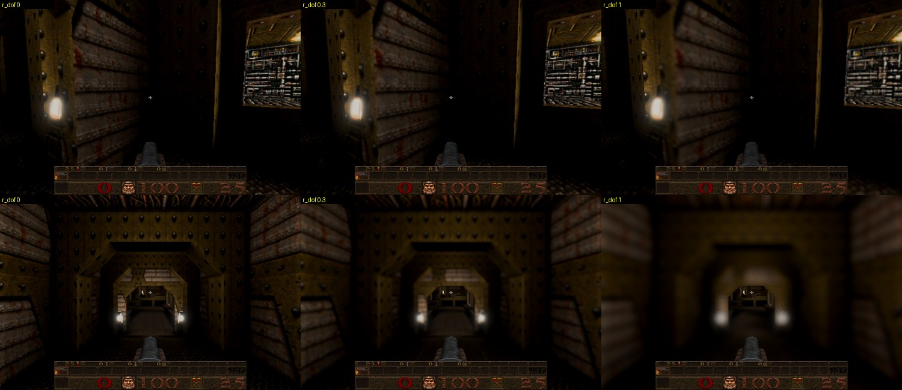
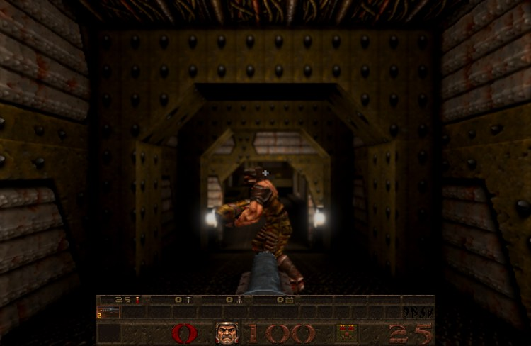

# Depth of field with autofocus

Card [38]. Newer Game only. What the crosshair rests on is sharp; what is much nearer or further is softened, as by a
camera lens. **Options → Newer Game features → Depth of field** is a slider: all the way left is off, right is strong.
Console: `r_dof` (0 to 1, saved). **It is off by default** until the owner chooses whether it should be on, and how strong.

## How it works

* **Autofocus** (`src/r_dof.js`, fed by `R_DofTrace` in `src/gl_rmain.js`).
  * **The rays.** Each frame, five rays go from the eye through the middle of the view (straight ahead, and 0.03 to each
    side, up and down) against what is drawn there:
    * the level;
    * its brush entities (doors, lifts, trains);
    * the models drawn this frame (monsters, items, and the player in the chase view), each by its current animation
      frame's own box, widened for its turning.
  * **What stops a ray.**
    * A ray that strikes a sky face, or enters a sky volume, focuses far.
    * One that reaches lava stops on it, because lava hides what is below.
    * Water and slime are seen through.
  * **The target** is the median of the five depths, clamped to 16..4096 units, so a thin post on the crosshair does not
    snatch it.
  * **Following it.** The focus follows the target in log distance with a 0.25 s time constant on the client's clock
    (the same at any frame rate).
    * It holds while the game is paused, and while the eye is inside a wall (noclip, a chase camera against a wall).
    * It snaps to the target at once on a new level, on a jump of the eye of more than 96 units in a frame (a teleport,
      a respawn), or when the clock goes back (a loaded game).
* **The blur** (`DOF_FRAGMENT` in `src/gl_post.js`). It is its own pass at the composite's resolution, after the vision
  modes and before the present pass, so dynamic resolution reduces its cost too.
  * **The circle.** Each pixel's circle of confusion is `min( largest, strength x | 1 - focus / depth | )` pixels.
    Strength is 14 x `r_dof` (held at most 1) pixels of a 1080-line picture, and the largest circle is twice that.
  * **The gather.** 16 taps on a golden-angle spiral, turned per pixel by interleaved gradient noise, so a small light
    behind a blur spreads into a disc rather than sixteen copies.
  * **Edges.** A nearer sample counts only as far as its own circle reaches there, so a sharp thing in front keeps its
    edge.
  * **The sky** counts as the far focus distance, so looking far leaves it sharp.
* **What is never blurred.** The held gun is marked in the G-buffer (the packet's alpha below -2). It is neither blurred
  nor blurred into its surroundings, and it never takes the focus. The status bar, menus, console and the Bestiary's
  paper are drawn after the picture.
* **Where it runs.**
  * The blur is applied once, on the linear picture, before the display's colour space, brightness and contrast.
  * With depth of field on, the picture always goes through the offscreen composite (as with ripples or dynamic
    resolution).
  * It is off in Classic, in the Classic half of the title demo, at strength 0, and in WebXR.

## Checks

* `tests/dof_test.js` (5):
  * **The target:** the median of the rays (a post on the middle ray alone does not move it), and the far and near clamps.
  * **The smoothing:** in log distance by `1 - exp( -dt / 0.25 )`; held while paused; settled within 1.5 s; the same at
    30 and 150 frames a second.
  * **Snaps** on a new level, a teleport and time going back.
  * **Off and on:** off in Classic, at 0 and in WebXR (with a frame run); back on at a new distance at once.
  * **The circle:** scaled by height, and held at strength 1.
  * **Holding and clearing:** held inside a wall; clearing forgets.
  * **Along the ray:** a sky volume focuses far, lava stops the ray, water is seen through.
  * **The real E1M1 hull** (from the shareware pak): a ray straight up from an open place stops on a sky face (E1M1 draws
    its sky on solid brushes), and knowing the sky faces makes it focus far.
* Browser, E1M1 (the pictures above;
  [evidence/depth-of-field-trial-2026-10-10.mjs](evidence/depth-of-field-trial-2026-10-10.mjs)):
  * The focus found 108 units (a wall) and 1120 units (down the corridor).
  * With a Grunt moved 100 units ahead, the focus went to 74.7 units, the front of its box.
  * Strengths 0, 0.3 and 1 render without shader errors; the gun and status bar stay sharp.
  * Median frame time at 1000x650 on this machine's GPU (ANGLE on Metal): 16.7 ms off; 17.3, 17.4 and 17.5 ms at strength
    0.001, 0.3 and 1. About 0.7 ms, most of it the offscreen composite the blur needs.
* The options menu: the new slider is the last row, and the note under the rows is one line, so it stays inside the
  panel.

## Not checked, and known limits

* The cost on a phone.
* Portals and mirrors: the blur is the main view's only.
* Things that write no depth take the depth behind them: beams, particles, explosions and fire, and the screen effects
  composed before the blur (lens drops, heat haze, Rend the Veil's lensing, the vision modes' smear). A lightning beam
  over a near wall blurs with the wall. The water ripples' glint is added after the blur, so it stays sharp on blurred
  water.
* On the frame a level crossing begins, the view moves into the next level's window after the focus was found, so that
  one held frame is focused for the old level.
* Whether it should be on, and at what strength, is the owner's to choose.
