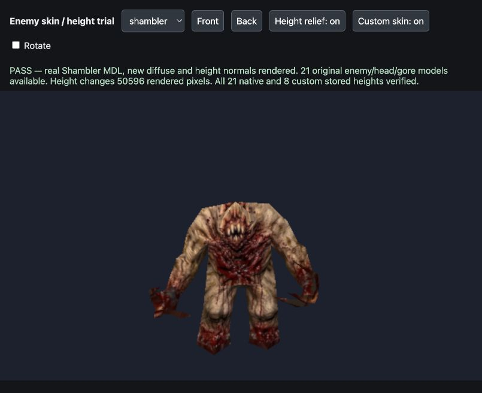
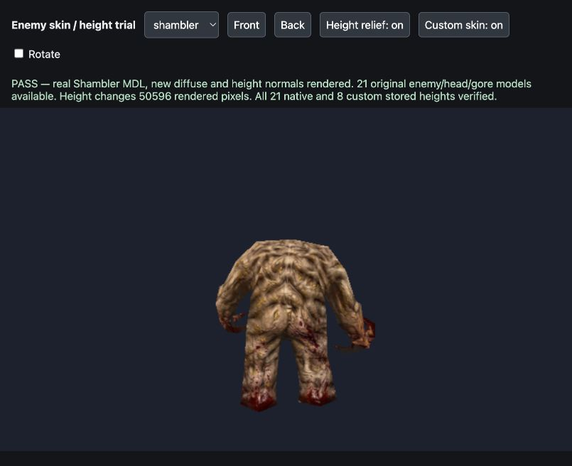

# Shambler skin and enemy height maps — 2026-10-01

The owner requested the supplied improved Shambler skin and height maps for every enemy model/skin. The fitted replacement is applied locally and height-driven relief is wired into the existing alias renderer. This is a verified working trial; owner appearance acceptance is pending. The owner authorized committing and pushing the reviewed work on 2026-10-01; no packed release was requested.

## Try it

Hard-refresh the game, start **Newer Game**, and enable **Newer enemies**, **Normal maps**, and **Newer lighting**. The Shambler uses the supplied skin. Normal maps controls height-driven relief on both custom and original enemy skins; disabling Newer enemies restores original diffuse art while retaining original-skin relief. New Game keeps its original skins and rendering. Lighting can be switched independently, but normal detail is visibly shaded by the enhanced lighting; enemy atlases have no parallax displacement.

For a direct model trial on the normal local server, open `/tests/enemy_height_trial.html`. It uses the actual `pak0.pak` model loader, alias renderer, enemy skin loader and post-processing pipeline. Select a body/head/gib, switch between front/back, rotate, or toggle custom diffuse and height relief. The page also runs exact stored-height checks and a GPU pixel comparison. It does not install another renderer in the product.





## Coverage and asset contract

**29 stored height files** are provided: eight custom enemy skins and 21 original enemy/head/gore model skins present in the shipped shareware pack. Every provided original model currently has one skin and one skin frame. The implementation preserves skin numbers and animation-frame selection and supports additional skins/groups when supplied.

| Coverage | Model keys |
| --- | --- |
| Custom diffuse plus new stored height | `boss`, `demon`, `knight`, `ogre`, `shambler`, `soldier`, `wizard`, `zombie` |
| Original bodies plus stored height | `boss`, `demon`, `dog`, `knight`, `ogre`, `shambler`, `soldier`, `wizard`, `zombie` |
| Original heads plus stored height | `h_demon`, `h_dog`, `h_guard`, `h_knight`, `h_ogre`, `h_shams`, `h_wizard`, `h_zombie` |
| Shared gore plus stored height | `gib1`, `gib2`, `gib3`, `zom_gib` |
| Additional runtime coverage, original model files absent here | `enforcer`, `fish`, `hknight`, `oldone`, `shalrath`, `tarbaby`, `h_hellkn`, `h_shal` |

The last eight keys use the same generated-height path when their registered-game skins are available. They have synthetic material/selection tests, but no stored-source assets or actual model render qualification in this checkout. This distinguishes **29 supported model keys** from **21 shipped model layouts**. Player color translation, non-enemy pickups and weapons keep their established paths; armor, suit and backpack custom entries are preserved.

Custom maps are `newer/enemies/<model>/custom/height.webp`, matching the diffuse dimensions exactly. Their existing variant gains `maps.height`, `heightStrength: 0.65` and `heightCap: 0.55`. Native maps are `newer/enemies/heights/<model>/skin<skin>_<frame>.webp`; `index.json.nativeHeights` describes the actual skin/frame groups. Heights are grayscale, non-color data. The existing `R_NormalMapFor` / `R_NormalsFromCraftedHeight` pipeline generates tangent normals using the same UVs and top-row-first convention. Stored height and diffuse assets invalidate together through enemy manifest version **13** in the initial delivery (previously 8). The [material-aware custom Shambler refinement](height-authoring-refinement.md) advances it to **16** and changes only that custom height map.

Only the Shambler diffuse was replaced. Other custom diffuse art, model geometry, poses, UV coordinates and original pack data were preserved. The offline generator crafts restrained height from each corresponding skin, removes broad baked-light bias, and uses the existing wrapped normal generator with a slope cap. No true geometric depth was supplied by the reference, so these are authored-from-diffuse relief estimates rather than recovered physical surface measurements.

## Shambler source and fitting

[Preserved source](../tools/texture_sheets/sources/shambler-2026-10-01.png) is byte-identical to the attachment, SHA-256 `f65fd1bcc87f70862cfb7284f216c4b20b89a05ed82fd0cc71f4d7a51033a3e9`. The [recipe](../tools/texture_sheets/sources/shambler-2026-10-01.json) records the separate front/back source boxes and four hand landmark warps.

Original skin dimensions are **308 × 115**; the existing replacement remains **1540 × 575** (5×). Front and back are fitted independently to their atlas halves. The neutral charcoal background and printed header/footer are excluded with a connected-body mask. Dark enclosed flesh remains supplied art; edge colors are carried outwards for filtering. The new reference's claw directions differ from the original UV layout, so the four wrists and three tips per hand are mapped to exact original MDL UV landmarks using two affine triangles per hand. Source colors are carried through the gaps between fingers before sampling, preventing charcoal wedges on visible triangles.

The actual MDL triangle UV footprint, including the half-texel and back-seam offsets, is the acceptance mask: **361,443 surface pixels**, with **2,034 edge pixels** receiving carried supplied colors after fitting. All surface pixels have replacement coverage. The footprint metric alone does not prove foreground provenance; independent review also checked all **31,526 hand warp samples** and found zero unfilled source-background samples. Unmapped atlas padding can retain original background and does not represent a model surface. The new height map is generated after final fitting/bleeding.

## Runtime ownership and failure handling

The caller remains `R_DrawAliasModel` -> `R_GetAliasMaterial` (`src/gl_mesh.js`). Custom replacements use `R_NewerAliasMaterial`; the selected original skin/frame uses `R_EnemyAliasMaterial`. Both share the existing enemy shader/material path in `src/r_newerskins.js`. The custom loader decodes height and diffuse in either completion order; a readable data companion feeds the existing normal generator without replacing a browser Texture's image with an incompatible pixel object.

The native path runs **after** exact original skin/frame selection and **before** returning a cached classic material. Native height selection mirrors the model loader: groups of one to four frames repeat modulo their count; longer groups use the last frame assigned to each `j & 3` slot. This prevents a height from being attached to a different animated skin. Geometry UVs, offsets and native diffuse identity remain unchanged.

Missing/failed height downloads and wrong dimensions use generated relief from that same selected diffuse; a wrong atlas is rejected/disposed. Until a custom diffuse arrives, the original skin remains. Native detail is independent of the custom-enemy toggle. The shared normal option updates already cached custom materials, and classic comparison rendering suppresses detail. Optional supplied normal, luma and gloss support remains; height-derived normals use the engine convention without a green flip. Luma/gloss remain gated by advanced lighting.

Caches own their generated normals, data companions, loaded height textures and materials. Original diffuse textures remain model-loader-owned. Dispose/shutdown releases detail once, removes native listeners and marks sets dead. Late custom callbacks dispose incoming textures; native callbacks additionally require exact current-set identity, so reusing the same texture after shutdown cannot resurrect an old set. Enemy catalogue versions participate in cache keys and both diffuse/height URL revisions.

## Verification

- **174 asset checks passed**: exact source hash, catalogue completeness against the actual pack, all skin/frame dimensions, nonflat grayscale ranges, exact encoded height regeneration, profile metadata and UV coverage. [Asset evidence](evidence/enemy-height-verification-2026-10-01.json), [UV evidence](evidence/shambler-uv-fit-2026-10-01.json).
- **37/37 focused public-interface tests passed** with real Three.js 0.183.0 and Node 24.13.0 through the temporary Deno compatibility harness. Deno was unavailable. Tests cover stock keys, selected native diffuse/frame identity, independent toggles, classic behavior, caching and ownership, stored custom loading in both orders, UV offsets, missing/wrong-height fallback, two/three/five-frame group slots, and stale callbacks after shutdown/reuse. Existing skin, smoothing, world-normal, visual-option, viewmodel and player-color tests also passed. [Output](evidence/enemy-height-tests-2026-10-01.txt).
- **48 browser checks passed** through real files and actual model/material APIs. Every **21 native and eight custom** stored height map was decoded and its expected engine normal bytes compared against the normals attached by the real loader, preventing a generated fallback from masquerading as a stored-height success. Shambler diffuse/normal dimensions are 1540 × 575.
- The fixed camera/model/lights GPU comparison changed **50,596 pixels** and recorded its channel difference when height relief was toggled. Front and back model renders were reviewed; no source captions, charcoal wedges or exposed original claw patches were visible. No browser shader errors or warnings were observed. [Browser evidence](evidence/enemy-height-browser-2026-10-01.json).
- Independent planning traced both original/custom paths and the actual UV layout. Independent review identified and verified the hand fit, lifecycle, animation-slot and custom mismatch fixes, independently ran a **28-test subset**, checked all 29 stored map dimensions/ranges/source bytes, and inspected the real model screenshots. The 37-test run is the coordinator's broader run.
- `git diff --check` and JavaScript syntax checks passed. Earlier visual-option and wizard-texture changes and unrelated local work remain preserved.

This qualifies a focused local model/material trial, not all-map gameplay, every pose, VR/mobile or missing registered-model data. Owner visual acceptance remains the next action. No unattended follow-up job or packed release was created; commit and push are authorized. No `newer.pak` exists here; if distributing a packed build, rebuild it with the existing pack tool before publishing.

Reproduce assets and verification with Python/Pillow/NumPy:

```sh
python3 tools/texture_sheets/update_enemy_heights.py
python3 tests/verify_enemy_heights.py
```

The updater starts from preserved source and original pack skins, regenerates the same image/height pixels and advances the manifest version. Run the focused JavaScript tests with `--import-map=tests/render_imports.json` when Deno is installed, or open the browser trial page directly. Keep the page's game-root base URL and the real kernel comparison; do not count only image existence, dimensions or generated fallback as stored-height acceptance.
