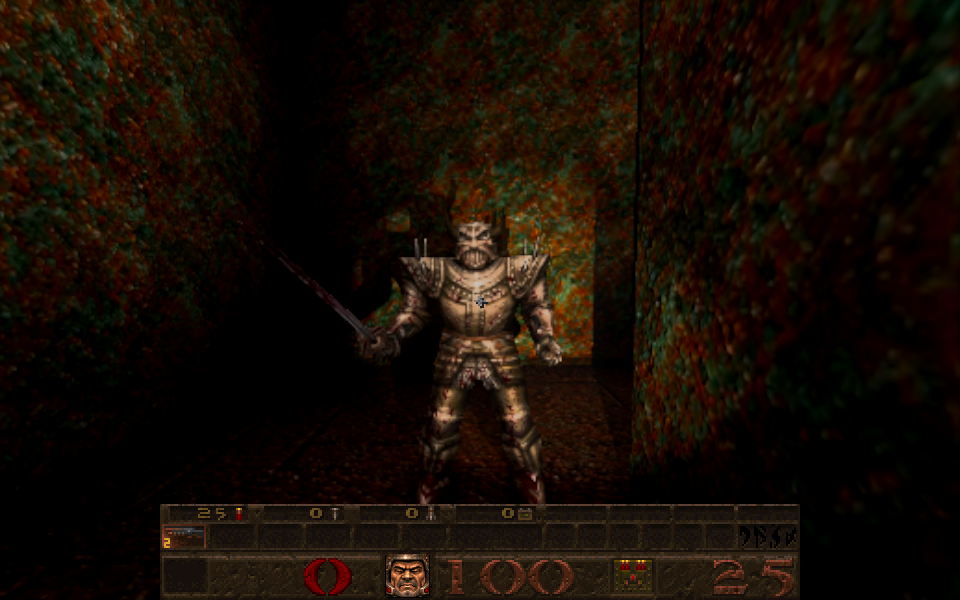
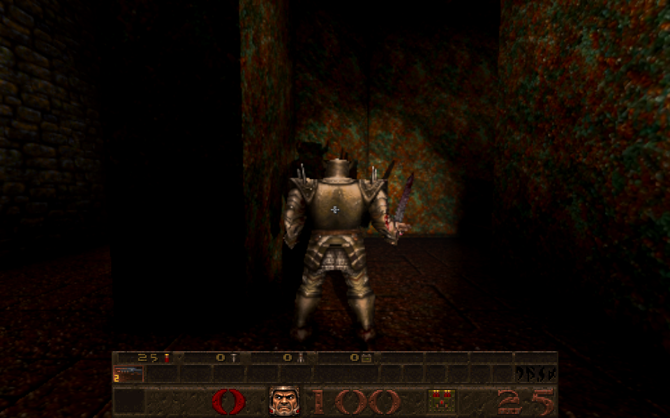
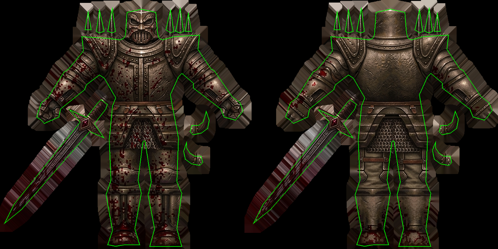

# Death Knight skin fitted to its native model

Card [31b]. The owner's sheet `Gemini_Generated_Image_8q8whb8q8whb8q8w.jpeg` (SHA-256 `b1d2fee5...aca8`, 1440 by 720, unchanged; one of the developer sheets already tracked in the repository) is the **Death Knight**: it redraws, on a dark slate background, the skin of the registered game's `progs/hknight.mdl` (SHA-256 `78d0273d...9d5a`; one ungrouped skin of 308 by 154, 250 vertices of which 141 are on the seam, 452 triangles, 166 poses). The identity was read from the owned archive's model bytes; the sheet has exactly the native aspect (2.0). In Newer Game, Death Knights now wear it. The Death Knights of the mission pack and of Quoth have other bytes (two skins each) and keep their own.

| Front (E2M3) | Back (E2M3) |
| --- | --- |
|  |  |

*(The gun is hidden and the monsters are held still for the picture; the flashlight is on.)*

## The fit

`tools/texture_sheets/fit_registered.py hknight` is the general form of the Enforcer and Spawn fits ([enemy-skin-enforcer-2026-10-09.md](enemy-skin-enforcer-2026-10-09.md), [enemy-skin-spawn-2026-10-09.md](enemy-skin-spawn-2026-10-09.md)), with one recipe per sheet. Output 1540 by 770 (five times native; the sheet is 4.7 times):

* **Pieces.** The background is what is connected to the sheet's border and within 8 of its colour (its noise is under 4); everything else is art, so dark armour inside a piece is never mistaken for background (the background's noise is nearly all within 4, at most 6). Each surface pixel of the model belongs to the nearest piece as a plain whole-sheet resize places them. Eight pieces have surface: the two bodies (spikes included), the two swords and four horn tips. **Three pieces of art are not used, because no triangle of the model uses them**: the two maces and a spare shoulder plate (the native skin has that plate too, unused).
* **Registration**, as for the Enforcer: each piece's box edges move to where its fine detail agrees best with the native skin's over its own surface. The bodies agree at 0.59 and 0.53 (from 0.53 and 0.49 at the whole-sheet resize) and moved at most 3 pixels; the horn tips moved up to 6. The native skin is only the yardstick: the canvas is blank and no native pixel is written.
* **The swords are a different shape: owner choice.** The redrawn grip is about half as wide as the native grip (about 15 to 19 pixels against 33), while the blade is slightly wider (35, 40 and 46 pixels against 30, 34 and 38 at a quarter, half and three quarters of its length). No box can fit both: the sword's detail agrees at only 0.30 and 0.26, and 7% of each sword's surface lies outside the drawn art, almost all of it on the grip (up to 17 pixels, about 3.4 native texels), where it takes the grip's own edge colour carried outward. The independent review searched the box edges and found coverage only improves by giving up registration. The recipe names the two swords as waived exceptions (floor 0.25, 20 pixels) and the tool records why. A sword redrawn to the native grip's width would remove the compromise.
* **Edges.** Colour is taken from 3 source pixels inside each piece's edge and carried 24 pixels outward; a piece's carried colour fills only its own region (its surface and, off the surface, the pixels nearest its surface), so a mip level at a triangle's edge sees that triangle's own piece. 4,625 of 410,920 surface pixels (1.1%, mostly the sword grips) take a carried colour; no surface pixel is within 4 of the background colour (the few within 8 are dark blade and groove art).
* The height map is authored from the fitted picture with the stock profile; the normal map is the prepared one baked from exactly these two images (`newer/normals/5be895ba...nm.gz`).

## Integration

`newer/enemies/index.json` (version 26) gains one `hknight/custom` variant for skin 0, bound to the native model's SHA-256; the prepared-normal manifest gains one sample and the `custom:hknight/custom` entry (the native model's existing `id1:` entry is reused); the sample is in the distribution runtime snapshot. Loader, Classic and the other families are unchanged.

Reproduce: `/usr/bin/python3 tools/texture_sheets/fit_registered.py hknight --source <the JPEG> --pack <owned id1 pak0.pak>`, then `node tools/bake_normals.mjs --skins --maps '^progs/hknight\.mdl$' --variant hknight/custom --namespace id1 --pack <owned pak>`.

## Checks

* Independent review: no blocking finding. It reproduced the files byte for byte and found the placement at the local correlation peak for the bodies (within 2 pixels in 20 windows), swords and horns; it measured the sword compromise (grip, not blade, as first written here), the registration gate silently skipping the swords, carried colour from a neighbouring piece next to another's surface, and loose wording; all fixed here (the files were regenerated and the normal re-baked).

* `tests/hknight_skin_identity_test.js` (6, adapted from the Spawn skin's): every native UV, seam flag, triangle and pose byte of the owned model; provenance (digests, 1540 by 770, eight pieces with surface and three unused, both bodies above 0.5 with under 1% of surface outside their art, exactly the two swords waived and still above their floors, every other piece within 12 pixels, carried colour under 1.5%, no native or background-coloured pixel); the shipped files' digests pinned in the test; every earlier index entry unchanged; only the matching model's skin 0 admitted; pending identity, failed images, shutdown; the shipped normal is the one for exactly these images.
* The Shub, Enforcer, Spawn and Vore identity tests and `r_newerskins_test` (twenty-two variants) pass; `tools/check_distribution_policy.py` passes.
* Real browser, E2M3 (owned data): the Death Knight's material uses `hknight/custom/diffuse.webp?v=26` at 1540 by 770 with the model's identity ready; captures above.

## Not checked

All 166 poses in a GPU gallery, the attack, pain and death frames by eye (the sword swings through most of them), and the height strength by eye.
