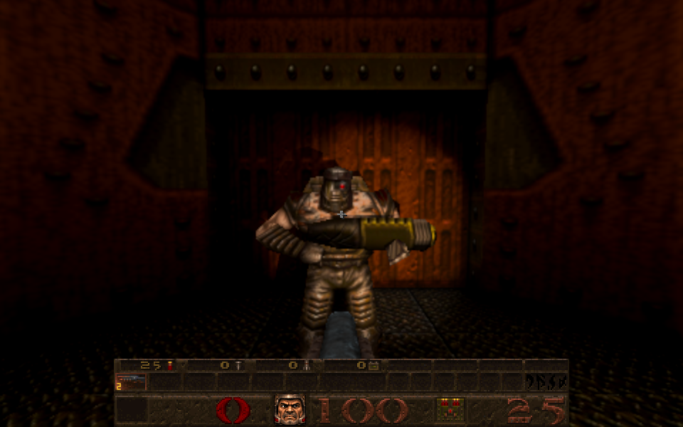
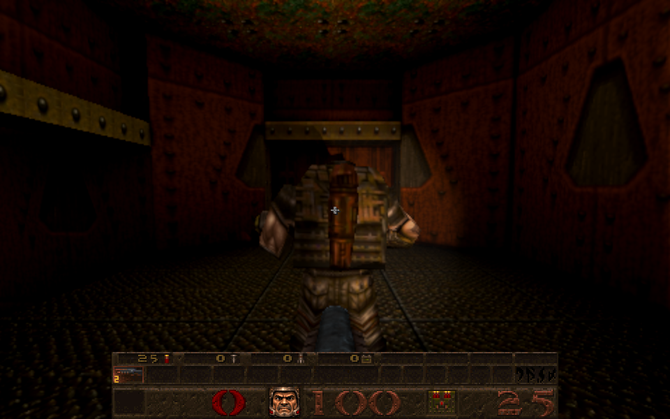
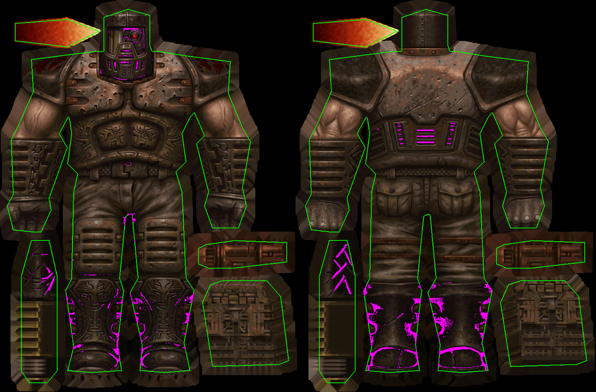

# Enforcer skin fitted to its native model

Card [31e]. The owner's sheet `Gemini_Generated_Image_hy0b7qhy0b7qhy0b.jpeg` (SHA-256 `5046d311...6edcb`, 1263 by 832, unchanged; it is one of the developer sheets already tracked in the repository) is the **Enforcer**: it redraws the skin of the registered game's `progs/enforcer.mdl` (SHA-256 `01eee88d...5677`; one ungrouped skin of 296 by 195, 222 vertices of which 112 are on the seam, 424 triangles, 102 poses). The identity was read from the owned archive's model bytes, not guessed from the picture. In Newer Game, Enforcers now wear it.

| Front (E2M1) | Back (E2M1) |
| --- | --- |
|  |  |

## The fit

`tools/texture_sheets/fit_enforcer.py` (reusing `fit_skin.spread`, `uv_footprint`, `height_for` and `fit_vore.member`), output 1480 by 975 (five times native; the sheet is 4.27 times, so nothing of it is thrown away):

* **Each of the eight pieces is registered, not just boxed.** The sheet has the native atlas's proportions (1.51803 against 1.51795) and its pieces are matched to the native pieces they redraw (the one covering most of each). But the redrawn bodies are a little taller than the native ones: pinning a body's outline to the native outline (my first attempt, caught by the independent review) left its belt, fists and knees two to three texels high on the mesh. So each piece's box edges are moved to where the fine detail of the supplied art agrees best with the fine detail of the native skin over the model's UV surface (a coarse look at every pair of opposite edges, then a walk). The native skin is only the yardstick. The bodies moved down 7 to 19 pixels and their agreement went from about -0.16 at the outline to 0.69 and 0.70; the six small pieces moved 1 to 4 pixels and score 0.81 to 0.87. The tool fails if a piece scores under 0.35 or leaves model surface more than 14 pixels outside its art.
* **Edges.** Colour is taken only from inside each piece's anti-aliased edge (3 source pixels in) and carried outward 14 pixels, so what the mesh samples at a seam, also at the smaller mip levels, is the art's own colour and not the sheet's black fringe. 1,753 of 819,238 surface pixels (0.2%) take such a carried colour; the furthest is 7.3 pixels from the art.
* **The sheet has no muzzle flash: owner decision.** The two flash pieces of the model's UV layout keep the native pixels, enlarged: 20,706 surface pixels (2.5%), 24,506 pixels in the file with a 4-pixel surround. The canvas is otherwise blank, so nothing else native is in the file, and no other piece paints into a flash. **This differs from the Vore and Shub skins, which contain no native pixels at all**; it is recorded in `SOURCE.json` (`nativeKept`, `native_pixels_in_file`). The owner may prefer a redrawn flash (supply one and it replaces these two pieces) or to accept the native one.
* The height map is authored from the fitted picture by the existing enemy-height tool with the stock profile; the normal map is the prepared one baked from exactly these two images (`newer/normals/b5446b94...nm.gz`).

*Green is the outline of the model's own UV triangles; magenta marks surface pixels at or below 10 of 255: the sheet's own dark vents, carvings and boot shading.*

## Integration

`newer/enemies/index.json` (version 24) gains one `enforcer/custom` variant for skin 0, bound to the native model's SHA-256: a model with the same file name but different bytes (a mission pack's or a mod's) keeps its own skin. The loader, the Classic picture, animation, gibs and the other families are unchanged. The prepared-normal manifest gains one sample and the `custom:enforcer/custom` entry (the native model's existing `id1:` entry is reused, not duplicated), and the sample is in the distribution runtime snapshot (`docs/distribution-local-only.json`).

Reproduce: `/usr/bin/python3 tools/texture_sheets/fit_enforcer.py --source <the JPEG> --pack <owned id1 pak0.pak>` (byte-identical on Python 3.9.6, Pillow 10.1.0, NumPy 1.26.2, SciPy 1.11.4; recorded in `SOURCE.json`), then `node tools/bake_normals.mjs --skins --maps '^progs/enforcer\.mdl$' --variant enforcer/custom --namespace id1 --pack <owned pak>` (with `QUAKED_THREE_MODULE` and `QUAKED_CANVAS_MODULE`).

## Checks

* `tests/enforcer_skin_identity_test.js` (6, adapted from the Shub skin's): every native UV, seam flag, triangle and pose byte of the owned model through the public loader; the provenance (source and model digests, 1480 by 975, the eight named pieces, each registering above 0.6 and no worse than at its outline, the bodies below 0 at their outline and moved down, surface outside the art under 1.5% and within 8 pixels, surface counts adding up with carried colour under 0.5% and native under 3%, no painting into a flash); the two shipped files' digests pinned in the test itself; every index entry before this skin and the Shub one unchanged; only the matching model's skin 0 is admitted, while a changed model, a bare file name, Classic and enemies-off stay native; pending identity, failed images and shutdown; and the shipped normal is the one for exactly these decoded images.
* `oldone_skin_identity_test` 6/6 (updated for version 24), `vore_skin_identity_test` 8/8, `r_newerskins_test` 8/8 (twenty variants), `startup_skins_test`, `skin_prepare_test`, `gl_rmisc_skin_test`; `tools/check_distribution_policy.py` passes. The normal suites are as before the change (`normal_bundle_test` 4/9 both before and after).
* Independent review: found the mis-registration above (blocking), the native-pixel boundary, bleed painting into the flashes, carried colour counted as supplied, and dark fringe in the bleed; all fixed here. Its measurement of the right body placement (top down 7 and 12, bottom down 19 and 13) agrees with what the tool's search now finds (7 and 11, 19 and 14).
* Real browser, E2M1 (owned data): the Enforcer's material uses `enforcer/custom/diffuse.webp?v=24` at 1480 by 975 with the model's identity ready; front and back captures above.

## Not checked

All 102 poses in a GPU gallery (the Shub skin had one; this has two in-game captures), the pain, death and gib frames by eye, the height strength by eye, and the flash on a firing frame. The registration is by whole boxes: a part the artist drew out of proportion inside a piece (a hand, say) is not warped to its triangles. The back pack's art touches the sheet's right edge, so up to 2 source pixels of it may be missing and are stretched. The evidence record of the Shub skin (`docs/evidence/oldone-skin-2026-10-08/`) pins the index, manifest and test files as they were then; it is a historical snapshot and those files have since changed here.
