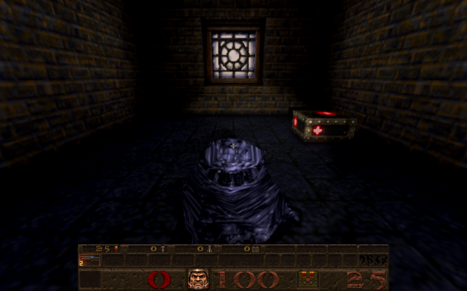
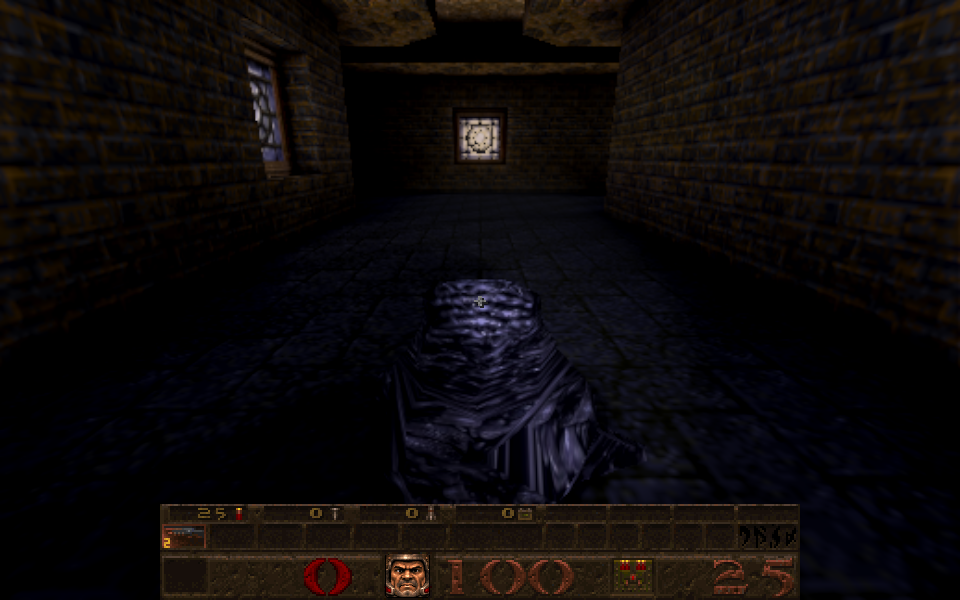
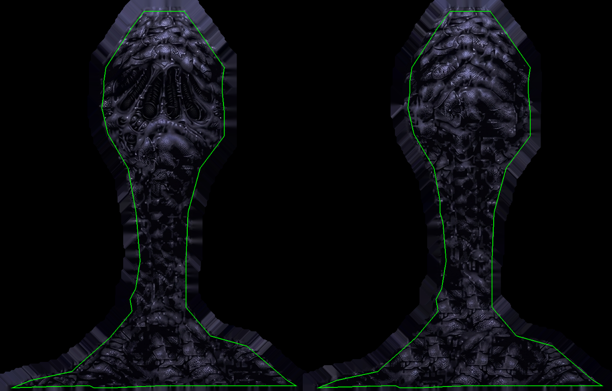

# Spawn skin fitted to its native model

Card [31g]. The owner's sheet `Gemini_Generated_Image_tcot82tcot82tcot.jpeg` (SHA-256 `f871111c...4751`, 1279 by 816, unchanged; one of the developer sheets already tracked in the repository) is the **Spawn**: it redraws, on a blue screen, the skin of the registered game's `progs/tarbaby.mdl` (SHA-256 `9933ee9b...23ea`; one ungrouped skin of 304 by 194, 130 vertices of which 46 are on the seam, 256 triangles, 61 poses). The identity was read from the owned archive's model bytes. In Newer Game, Spawns now wear it. The mission pack's Spawn model has different bytes and keeps its own skin.

| Front (E4M3) | Back (E4M3) |
| --- | --- |
|  |  |

*(The gun is hidden for the picture; the flashlight is on.)*

## The fit

`tools/texture_sheets/fit_tarbaby.py`, output 1520 by 970 (five times native; the sheet is 4.2 times):

* **Registered, as the Enforcer's pieces are** ([enemy-skin-enforcer-2026-10-09.md](enemy-skin-enforcer-2026-10-09.md), `fit_enforcer.register`). The sheet has the native atlas's proportions and every UV triangle lies inside its art, but a plain resize of the whole sheet leaves the pieces off the native layout: the fine detail of the art agrees with the native skin's at only 0.35 (front) and 0.04 (back). Moving each piece's box edges to where the agreement is best gives 0.75 and 0.77; the pieces moved 3 to 12 pixels (under 2.5 native texels) and both ended at the same even scale (1.18 by 1.17). The native skin is only the yardstick.
* **No native pixel and no blue.** The canvas is blank; the blue screen is cut away, colour is taken only from 3 source pixels inside the art's edge and carried 24 pixels outward. 1,423 of 432,718 surface pixels (0.3%) take a carried colour, the furthest 4 pixels from the art; the file has no blue-screen pixel at all.
* The height map is authored from the fitted picture by the existing enemy-height tool with the stock profile; the normal map is the prepared one baked from exactly these two images (`newer/normals/6da56a42...nm.gz`).

## Integration

`newer/enemies/index.json` (version 25) gains one `tarbaby/custom` variant for skin 0, bound to the native model's SHA-256. The prepared-normal manifest gains one sample and the `custom:tarbaby/custom` entry (the native model's existing `id1:` entry is reused), and the sample is in the distribution runtime snapshot. The loader, Classic, animation and the other families are unchanged.

Reproduce: `/usr/bin/python3 tools/texture_sheets/fit_tarbaby.py --source <the JPEG> --pack <owned id1 pak0.pak>`, then `node tools/bake_normals.mjs --skins --maps '^progs/tarbaby\.mdl$' --variant tarbaby/custom --namespace id1 --pack <owned pak>`.

## Checks

* `tests/tarbaby_skin_identity_test.js` (6, adapted from the Enforcer skin's): every native UV, seam flag, triangle and pose byte of the owned model through the public loader; the provenance (digests, 1520 by 970, the two pieces each registering above 0.7 and at least 0.3 better than the whole-sheet resize, an even scale, surface outside the art under 1% and within 5 pixels, no native and no blue pixels); the two shipped files' digests pinned in the test; every index entry before the three bound skins unchanged; only the matching model's skin 0 admitted; pending identity, failed images, shutdown; and the shipped normal is the one for exactly these decoded images. Two checks that it bites: a wrong model digest in the index fails 4 of 6, another picture in place of the diffuse fails 2 of 6.
* `enforcer_skin_identity_test` 6/6 and `oldone_skin_identity_test` 6/6 (updated for version 25), `vore_skin_identity_test` 8/8, `r_newerskins_test` 8/8 (twenty-one variants); `tools/check_distribution_policy.py` passes.
* Independent review: no blocking finding. It reproduced the files byte for byte; with its own model parser and features it found the placement at the correlation peak for both halves (largest local residual 0.14 native texel; the back's right-edge move is a single smooth peak, the sheet being the native atlas cropped by about 1 texel left, top and bottom and 2.3 on the right); no blue or blank canvas within 22 pixels of the surface; the manifest, index and distribution changes exactly the expected additions; and the mission pack's Spawn (different bytes) keeps its own skin. Its one should-fix, that three provenance counts were written as constants, is fixed: they are now measured (the images did not change). Most of the 1,423 carried pixels are where the art runs off the sheet's bottom edge (no blue there), the rest the back's right neck edge.
* Real browser, E4M3 (owned data): the Spawn's material uses `tarbaby/custom/diffuse.webp?v=25` at 1520 by 970 with the model's identity ready; captures above.

## Not checked

All 61 poses in a GPU gallery, the jump and explode frames by eye, the height strength by eye (a Spawn is glossy tar; the stock profile was used), and how it reads in the dark places Spawns live without the flashlight.
