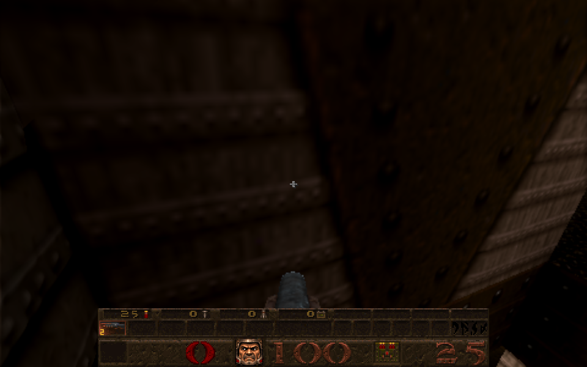
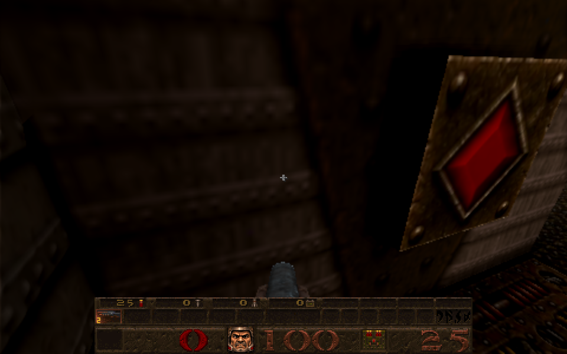

# Lifts, buttons and monsters no longer vanish in busy levels

Card [B1]. The owner reported platforms, buttons and enemies becoming invisible while still working physically (you could stand on a lift you could not see, press an invisible button, be shot by an invisible enemy), for example the first lift and its button at the very start of E3M1, which disappeared and reappeared as the player moved; also on other levels, possibly more on the full game than the shareware.

## Cause

The server sends each client, every frame, the entities in view. This port uses QuakeWorld's packet format, which carries **at most 64 entities**; the rest, taken in entity-number order, were simply left out of the frame. Quake keeps every entity on the server, so they kept moving, blocking and shooting, but the client never heard of them and drew nothing. Full-game levels have many more entities in view at once than the shareware ones (86 at the failing spot in E3M1), so high-numbered ones (E3M1's lift is entity 205, its button 207) dropped out and came back as the count in view changed with the player's position.

(Two other suspects were ruled out first: the lift and button were well inside Quake's 16-leaves-per-entity limit, and the map's visibility data did mark them visible from the failing spot.)

| Before (the button is not drawn) | After |
| --- | --- |
|  |  |

## Fix

The 64-entity, 1024-byte packet stays for network play (real packets have a size limit). The local game, which talks to itself through an in-memory link, now carries up to **512 entities in a packet of up to 32,000 bytes** (`MAX_PACKET_ENTITIES_LOCAL`, `MAX_DATAGRAM_LOCAL`; `SV_SendClientDatagram`/`SV_WriteEntitiesToClient` in `src/sv_main.js` choose by the client's link). The entity arrays on both sides, the loopback buffers and the client's receive buffer were enlarged to match (`src/protocol.js`, `client.js`, `server.js`, `cl_parse.js`, `net.js`, `net_loop.js`, `net_main.js`, `quakedef.js`). This applies to New Game and Newer Game alike: it is the transport, not the look.

## Checks

* Real browser, E3M1 (owned data), 47 standing spots around the start each facing the lift and button: before the fix both were missing (not in the client's entity list at all) from the spots near x 800 while in clear sight; after it, none missing anywhere, and 86 entities drawn at the formerly failing spot. Pictures above.
* The whole test suite: 1018 of 1042 before three unrelated fixes made in the same commit; the remaining failures are the known ones (missing weapon source archives, a Python/Pillow and a hub-logo path environment requirement, and the existing gl_model, gl_rlight, emissive, glass, r_anim, normal_bundle failures), the same with and without this change.

## Not checked

Network multiplayer was not run (its limits are unchanged by design). A local level with more than 512 entities in view at once would still drop the rest; none of the stock levels comes near it.
