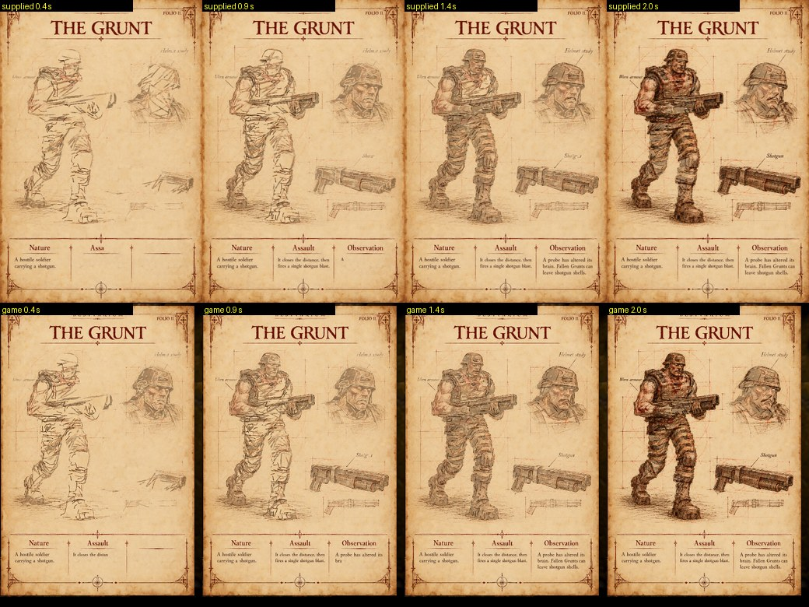

# The Bestiary's pencil replay

Card "Folio pencil fast replay". When a creature is first met, its Bestiary page is drawn as if by pencil. The owner
supplied the effect as `folio-pencil-fast-replay.html` (on the owner's Desktop, sha256
`b864769450933bf95e23af478223bdbca6ed808fef7af14d1b559b7e3f115295`, kept intact and local). Order on the page:

* The frame and title are there at once.
* The contours and first hatching start together, with the notes beside them.
* The deepening follows at about two thirds.
* The finished drawing is the page itself.

## How it is made

* **The analysis, done ahead of time.** The supplied page analyses a page image in a worker into thousands of strokes
  (about 10,000 for the Grunt), each with a phase (first hatching, contours, deepening, notes) and per-texel ownership.
  That takes 22 to 54 seconds a page, far too long to run when a creature is met. `tools/prepare_folio.mjs` runs it
  ahead of time:
  * the supplied worker, verbatim (`tools/folio/analysis_worker.js`, with its provenance);
  * the supplied Bestiarium template (`tools/folio/template.json`);
  * the supplied `schedulePaths`: art over 7 s, notes over 4 s, the first 68% for hatching and contours, then the
    deepening;
  * every Bestiary page, in parallel.
* **What it keeps.** Per page, in `newer/bestiary/folio/`:
  * `<id>.reveal.png` (about 470 kB): per texel, when its first and second strokes reach it (0 to 254 of the replay),
    how strong the first stroke is (the supplied hatching pressure), and whether a stroke draws it at all (the frame,
    title, rails and ornament are the page's own);
  * `<id>.paper.webp` (about 150 kB): the paper the strokes are drawn onto;
  * `index.json`: the duration and speed, the source and analyzer hashes, and each page image's hash.

  All 47 pages come to about 27 MB, next to the Bestiary's 190 MB of art.
* **The replay** (`src/r_folio.js`). The supplied shader's per-texel rule, on those moments:
  * `first` = reached x strength;
  * `reveal` = first + (1 - first) x second;
  * the colour mixes the paper towards the page's own pixel by `reveal`.

  It runs on a small WebGL2 canvas of its own and is drawn into the Bestiary's 2D overlay as an image. The page's own
  pixels are never altered, and once the replay is over the page itself is drawn.
* **Timing.** The supplied replay's 7 s at its speed of 3: about 2.3 s on screen, from the moment the game stops (as
  the line reveal did). Art still arriving holds it back, as before.
* **When it is used.** A page's two images are fetched when its encounter begins (a few hundred kB). The replay is
  chosen if they are ready when the drawing starts, and kept for that encounter, never switching half way. Otherwise,
  or without WebGL2, or after a lost WebGL context, the line reveal draws the page as before. The book's spreads are
  unchanged.

## Updating

When a page image changes, re-run `node tools/prepare_folio.mjs <id>` (or with no ids for every changed page: pages whose
image hash is unchanged are skipped). `tests/folio_test.js` fails while a prepared page does not match its image.

## Checks

* `tests/folio_test.js` (3):
  * the supplied schedule (hatching and contours from 0 over 68% of 7 s, the deepening after, notes over 4 s);
  * the reveal map (later along a stroke means later; the second stroke after the first; the hatching's 0.48 pressure,
    lighter at its ends; the page's own pixels untouched);
  * every page prepared from today's image by today's analyzer, with no drawn pixel left without a stroke.
* `tests/bestiary_book_test.js`:
  * ready when the drawing starts: the plate drawn, at the right fraction; done: the page itself;
  * late art holds it back;
  * not ready: the line reveal, even once it becomes ready;
  * no plate (no WebGL2): the line reveal.
* Browser, E1M1, a real first sighting of a Grunt (pictures above): the replay ran (126 plates, no failures). At the
  same moments it shows what the supplied page shows.

## Not checked

The other 46 pages in the browser (they are prepared and checked against their images, not replayed on screen); phones;
a lost WebGL context in the browser (the fallback is unit-tested only).
