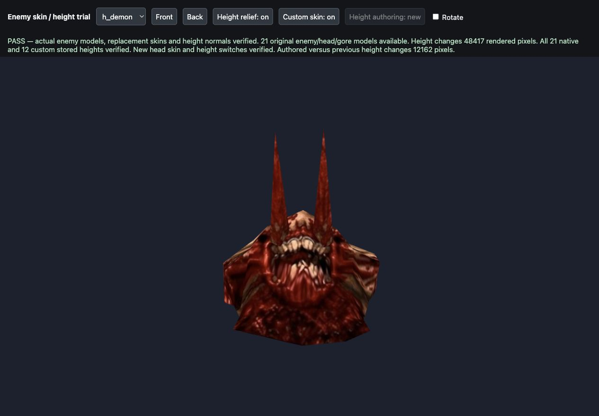
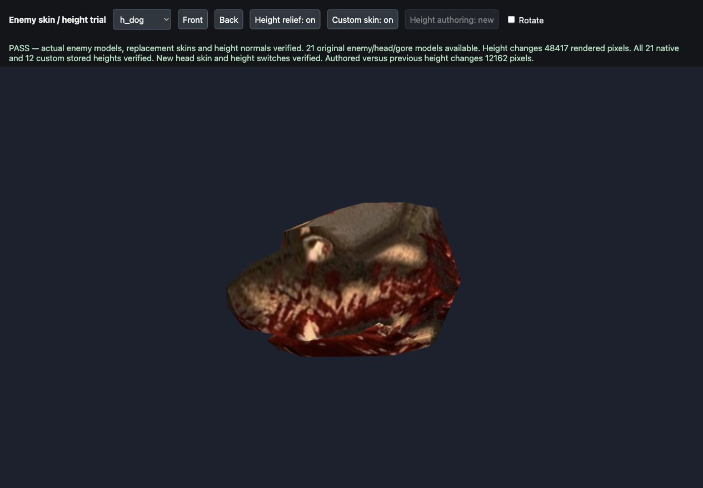
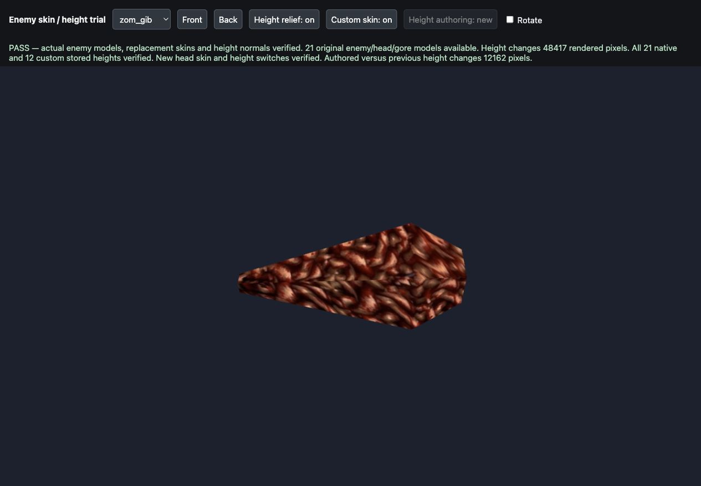
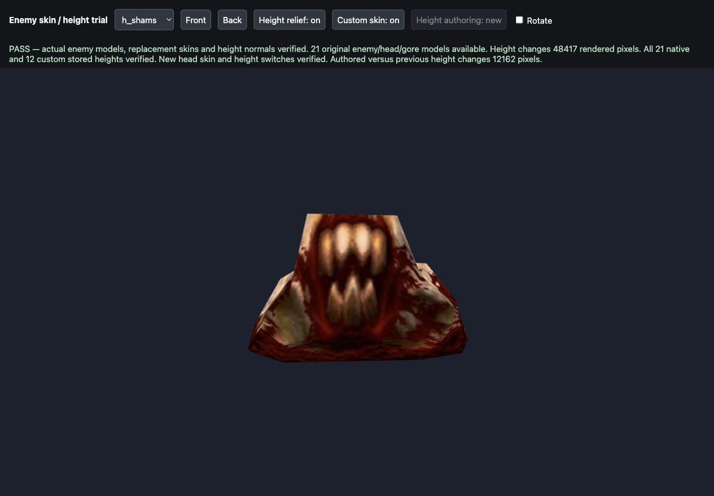

# Four supplied head/gib skins — 2026-10-01

The four supplied atlases are applied through the existing Newer Game enemy skin catalogue with matching height maps. Actual model and shader trials pass; owner appearance acceptance remains pending. The owner authorized committing and pushing the reviewed work on 2026-10-01; no packed release was requested.

## Mapping and assets

| Supplied image | Actual Quake model | Native atlas | New diffuse/height |
| --- | --- | --- | --- |
| 13.03.11 | `progs/h_demon.mdl` — Demon head | 200 × 164 | 800 × 656 |
| 13.03.15 | `progs/h_dog.mdl` — Dog head | 264 × 84 | 1056 × 336 |
| 13.03.21 | `progs/zom_gib.mdl` — Zombie thrown gib | 104 × 92 | 416 × 368 |
| 13.05.03 | `progs/h_shams.mdl` — Shambler head | 312 × 114 | 1248 × 456 |

Each model has `newer/enemies/<model>/custom/diffuse.webp` and `height.webp`, indexed under that exact model key. The native logical texture dimensions, MDL geometry, UVs, half-texel positions and back seam offsets are unchanged. Four new catalogue entries bring custom enemy/head/gore height maps to **12**, plus **21 native height maps**, for **33 stored heights**. Existing gear variants remain preserved. Manifest cache version advances from **16 to 21** during the fitting/check iterations.

Originals and previous body skins/heights remain byte-identical, including the material-aware custom Shambler body height. The four screenshot sources are copied unchanged under `tools/texture_sheets/sources/<model>-2026-10-01.png`; exact SHA-256 hashes and measured source/destination boxes are in [the fitting recipe](../tools/texture_sheets/sources/head-skins-2026-10-01.json).

## Fitting and height treatment

The Demon needs six separate island fits: four narrow horn strips and two head views. The other atlases each need two views. Artwork bounds are fitted to the original silhouette bounds, then checked against the **actual MDL triangle UV footprint**, not a presumed grid. Color is carried into filtering margins and any surface-edge gap. Output WebP is lossless after the required resize/alignment.

Slate screenshot backdrops and the Shambler's burgundy backdrop are excluded before sampling; enclosed background voids are not foreground color seeds. Four slate-colored visible pixels in the Zombie gib were repaired with nearby supplied tissue-color donors. Burgundy RGB values can also occur in dark blood mixtures: source-seed provenance and actual model review distinguish those from background. A color-distance diagnostic alone cannot prove semantic foreground ownership. All visible UV pixels receive supplied colors/bleed; atlas padding outside the surface can retain original backdrop.

The four grayscale height maps use the existing restrained enemy profile (`heightStrength 0.65`, `heightCap 0.55`) and existing normal generator, with matching UVs and an unflipped top-row-first convention. They are **generated relief estimates from these supplied skins**. They have no individually reviewed blood-paint/wound annotations, and do not inherit the custom Shambler body's anatomy recipe. Geometry is not displaced. The previous [material-aware Shambler authoring](height-authoring-refinement.md) remains preserved.

No production renderer branch was added: `R_DrawAliasModel` -> `R_NewerAliasMaterial` selects each indexed replacement; the existing height loader and `R_NormalMapFor` attach generated normals. New Game keeps the originals; `Newer enemies` switches the diffuse replacement, and `Normal maps` switches height-driven detail. Visible relief uses Newer lighting. Existing failure/fallback and disposal behavior is retained.

## Verification

- **68 permanent head-asset checks passed**: source hashes, deterministic source fitting, native/output dimensions, mappings, actual UV coverage, matte handling and **44 pre-existing asset hashes**. [Evidence](evidence/head-skins-verification-2026-10-01.json).
- **194 full enemy asset checks passed** for all 33 stored maps: actual skin/frame sizes, nonflat grayscale data, exact height regeneration, profile values and catalogue completeness. [Evidence](evidence/enemy-height-verification-2026-10-01.json).
- **37 focused tests passed** using Node 24.13.0 with the temporary Deno compatibility runner and actual Three.js 0.183.0; Deno was unavailable. Existing catalogue expectations now include the four added models, with 17 total variants including non-enemy gear. [Output](evidence/head-skins-tests-2026-10-01.txt).
- **82 browser checks passed** through actual files, MDLs, alias materials and the existing post pipeline. All 21 native and 12 custom stored heights were matched to its actual generated-normal bytes. The four new replacements bind in the real alias renderer; toggling them restores the exact original diffuse object. Height on/off and custom/original comparisons use a fixed pose, camera and lights with dynamic resolution disabled.

| Model | Pixels changed by height toggle | Pixels changed by custom/original switch |
| --- | ---: | ---: |
| `h_demon` | 32,883 | 68,655 |
| `h_dog` | 47,101 | 80,617 |
| `zom_gib` | 21,654 | 44,192 |
| `h_shams` | 29,182 | 65,914 |

[Browser evidence](evidence/head-skins-browser-2026-10-01.json) records the differences and original-diffuse restoration. The first gib comparison failed because its end-on view sampled an endcap with collapsed original UVs. The trial framing was corrected to show its textured side; that fixed the required comparison without changing the mesh/UVs. Endcaps retain the original model's stretching limitation and are not a qualified new UV layout. No shader compilation errors were observed in the final trial; the earlier failed comparison is distinct from final GPU acceptance.

Independent planning decoded the original models and identified each atlas. Independent review checked all four source hashes, size/height/profile data, native UV wireframes and actual rendered heads/gib; its **68 read-only checks passed** at the final asset version. The permanent test's reconstruction equality is a regression check, complemented by independent UV/model appearance review. `git diff --check` passes. Earlier local work and unrelated untracked files were preserved.

## Try and accept

Hard-refresh and start **Newer Game** with **Newer enemies**, **Normal maps** and **Newer lighting** enabled. Or open `/tests/enemy_height_trial.html` on the normal local server and select `h_demon`, `h_dog`, `zom_gib` or `h_shams`; try Front/Back and the two switches. The authoring comparison remains available only for the separately authored custom Shambler body.









This is a focused local asset/model trial, not all-map gameplay, every pose, VR/mobile or a published pack release. Owner visual acceptance is the next action. No unattended follow-up campaign was created. This checkout has no `newer.pak`; a future packed distribution must rebuild that pack with the existing tool before publishing.

Reproduce with Python/Pillow/NumPy:

```sh
python3 tools/texture_sheets/update_head_skins.py
python3 tests/verify_head_skins.py
python3 tests/verify_enemy_heights.py
```

The updater prepares and checks all four fits before writing, then saves only their new diffuse/height pairs and catalogue entries. Re-running reproduces the same pixels while advancing the cache version. Keep the source copies and recipe together; do not reuse global scaling for the Demon islands or count mere height-file existence as rendering acceptance.
