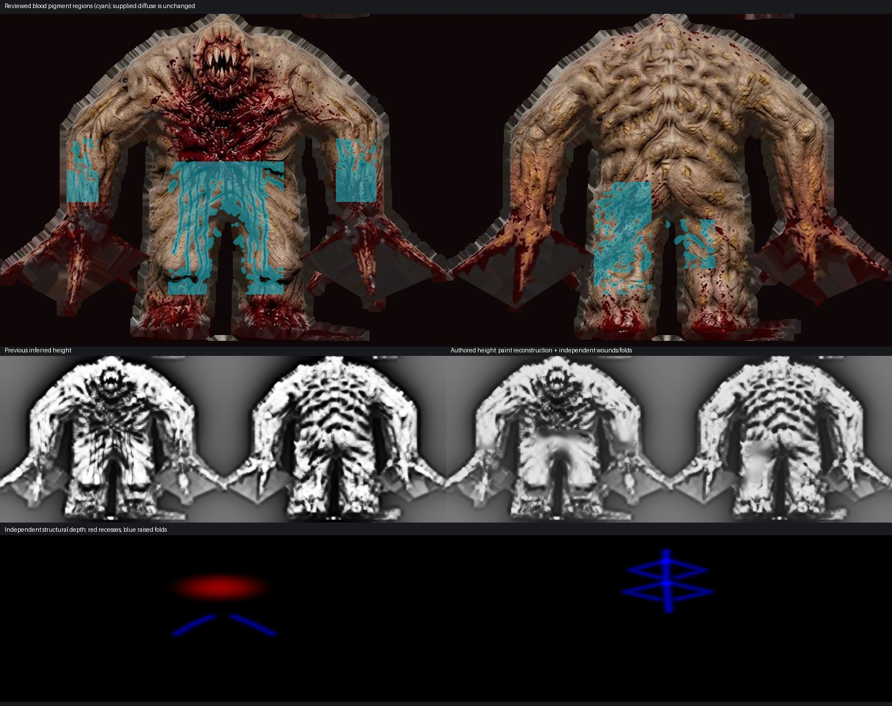

# Material-aware height authoring — custom Shambler trial

The owner's refinement request was to keep blood coloration mostly flat while actual wounds and folds retain depth. This first working increment authors the **supplied custom Shambler skin**. It changes only `newer/enemies/shambler/custom/height.webp`; its diffuse, model, UVs, original Shambler height, other 28 stored heights and `pak0.pak` are byte-identical to the previous delivery. Manifest version is now **16** so the existing loader fetches the new map.

## What is authored

`tools/texture_sheets/sources/shambler-height-authoring.json` uses native atlas coordinates (308 × 115), scaled to the existing 1540 × 575 custom skin. Five reviewed regions identify painted drips on the abdomen/forearms and smears on the back. Color detection is allowed only inside those regions. Its dilation/feather is clipped to the reviewed regions, and chest/wrist/foot wound regions are protected from pigment removal.

The enemy-only helper `enemy_height_authoring.py` reconstructs nearby unpainted surface luminance before the existing height craft stage. A narrow blood stripe therefore does not automatically become a deep channel. The reconstruction estimates the skin beneath opaque paint; it cannot recover unseen physical anatomy. It preserves more visible contour with narrow padding (0.35 native texel), feather (0.25) and reconstruction scale (3).

Signed structural fields are authored separately afterward: a shallow chest recess plus abdominal folds and back/spine ridges. The height range reserves space for positive/negative structure. These fields share the existing UVs and do not move vertices. Existing normal strength/cap settings and renderer behavior remain unchanged. No diffuse pixels were repainted. The recipe is bound to the decoded diffuse RGB hash. Changed artwork fails with `Custom Shambler diffuse changed; review height annotations for this artwork`; it requires new reviewed annotations. Full reconstruction checks that binding before writing its fitted diffuse or replacing accepted UV evidence. This does not claim a physical scan or complete anatomy reconstruction.

The original Shambler skin is a different piece of art despite sharing UVs, so it does **not** inherit the custom skin's wound recipe. Other characters retain their previous height estimates pending individually reviewed material annotations. Red color alone is not a general classification of blood: it can also represent flesh, exposed tissue, lava or painted equipment. This trial makes no claim that all enemy heights have been semantically authored, and it creates no unattended follow-up campaign.



## Try and accept the result

Hard-refresh and start Newer Game with Newer enemies, Normal maps and Newer lighting enabled. Compare the abdomen, forearms, chest wound and back folds. On the normal local server, `/tests/enemy_height_trial.html` provides **Height authoring: new/previous**, alongside front/back and rotation controls. The previous map is retained only as a test baseline under `docs/evidence/height-authoring-baseline/`; it is not used by the product.

The authoring switch is enabled only for the custom Shambler. Controls stay disabled until the automatic catalogue and fixed-camera comparison finishes, preventing pose/material changes from invalidating the test. The previous/new GPU comparison uses the same diffuse, model, pose, camera, lights and texture sampler settings. Only the height-derived normal changes. Owner appearance acceptance remains pending; the owner authorized commit and push on 2026-10-01; no packed release was requested.

## Verification

- **10 property tests passed** in `tests/enemy_height_authoring_test.py`: flat skin with a painted red stain acquires no false trench; independent wound and ridge survive paint; protected wounds are not flattened; a broad analytical fold/ramp is retained beneath a narrow stain; neighboring unreviewed red pixels stay exactly unchanged; unannotated/native Shambler generation stays unchanged; color arrays are never mutated; atlas structural units scale consistently; changed custom diffuse art requires reviewed annotations through decoded-pixel hash binding.
- **174 asset checks passed**, verifying real skin dimensions, source provenance, all 29 encoded heights, profiles and catalogue relationships. The existing verifier now calls the enemy authoring entry point for a custom variant, while native variants retain their original generation.
- **37 focused renderer/interface tests passed** with real Three.js 0.183.0 through the Node 24 Deno compatibility runner. Deno is unavailable here. No production JavaScript renderer/shader changes were required for this refinement.
- **43 baseline hashes compared**: only the custom Shambler height differs; all diffuse files, original pack and other 28 height maps are unchanged. [Preservation record](evidence/height-authoring-preservation.json).
- The reviewed paint mask covers **47,323 pixels**. Mean raw height gradient within that mask changed from approximately **0.06234 to 0.01497**. This includes the authored height range adjustment and is a descriptive result, not an isolated causal measure of paint removal or proof of anatomical accuracy.
- Independent planning/review required custom-only scope, strict region boundaries and the nonconstant-surface test; those fixes passed independent rechecks. **50 browser checks passed** with all 29 stored maps matched to attached normals. The same-state previous/authored GPU comparison changed **11,205 pixels**, with total RGB channel delta **16,059**; this establishes that the new map reaches rendering, while appearance remains subject to owner review. No shader errors/warnings were observed. The GPU comparison and screenshots are recorded in `evidence/height-authoring-browser.json` and `images/height-authoring-new.jpg` / `height-authoring-previous.jpg`.

Reproduce the refinement without refitting or rewriting diffuse assets:

```sh
python3 tools/texture_sheets/update_enemy_heights.py --heights-only
python3 tests/enemy_height_authoring_test.py
python3 tests/verify_enemy_heights.py
```

Use Python with the same Pillow/NumPy dependencies as the existing texture tools. The helper leaves world-material crafting unchanged. The updater regenerates deterministic height bytes and increments the catalogue cache version. Full asset reconstruction without `--heights-only` retains the previous Shambler fitting step. If distributing a packed build later, rebuild its pack through the existing tool; this checkout uses loose assets.
