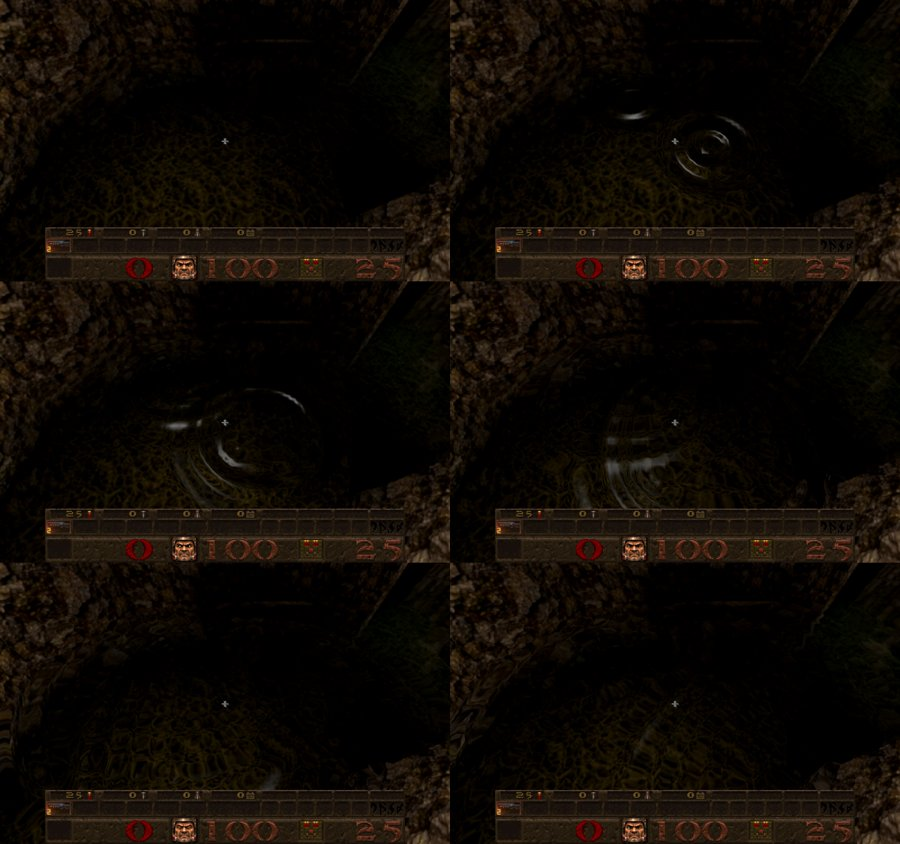
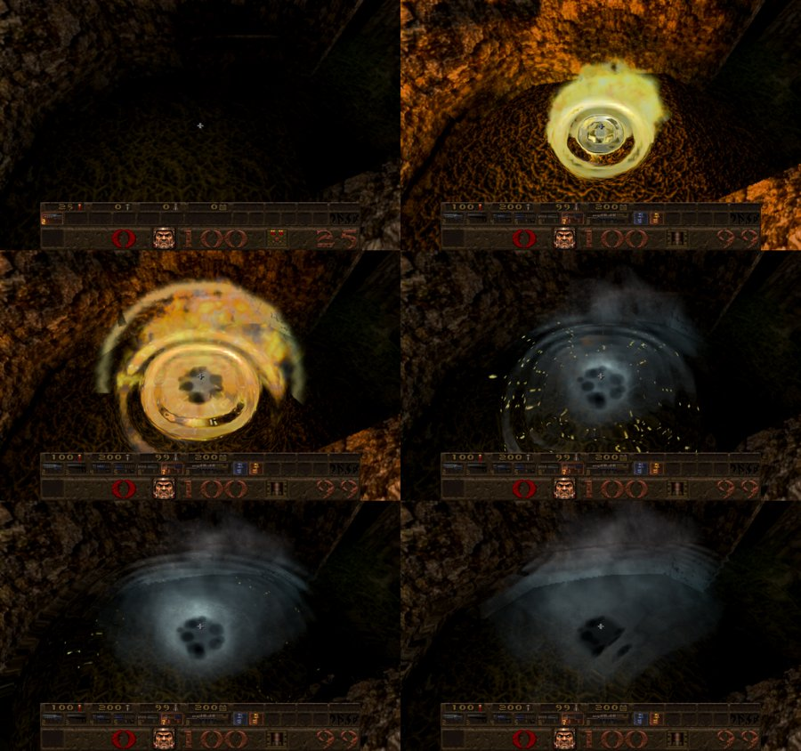
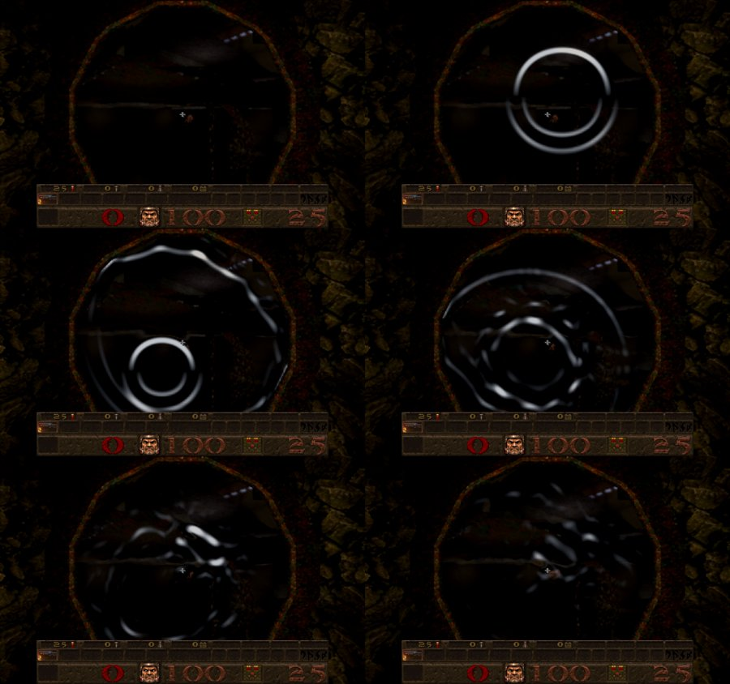
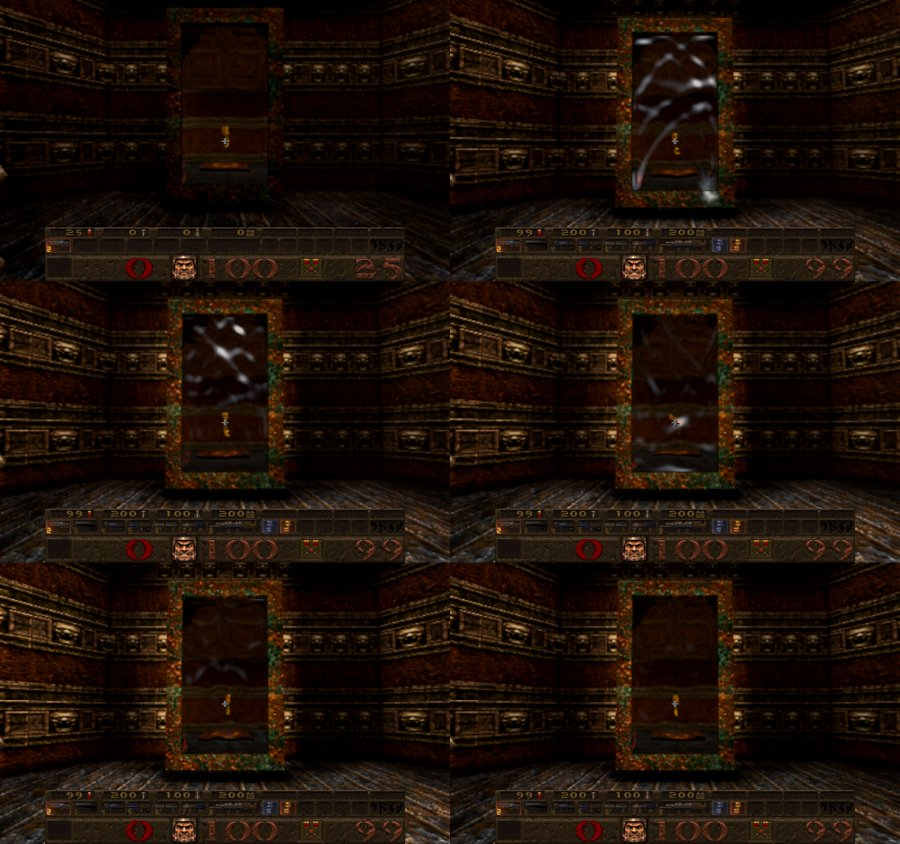

# Ripples where shots cross water and hit portals

Card [W1]. In Newer Game, a shot that goes through the surface of a pool, or hits a teleporter's window or a slipgate's window
onto the next level, makes **real ripples**: waves that spread, pass through and add to each other where they meet, and come
back off the pool's sides and the window's frame. On water they bend what the water shows (its reflection and what lies
beneath) and catch the light on their crests; on a portal the window behaves like a sheet of liquid metal held in its frame.

## Second version (owner, 9 Oct 2026)

The first version drew rings: a fixed wave packet spreading from each hit, which never met an edge or another ring. The owner:
*"Shooting at the surface of the water should cause ripples + Shooting at projected standing portals that you walk through when
fired should have a metallic ripple effect NOT rings!! The effect has to show a visible visual distortion and ripples should
interact with each other and surrounding edges we are looking for realism."* The rings are replaced by a wave simulation
(`src/r_waves.js`); the detector below is unchanged and now feeds it.

| Two hits on E1M1's pool, injected 0.25 s apart (0, 0.25, 0.6, 1.0, 1.6, 2.4 s) | A real rocket into the same pool |
| --- | --- |
|  |  |
| **Two hits on E1M4's slipgate ring** (0, 0.15, 0.4, 0.7, 1.1, 1.7 s) | **A real shotgun blast at an E1M5 teleporter** (0, 0.4, 0.7, 1.1, 1.7, 2.6 s) |
|  |  |

## The simulation (`src/r_waves.js`)

* A **wave field** is a height field of up to 128 x 128 cells stepped with the 2D wave equation (explicit, fine enough steps to
  stay stable: the wave moves under half a cell a step), with a little damping. Waves are linear, so ripples from different
  hits simply add: they cross, reinforce and cancel.
* **Water**: a field of 3-unit cells (384 units across) centred on the hit at the surface's height. Its cells are found from
  the BSP: water just below the surface and neither liquid nor rock just above. A cell next to rock reflects as water does at
  a wall (no slope across it), so ripples come back off the pool's sides and anything standing in the water. Where the field's
  square ends in open water, a sponge layer soaks the waves up instead (the pool goes on). A hit pushes in a crater with a
  raised rim (the 2D Laplacian of a Gaussian: the rim holds what the crater pushed out, no water is added) and, 0.11 s later,
  the rebound jet; together they make the train of crests real water shows. Speed 66 units a second; the waves keep 85% of
  their height a second (the motion is damped); a rocket's crater is 9 units deep. Later hits well inside an existing field use
  it; a hit near its edge gets a field of its own, and where two fields overlap the shader adds them (the waves are linear).
  A cell beside the water is sent to the shader holding its water neighbours' level, so the slope at the pool's side is the
  water's own and not a cliff.
* **Portals**: a field over the window's plane, 1.5-unit cells or coarser for a big window. The window's own outline holds it
  (a slipgate's round ring is round, from the window's polygons; a teleporter's window is its box), like a struck sheet of metal
  held in a frame: the edge stays still and waves come back off it turned over. Speed 170 units a second, 60% of the height
  kept a second, crater 5 units. One field per window (the window's plane object is kept for the portal's life, so the same
  window always finds its field). A slanted window's axes lie in its own plane.
* With the water optics off (`r_newer_water 0`: the plain opaque surface) a hit on the water makes no field.
* At most 4 water and 4 portal fields at once (the quietest goes for a new one); a field whose highest wave has stayed under
  0.02 units for a second is dropped; everything goes with a new level, when the clock jumps back (a demo loop), with
  `r_impactripples 0`, and in Classic.
* The heights go to one half-float texture (8 slots of 128 x 128, rounded to the nearest half float), uploaded when a field
  has moved (and marked at once when a slot is cleared); the shaders read the height and its slope there.

## How it is drawn

* **Water** (`PRESENT_FRAGMENT`, `src/gl_post.js`): the composite pass that draws the water already uses all sixteen of its
  texture units, so the ripples are applied to the finished picture in the present pass, which is switched on while a water
  field lives (otherwise it runs only for dynamic resolution or the power-up visions). For each pixel the ray is met with a
  live field's surface in front of what the pixel shows; there the picture is taken from a point moved across the surface by
  the slope (60 units for a slope of 1, in perspective, at most 6% of the screen), only ever from more of the water (never the
  bank, the gun or a wall), the slope turned toward the eye is lightened and the one turned away darkened (more or less of the
  light above is mirrored), and a sharp glint is added on the crests. The reflection and what is seen below the surface bend
  together, as they do on real water.
* **Portal** (the portal fragment shader, `src/gl_portal.js`): the slope tilts the window's surface; the view through it is
  bent by the tilt (as a refracting surface would bend it) and the tilted metal mirrors a bright overhead where it tilts up and
  darkens where it tilts down, with a glint on the crests. A flat window is unchanged.
* **Slipgate windows** onto the next level (card [B2]) are hit like teleporter windows: their plane carries the window's
  polygons, which shape the field. The seamless doorways between Episode 1 levels still get no hits (see *Open decision*).

## What makes a hit (the detector, unchanged)

Everything is decided on the client side of the picture, only for what is drawn, and never reaches the game (nothing is
saved, nothing changes in the rules).

* **Missiles**: a rocket, a grenade or a nail (`R_ImpactMissile`, called from `CL_LinkPacketEntities` in a live game and
  `CL_RelinkEntities` in a demo, in `src/cl_main.js`, for the segment each moved this frame; a jump of more than 128 units is
  a teleport and counts for nothing, an entity must have been linked on the previous frame too so a reused slot's old
  position is not used, and the lava fountain's ball, which carries the rocket flag, is not a missile).
* **Shotgun pellets**: `r_shotgun.js` hands each pellet's stretch of flight this frame to the detector, so the ring appears
  when the pellet gets there, not when the shot was fired (the pellets are the supplied ones, with their own speed).
* **Detector** (`R_ImpactSegment` in `src/r_impactripples.js`): if a segment's ends are on different sides of a liquid
  surface (water or slime by BSP contents; lava has no water optics to draw a ring on), the crossing is found by bisection
  and a **water ring** is made there (going in at full strength, coming out at 0.6), unless the point is inside a
  teleporter's window (its brush is water to the BSP, and the window's ring is the one wanted); if it passes through a
  teleporter window's visible surface (the opening taken 4 units larger so its frame counts) a **metal ring** is made at that
  point. The window's box is its visible surface, not its trigger's box (in e1m3, e1m5, e1m6 and others the trigger lies
  beside the surface), and the two faces of a teleporter brush, and planes a few units apart, count as one window. Strengths: pellet 0.35, nail 0.5, grenade 0.8, rocket 1.
* **Caps**: at most 8 water and 8 metal rings alive (the oldest goes); water rings last 2.6 s, metal 1.8 s. Cost per frame is
  two contents lookups per moving missile or pellet and one plane test per portal.
* **Off**: `r_impactripples 0` (archived; rings alive go at once), Classic Quake (New Game and the classic half of a split demo)
  has none, and pellet rings need the pellets, so `r_shotgunfx 0` stops those too.

## How the first version drew them (replaced)

* **Water** (`src/gl_post.js`, `waterImpactRings`): a wave packet of two or three crests travels out at 62 units a second,
  short ahead of its front and with a longer wake, fading in about a second. It adds a slope to the same ripple normal that
  already bends the water's reflections and refraction, and a faint crest of foam so it reads in a dark pool too (the existing
  optics clamp the refraction offset to a few pixels, so the normal alone was not visible in the dark). It only touches water
  at the ring's own height, so a ring on one pool does not show on another level of water.
* **Portal** (`src/gl_portal.js`, the portal fragment shader): the same kind of packet, spreading at 150 units a second over
  the portal surface; it bends the view through the portal along the screen-space direction away from the hit and adds a
  steel-blue highlight and a short flash at the hit. The shader is on every portal surface; only teleporter windows are given
  hits.
* The rings are packed once a frame (`R_ImpactRippleFrame`, before the scene renders) into shared arrays both shaders read.

## Open decision

The seamless doorways between Episode 1 levels are "just a doorway: no shimmer, no tint" (the existing contract in the portal
shader). Giving them a metallic ring would show the seam, so they get none (the ring is not given hits there). If the
owner wants shots at those doorways to ring too, it is one plane per crossing (the opening's corners are already kept on
the level portal as `plane`) and a one-line change; it is the owner's call because it changes that contract.

## Checks

Second version:

* Independent review (read-only) of the first cut found: a second field overlapping the first hid its ripples (blocking);
  a false slope along every pool side; ripples drawn on the plain water with its optics off; the waves losing half the stated
  amount a second; the crater adding water; one frame of stale heights after a slot was reused; a portal's far face (up to 12
  units behind) never rippling; skewed axes on a slanted window; slipgate windows still hit with portals switched off; a
  window's plane rebuilt (so a second field) when the portal list changed; and nine wrong versions the tests could not tell
  apart. All fixed as described above; tests added for each, and each of those wrong versions (and two more) now fails them.
* `tests/waves_test.js` (12): after a second the leading edge has run the water's speed and the strongest crest is behind it,
  with at least two crests; with a wall 30 units off, the water at a point 24 units the other way is exactly the same as in open
  water until the wall could answer and then carries the echo; two hits together are the sum of each alone (to 1e-4); a round
  window's corners never move while its middle is still rippling after 0.6 s (the waves came back off the frame), and the same
  window gets the same field; rock cells are not water and never move; fields are shared by nearby hits, capped at 4, carried
  to the texture as half floats (to 0.2%), described to the shaders, and dropped once still with their slots cleared; the
  detector's water and window hits reach the simulation (the window's field keyed to its plane), and switching off, Classic, a
  clock that jumps back and nothing set up leave none; a pool's side is exactly a mirror (the walled pool equals the open pool
  with a mirror-image hit, to 0.1%: not turned over); beside a portal's frame the sheet swings no more than inside (a free
  edge swings 1.7 times as far); the crater adds no water and its rebound comes; a sheet's energy a second on is `keep`
  squared (within 25%); the quietest field is the one replaced; a reused slot is cleared; the texture is marked for the GPU;
  the shore cell holds its water's level; the half floats are rounded to within half a step; and with the water optics off no
  field is made. Mutants run: water walls held, frame free, no rebound, the loudest evicted, half floats truncated, window
  fields counted as water, no clearing, damping doubled, texture never marked, no shore level, the crater adding water, the
  optics switch ignored: all fail.
* `tests/impact_ripples_test.js` (9) unchanged and passing (the detector, below).
* Real browser (Chrome for Testing, owned data): two injected hits on E1M1's pool (and E1M2's, E1M3's: too dark to show well
  there; E1M1 is the one photographed), a real rocket fired into E1M1's pool, two injected hits on E1M4's slipgate ring, and a
  real shotgun blast at an E1M5 teleporter: the images above. A frame difference on E1M2 showed the rings and their crossing on
  a pool too dark to see them in the picture, which is why the slope shading and glints were added. No shader errors.

First version (rings):

* `tests/impact_ripples_test.js` (9): the ring is at the crossing point and on the surface (straight, slanted, long and
  shallow within about a unit), leaving is smaller, no crossing no ring, slime counts and lava does not, the opening and its
  4-unit margin (3.5 in, 5 out), a slanted portal where the plane and not the box decides, a segment lying in the plane,
  two windows in line both ringing, a crossing inside a window making only the window's ring, missing contents data, nothing
  set up, rockets, grenades (smaller) and nails and lasers are missiles while gibs, zombies and the lava ball are not, a jump
  of 129 units is a teleport and 100 is a flight, caps, expiry (metal first, and exactly at the lifetime), rings from the
  future not packed, unused rows of both kinds marked, a clock that jumps back clears the rings for good, Classic, the
  split-demo classic half and `r_impactripples 0` make none (and take live ones away). With a level built the way a real one
  is (a visible surface and a trigger box 8 units short of it, two faces and a second plane 8 units behind), the portal
  module gives one window, built once, a shot through the visible surface makes one ring, a shot stopping at the trigger
  box or passing beside makes none, and switching portals off leaves nothing to hit.
* Mutation checks: 29 mutants of `src/r_impactripples.js` (Classic ungated, cvar ignored, hi or bisect 6, exits as strong,
  slime or lava mis-classed, margin 40 or 3, the x box test removed, the plane side ignored, an in-plane segment, no cap, no
  expiry, expiry `>`, future rings packed, teleport 64 or ignored, clock jump kept, every model a missile, laser dropped,
  grenade as rocket, lava ball a rocket, no set-up guard, undefined contents accepted, water in a window, stop after the first
  window, rings kept after switching off) are all caught except one equivalent (taking the last point before the crossing
  instead of the midpoint: it differs by at most a bisection step).
* The shaders were compiled in the browser (no errors) and a real run shows the rings; the hooks in `cl_main.js`,
  `r_shotgun.js` and `gl_rmain.js` and the shaders have no unit tests (they need a renderer): they are covered by the browser
  runs below only.
* Real browser (Chrome for Testing): a real super shotgun blast into the E1M3 pool made 8 water rings at the surface height
  (the first 8 pellets'); a nail gun, a shotgun and a rocket at a hub teleporter window made metal rings; a ring injected at
  a known point is one soft crest spreading and fading (water) or two bending metal crests (portal); and a pixel comparison
  with a no-ring control beat the scene's own flicker. A direct check on the real E1M3 level: its 8 portals are 2 windows,
  and a segment through the first one makes a ring. The images above are from those runs.

## Not checked

Second version: the shaders have no unit test of their own (slot offsets, bounds, the plane cutoff; they are covered by the
browser runs); the present pass reads depth at the pixel itself, so while an effect moves the composite's picture (heat haze,
lens drops, a teleport stretch, a power-up vision) the ripples' outline can be off by that much; with `r_demosplit 2` the
ripples are simulated and the present pass runs for a picture then covered by the classic half; the ripples seen from below the surface (the present pass also bends it, not photographed); Episode 2 to 4
pools and slime (the same code); a fireball or other effect drawn over the water without depth is bent with the water for the
moment it is there (seen in the rocket run, under half a second); multiplayer; how the strengths, speeds and damping feel is
for the owner to judge (the constants are `WATER` and `METAL` in `src/r_waves.js`). Cost, measured in Node on this Mac (Apple
silicon): stepping and uploading 4 water fields and 1 portal field took 1.7 ms a frame (before the review's changes), and making a water field about 2 ms
with a trivial contents lookup (the real BSP lookups for its 16,000 cells take longer: a one-off hitch on the hit, not
measured); a slower machine was not tried, nor the GPU cost of the present pass (which runs while a water field lives).

First version:

Real nail or shotgun shots at the E1M3, E1M5 windows (the direct segment check on E1M3 made a ring, but my scripted shots there
made none, probably an aiming or firing problem in the script, not checked further); Episode 2 to 4 water (the same code, not
photographed); slime rings (detected, drawn only where the liquid has a water-optics region); multiplayer or a remote server (the detector reads the client's own entities; not run);
the ring seen from below the surface (the shader applies the same ring to the underside, not photographed); a very large
number of simultaneous shots (capped at 8 rings of each kind, so a super shotgun blast draws the first 8 pellets' rings).
A pellet that stops short of the water because it hit something first makes no ring, as it should. How strong the rings look
is for the owner to judge: strengths, speeds, lifetimes and the crest brightness are the constants named above.
