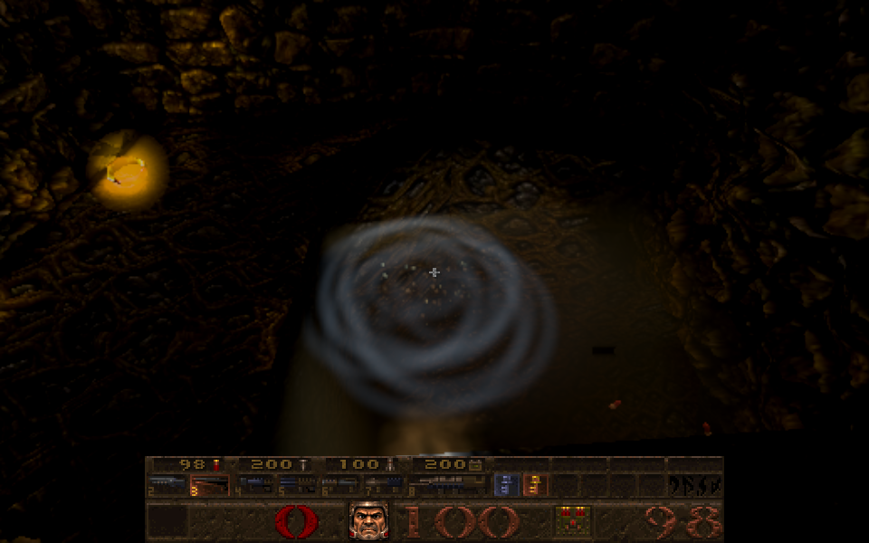
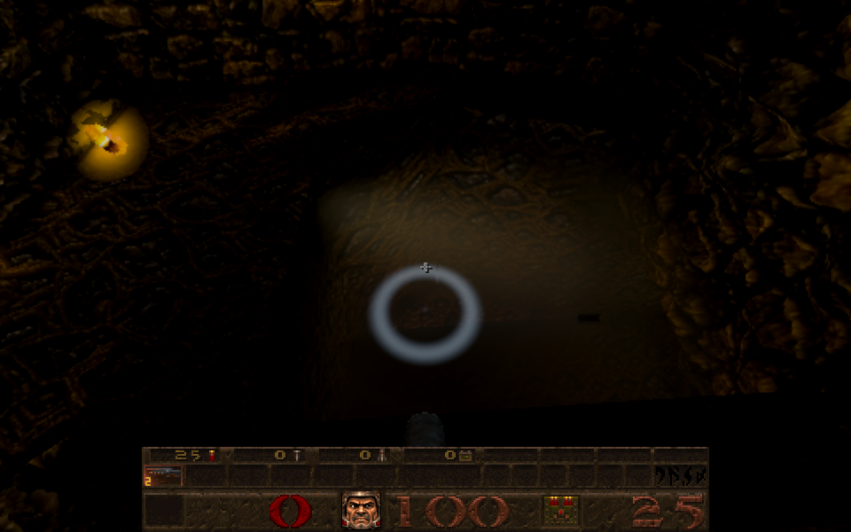
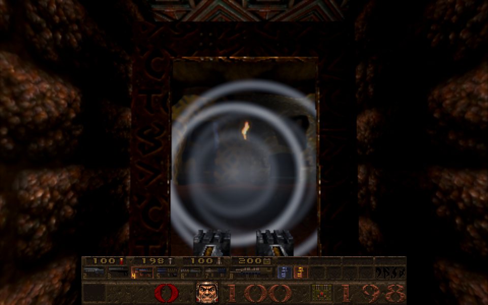

# Ripples where shots cross water and hit portals

Card [W1]. In Newer Game, something fast that goes through the surface of a pool leaves a ring that spreads over the
water, and something that hits a teleporter's window leaves a **metallic** ring that spreads over the window and bends what
is seen through it. (Doorways onto the next level, the seamless ones, make no ring: see *Open decision*.)

| Water (a super shotgun blast into a pool) | Portal (the nailgun at a teleporter window) |
| --- | --- |
| 

A single ring (injected at a known point, 0.2 s after):  |  |

## What makes a ring

Everything is decided on the client side of the picture, only for what is drawn, and never reaches the game (nothing is
saved, nothing changes in the rules).

* **Missiles**: a rocket, a grenade or a nail (`R_ImpactMissile`, called from `CL_LinkPacketEntities` in a live game and
  `CL_RelinkEntities` in a demo, in `src/cl_main.js`, for the segment each moved this frame; a jump of more than 128 units is
  a teleport and counts for nothing, an entity must have been linked on the previous frame too so a reused slot's old
  position is not used, and the lava fountain's ball, which carries the rocket flag, is not a missile).
* **Shotgun pellets**: `r_shotgun.js` hands each pellet's stretch of flight this frame to the detector, so the ring appears
  when the pellet gets there, not when the shot was fired (the pellets are the supplied ones, with their own speed).
* **Detector** (`R_ImpactSegment` in `src/r_impactripples.js`): if a segment's ends are on different sides of a liquid
  surface (water or slime by BSP contents; lava has no water optics to draw a ring on), the crossing is found by bisection
  and a **water ring** is made there (going in at full strength, coming out at 0.6), unless the point is inside a
  teleporter's window (its brush is water to the BSP, and the window's ring is the one wanted); if it passes through a
  teleporter window's visible surface (the opening taken 4 units larger so its frame counts) a **metal ring** is made at that
  point. The window's box is its visible surface, not its trigger's box (in e1m3, e1m5, e1m6 and others the trigger lies
  beside the surface), and the two faces of a teleporter brush, and planes a few units apart, count as one window. Strengths: pellet 0.35, nail 0.5, grenade 0.8, rocket 1.
* **Caps**: at most 8 water and 8 metal rings alive (the oldest goes); water rings last 2.6 s, metal 1.8 s. Cost per frame is
  two contents lookups per moving missile or pellet and one plane test per portal.
* **Off**: `r_impactripples 0` (archived; rings alive go at once), Classic Quake (New Game and the classic half of a split demo)
  has none, and pellet rings need the pellets, so `r_shotgunfx 0` stops those too.

## How it is drawn

* **Water** (`src/gl_post.js`, `waterImpactRings`): a wave packet of two or three crests travels out at 62 units a second,
  short ahead of its front and with a longer wake, fading in about a second. It adds a slope to the same ripple normal that
  already bends the water's reflections and refraction, and a faint crest of foam so it reads in a dark pool too (the existing
  optics clamp the refraction offset to a few pixels, so the normal alone was not visible in the dark). It only touches water
  at the ring's own height, so a ring on one pool does not show on another level of water.
* **Portal** (`src/gl_portal.js`, the portal fragment shader): the same kind of packet, spreading at 150 units a second over
  the portal surface; it bends the view through the portal along the screen-space direction away from the hit and adds a
  steel-blue highlight and a short flash at the hit. The shader is on every portal surface; only teleporter windows are given
  hits.
* The rings are packed once a frame (`R_ImpactRippleFrame`, before the scene renders) into shared arrays both shaders read.

## Open decision

The seamless doorways between Episode 1 levels are "just a doorway: no shimmer, no tint" (the existing contract in the portal
shader). Giving them a metallic ring would show the seam, so they get none (the ring is not given hits there). If the
owner wants shots at those doorways to ring too, it is one plane per crossing (the opening's corners are already kept on
the level portal as `plane`) and a one-line change; it is the owner's call because it changes that contract.

## Checks

* `tests/impact_ripples_test.js` (9): the ring is at the crossing point and on the surface (straight, slanted, long and
  shallow within about a unit), leaving is smaller, no crossing no ring, slime counts and lava does not, the opening and its
  4-unit margin (3.5 in, 5 out), a slanted portal where the plane and not the box decides, a segment lying in the plane,
  two windows in line both ringing, a crossing inside a window making only the window's ring, missing contents data, nothing
  set up, rockets, grenades (smaller) and nails and lasers are missiles while gibs, zombies and the lava ball are not, a jump
  of 129 units is a teleport and 100 is a flight, caps, expiry (metal first, and exactly at the lifetime), rings from the
  future not packed, unused rows of both kinds marked, a clock that jumps back clears the rings for good, Classic, the
  split-demo classic half and `r_impactripples 0` make none (and take live ones away). With a level built the way a real one
  is (a visible surface and a trigger box 8 units short of it, two faces and a second plane 8 units behind), the portal
  module gives one window, built once, a shot through the visible surface makes one ring, a shot stopping at the trigger
  box or passing beside makes none, and switching portals off leaves nothing to hit.
* Mutation checks: 29 mutants of `src/r_impactripples.js` (Classic ungated, cvar ignored, hi or bisect 6, exits as strong,
  slime or lava mis-classed, margin 40 or 3, the x box test removed, the plane side ignored, an in-plane segment, no cap, no
  expiry, expiry `>`, future rings packed, teleport 64 or ignored, clock jump kept, every model a missile, laser dropped,
  grenade as rocket, lava ball a rocket, no set-up guard, undefined contents accepted, water in a window, stop after the first
  window, rings kept after switching off) are all caught except one equivalent (taking the last point before the crossing
  instead of the midpoint: it differs by at most a bisection step).
* The shaders were compiled in the browser (no errors) and a real run shows the rings; the hooks in `cl_main.js`,
  `r_shotgun.js` and `gl_rmain.js` and the shaders have no unit tests (they need a renderer): they are covered by the browser
  runs below only.
* Real browser (Chrome for Testing): a real super shotgun blast into the E1M3 pool made 8 water rings at the surface height
  (the first 8 pellets'); a nail gun, a shotgun and a rocket at a hub teleporter window made metal rings; a ring injected at
  a known point is one soft crest spreading and fading (water) or two bending metal crests (portal); and a pixel comparison
  with a no-ring control beat the scene's own flicker. A direct check on the real E1M3 level: its 8 portals are 2 windows,
  and a segment through the first one makes a ring. The images above are from those runs.

## Not checked

Real nail or shotgun shots at the E1M3, E1M5 windows (the direct segment check on E1M3 made a ring, but my scripted shots there
made none, probably an aiming or firing problem in the script, not checked further); Episode 2 to 4 water (the same code, not
photographed); slime rings (detected, drawn only where the liquid has a water-optics region); multiplayer or a remote server (the detector reads the client's own entities; not run);
the ring seen from below the surface (the shader applies the same ring to the underside, not photographed); a very large
number of simultaneous shots (capped at 8 rings of each kind, so a super shotgun blast draws the first 8 pellets' rings).
A pellet that stops short of the water because it hit something first makes no ring, as it should. How strong the rings look
is for the owner to judge: strengths, speeds, lifetimes and the crest brightness are the constants named above.
