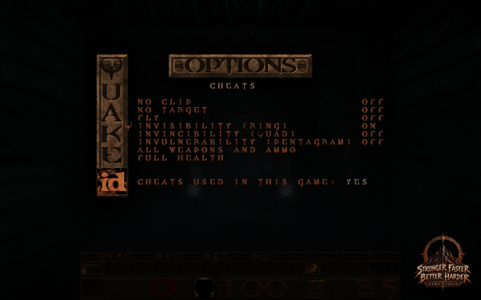
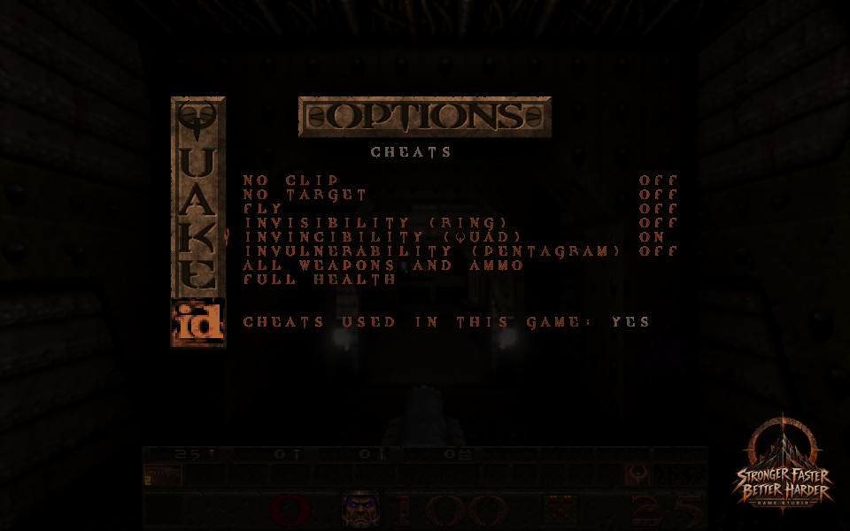
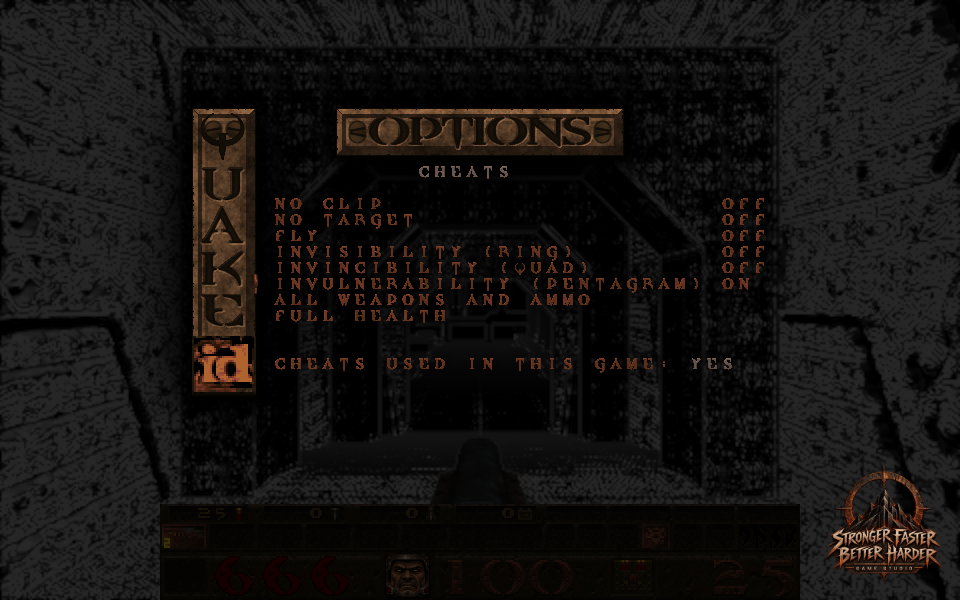

# Level Select by episode, and a Cheats menu in Options

Card [L1].

## Level Select: episode, then level

Single Player > Level Select now has three rows above the levels: **Game** (Newer Game or New Game), **Skill**, and
**Episode**. Left and right (or Enter, or a tap) on the Episode row step through the episodes this copy of the game has,
wrapping round; the levels listed below are that episode's, with their names.

* All stock maps are listed by episode, each with the title the map itself carries: the Introduction (`start`), Episode 1
  (E1M1 to E1M8), Episode 2 (E2M1 to E2M7), Episode 3 (E3M1 to E3M7) and Episode 4 (E4M1 to E4M8, then `end`,
  Shub-Niggurath's Pit, the final level; E4M8 is The Nameless City).
* An episode appears only if at least one of its maps is available: the shareware `pak0.pak` gives the Introduction and
  Episode 1; the 2021 re-release's `pak0.pak` read from `resources/id1/pak0.pak` adds Episodes 2 to 4 (the original release
  keeps them in `pak1.pak`, which is not read)
  ([fullgame-pak-2026-10-05.md](fullgame-pak-2026-10-05.md)). Within an episode only the maps present are listed.
* Episode 1 is the default when it exists (the cursor opens on its first level, E1M1; before, it opened on the Introduction), and the
  menu remembers the episode and cursor between visits. Keyboard, Enter and touch all work; a level starts exactly as
  before (`map <name>` with the chosen game mode and skill).
* The old fixed list (the Introduction, Episode 1 and E2M1) is replaced; `LEVEL_SELECT_LEVELS` keeps its name and now
  carries each map's `episode`.

## Options > Cheats

A last row in Options, **Cheats**, opens a small menu (changed 9 October 2026 at the owner's request: God mode removed, the three power-ups added as switches):

| Row | Command | Shown |
|---|---|---|
| No clip, No target, Fly | the game's own `noclip`, `notarget`, `fly` | on/off, read from the player's movement and flags |
| Invisibility (Ring), Invincibility (Quad), Invulnerability (Pentagram) | `cheat_power ring`, `cheat_power quad`, `cheat_power pentagram` | on/off, the switch |
| All weapons and ammo | `cheat_weapons` | |
| Full health | `give h 100` | |

(The row names are the owner's. The Quad is Quad Damage: it multiplies the player's damage; the Pentagram is what makes the player take none.)

* **The power-ups stay on until switched off.** Switching one on gives the game's real power-up: its item and its timer, so the game's own rules apply (the Ring hides the player from monsters and shows the eyes, the Quad multiplies damage, the Pentagram stops damage). The timer is kept 30 seconds ahead every server frame (`src/sv_cheats.js`, `SV_CheatsFrame` from the host frame), so it never runs out and never plays the running-out warning. Switching it off removes the item, the timer, the glow and the eyes at once. A death clears power-ups as usual; a switch still on puts its power back once the respawn has finished. The switches are kept with the player in a saved game.
* **Each takes effect at once, under the menu.** A single-player game stops its physics while a menu is open, so the game's own `impulse 255`/`impulse 9` used to act only when the menu closed. The new commands change the player directly, and the client update the server sends every frame (also while paused) carries it to the picture: in Newer Game the Ring's Unseen World vision and the eyes face, the Quad's purple face and glow, the Pentagram's Demon vision and 666 health show behind the menu immediately; switching off returns the picture at once.

| Ring on, menu open | Quad on | Pentagram on |
|---|---|---|
|  |  |  |

* They work only in a local single-player game: the menu, and the commands themselves, refuse and say "Cheats need a single player game" when there is no game, in multiplayer, in deathmatch or in co-op. After a co-op session `coop` can stay set, so the menu may refuse in what is really a single-player game.
* The menu says **"Cheats used in this game: yes/no"**, counting only cheats used from this menu. It starts again for every map load and every loaded game.
* A give (all weapons, full health) needs Enter or a tap; the arrow keys only flip the switches. Up and down move (wrapping); Enter, left, right and a tap apply the row; Escape returns to Options. The rows start clear of the Quake plaque on the left.

## Checks

* `tests/level_select_test.js` (4): the shareware copy offers the Introduction and Episode 1, defaults to Episode 1 with
  its eight levels on the cursor, steps and wraps on the Episode row (also with Enter), and launches the Introduction and
  E1M5; with the owned full game (read from `resources/id1/pak0.pak`, never copied) all five episodes and each episode's
  levels, Episode 4 (with `end`) wraps to the Introduction, E3M3 launches in Newer Game and in Classic, the episode is
  remembered, and `end` and E4M8 launch; a fourth test reads what is drawn (the Episode row at y 64 with its name at x 184,
  level row i at y 84 + 8 i, nothing at the old row, the Introduction's single row); touch steps the episode, starts a tapped level and ignores taps between the rows. The full-game part
  prints whether it ran (it ran in this evidence).
* `tests/cheats_native_test.js` (5, real QuakeC and server): switching each power on gives its item, its timer and (Quad, Pentagram) its glow, and the very next client update carries it with no physics run; a minute of real play never lets a timer near its warning, the game shows the Ring's eyes, switching off removes item, timer and eyes at once and they stay off while the other power is untouched; the Pentagram stops 500 damage and damage lands again once it is off; the switches are saved and loaded (malformed values refused), cleared by a death and back after the respawn; all weapons at once; nothing in multiplayer or deathmatch.
* Browser (E1M1, Newer Game): with Options > Cheats open and the game held (server time unchanged), each switch changed the server's and the client's items in the same moment and the picture behind the menu showed it (pictures above); switching off restored it.
* `tests/cheats_menu_test.js` (2): the row is last in Options and opens the menu (keys and touch), Escape returns; each row
  sends its game command, the states read from the player's flags, the note says "no" then "yes" and starts again for a
  new game on the same map (and is not reset by a map name alone), the arrows do not fire the one-shot gives, the cursor wraps
  both ways, touch applies a row, and multiplayer, no game, deathmatch and co-op all refuse
  and say so.
* Updated for the new layout: `tests/options_order_test.js` (18 rows), `tests/fullgame_pack_test.js` (needs
  `QUAKED_OWNED_PAK`) and `tests/demo_hdr_ownership_test.js`.
* Mutation checks, each failing a named test: a cheat applied outside single player, the wrong command, the "used" note
  never set, deathmatch allowed, no wrap, Cheats missing from Options; all episodes always offered, levels of every episode,
  the episode never changing, the default being the Introduction. (A touch-offset mutant is equivalent: the start handler
  already ignores a missing level.)

## Not checked

No browser capture of either screen (they are the game's own 8-pixel menu text). The Cheats rows depend on the game's
cheat commands being allowed (they are not in deathmatch or co-op, and the menu cannot see QuakeC's own `deathmatch`
global, only the cvar). Mission-pack episodes are not listed (this engine has none). The episode names are short so they
fit the 320-pixel menu ("E2 Black Magic").
