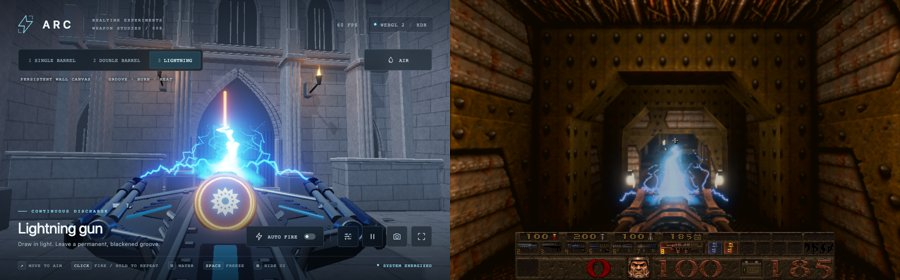

# The lightning gun's beam

Card [30a] (owner request 30). Newer Game only; Classic keeps Quake's bolt models. `src/newer/render/r_lightning.js`, fed by
`src/engine/client/cl_tent.js` (the beam) and `src/engine/render/gl_rmain.js` (the held gun).

## What is drawn

The supplied effect (`arc-weapons-wall-canvas-shotgun.html`, sha256 `8b1569225ae5...`, kept intact and not copied into the
game): an irregular white-blue channel from the muzzle to the hit, two weaker braided filaments, a dense eroded plasma hood whose
root is recessed into the gun, short arcs from the gun's two electrodes into the emitter with intermittent upward leaders, and
finite fork families along the channel. Ported from its `ribbonProgram` (the shader, unchanged but for the game's material),
`ribbon`, `boltPath`, `PLASMA_HOOD_OFFSET` and `buildElectricity`, with its own JS noise and its noise texture (seed 897234,
256 x 256).

## Fitted to the game

* **Space.** The supplied page builds in view space (the eye at the origin, looking down -z); here the same constructions are
  made in the world with the real camera: a ribbon faces the eye, a point's depth is along the camera's forward axis (which
  spaces the channel's points evenly on the screen, as the source does), and its view-space offsets use the camera's axes.
* **Size.** The supplied gun is about 2 units long, Quake's `v_light` about 25: one source unit is `K` = 12 Quake units.
* **The muzzle** is the front of the held gun's own posed geometry (`viewModelMuzzles`, as the shotgun's pellets use), placed
  this frame. The hood's recessed root follows the gun's own frame, so the gun's depth hides it; the channel, the electrode arcs
  and the light stay at the true muzzle. The electrodes sit either side of it (the supplied `gunShape` belongs to its own gun).
* **The end** is the server's: the endpoint of the game's own `TE_LIGHTNING2` beam from the player (`CL_PlayerLightning`),
  which stops at a wall (the game's own trace passes through monsters, as Quake's bolts always have). The beam lives while
  the game's does (0.2 s of server time, renewed while firing), with the source's power rising at 34 a second; the source's
  fall (18 a second) is not used, because when the server's beam is over there is nothing to draw it to, so it goes at once. Underwater discharge, damage, ammunition, range and cadence are
  the game's, untouched.
* **Tuned against the supplied page** (`lightningTune`): in Quake the beam runs almost straight into the screen from a muzzle
  near its middle, so the channel, hood and arcs overlap far more than in the supplied scene (a gun low on the screen firing up
  at a wall). The hood is dimmed to 0.4, the channel twice as wide (the beam reaches hundreds of units, where the supplied width
  is under a pixel), and the electrodes set at 0.9 of the supplied spread.
* **Drawn** as an additive emissive layer in the game's scene (the Fireball's material: depth tested, no depth written, zeros into
  the other G-buffer targets), so walls and the gun hide it, and the game's bloom takes its HDR brightness. A white light (the
  game's dynamic lights have no colour) follows the hit.
* **Only the player's own beam.** Its native bolt models are still added to the entity list, marked, and left out when the
  entities are drawn in the Newer pass while the beam is drawn here (the gun held last frame, a beam this frame), so the
  Classic pass (the Classic half of the title demo's split, `r_demosplit 2`) still draws them, and the beam's light is left
  out of the Classic pass's lights. The Shambler's and Chthon's lightning and the grapple's beam stay the bolt models. Off
  with `r_newer_lightning 0`.
* **Uploaded** only as far as it was built (about 30,000 floats a frame, in a 64,000-float buffer).

## Checks

* `tests/lightning_test.js` (5): with a real camera and a held-gun muzzle, the main channel starts at the muzzle and reaches the
  hit; the hood's root lies behind the muzzle (inside the gun); electrode arcs and leaders at the muzzle; a light at the hit; the
  channel moves with the clock; no beam, nothing built; Classic and the switch draw none; cleared with the level; the noise
  texture is the source's generator. Only the player's own `TE_LIGHTNING2` is taken (another entity's, an expired one, are not)
  and only its bolt models are marked to be left out, in the Newer pass alone (the Classic pass draws them), the Shambler's
  unmarked. Review of the first version: with a gun turned 30 degrees from the view and set off from it, the hood's root is
  recessed along the gun's own axes, every strip faces the eye, the channel's points are evenly spaced on the screen, the
  hood is at its tuned strength, the power ramps up from the first frame, and the light has its radius (each of these fails
  when its construction is broken: checked by mutation).
* Browser, E1M1: the real lightning gun fired at the corridor (picture above, right; ~29,000 floats a frame); on release the
  beam and its light go. The supplied page captured for comparison (left).

## Not checked

Through a portal, underwater (the game discharges rather than firing a beam there), in WebXR (where the camera's matrix is in
metres while the ribbons are in Quake units, so the facing and depth spacing would be wrong), and at other fields of view or
pixel ratios; the draw loop's skip itself (R_DrawEntitiesOnList) is checked only in the browser;
GPU state checked only by the frame rendering without errors. How bright and how wide it should be is the owner's to tune.
