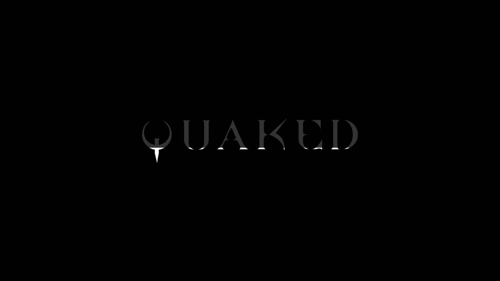

# Loading logo

When the page first loads, the thin progress bar is replaced by the Quaked logo (`logo.svg`) centred on the black page. The logo starts as a dim silhouette (`#333`) and fills with white from the bottom up as `pak0.pak` downloads. When startup completes, the screen is removed exactly as the bar was. The colours are the old bar's track and fill colours.

[Empty](images/loading-logo-2026-10-02/empty.png) · [full](images/loading-logo-2026-10-02/full.png) · [phone portrait and landscape at 60%](images/loading-logo-2026-10-02/phone-60-percent.png) · [real load at 60%](images/loading-logo-2026-10-02/real-load-60-percent.png)

## How it works

- **Inlined logo.** `index.html` carries the six paths of `logo.svg` inline. The logo is drawn with the HTML, before any script, module or fetch, so the screen is never blank while Three.js and the game modules load.
- **Cropped to the artwork.** The artwork occupies only part of Inkscape's 194 × 194 page: x 13.73–160.43, y 118.06–148.57, measured in Chrome with `getBBox`. The inline copy uses a viewBox cropped to that box plus a one-unit margin (`12.73 117.06 148.7 32.51`), so the logo is truly centred.
- **Size.** The logo is `min(80vw, 560px)` wide: about 560 × 122 px on a desktop and 312 px wide on a 390 px phone.
- **Two layers.** The logo is drawn twice with `<use>`: a dim base, and a white copy clipped by `#loading-fill`, a rectangle in the logo's own units. The fill therefore follows the letter shapes exactly, including the Q's tail, which fills first.
- **`src/newer/ui/loading_screen.js`.**
  - `LoadingScreen_SetProgress( value )` sets the rectangle to the bottom `value` fraction of the crop, and sets `aria-valuenow` on the `role="progressbar"` overlay.
  - Values are clamped to 0–1, and non-numbers count as 0. A compressed download can report over 1, and a download without a size reports nothing until it completes.
  - Pages without the logo, such as the trial pages, are ignored.
  - `LoadingScreen_Remove()` removes the overlay.
- **`main.js`.** It passes `pak0.pak`'s download progress to the logo and removes the screen after the weapon preload, as before. Progress has the same meaning as the old bar: the download of `pak0.pak`. Engine start-up after the download shows the full logo.
- **`logo.svg`** is now tracked. It remains the source artwork. If it changes, copy its path `d` attributes into `index.html` and re-measure the crop. `tests/loading_screen_test.js` fails if the two drift apart.

## Verification

- **4/4 public-interface tests** ([output](evidence/loading-logo-tests-2026-10-02.txt)):
  - the inline paths equal `logo.svg`'s, in order;
  - the crop contains the measured artwork and is tight;
  - the old bar is gone and the fill starts empty;
  - the fill height and bottom anchoring are correct at 0, 25, 50 and 100%, with the reported percentage and clamping;
  - removal is safe, and pages without the logo are safe;
  - `main.js` wiring is in place.
- **Rendering.** The real `index.html` markup and module were rendered in headless Chrome at 0, 35, 70 and 100%, and at phone portrait and landscape sizes (images above).
- **Real load** ([log](evidence/loading-logo-real-load-2026-10-02.txt), [script](evidence/loading-logo-watch-2026-10-02.mjs)). The unmodified game page was served locally and watched over the DevTools protocol with the download throttled. The fill rose monotonically from 0 to 100% with the real download. The overlay was then removed, the game canvas and title demo appeared, and no page errors were reported.

## Try it

Serve the checkout (`python3 -m http.server 8000`) and open [localhost:8000](http://localhost:8000/). A local load is fast. To watch the fill, open DevTools, go to Network, set throttling to "Fast 4G", and reload.

Safari and Firefox were not checked. Owner acceptance of the look is pending.
