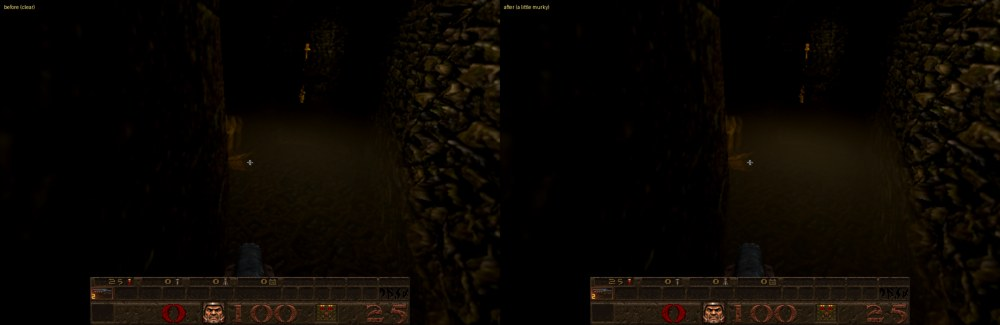

# Muddy water: every E1M3-style pool, a little murkier

Card [42]. The owner's answer of 10 October 2026 to the [caustics investigation](caustics-investigation-2026-10-10.md):

* **Where.** Every pool with E1M3's water texture, `*04water1`, has the Muddy look, as it has since 8e4fefc: eleven maps
  (E1M2, E1M3, E1M4, E2M2, E2M4 to E2M6, E4M5, E4M6, the end map and dm7), with Episode 3's murky water (`*04mwat1/2`).
  Nothing changes there.
* **How clear.** It was too clear: the stone floor showed through it plainly. It is now a little murky.

## The change

In `LIQUID_LOOKS` (`src/newer/render/gl_post.js`), the Muddy look's:

* absorption per unit of water, from `[0.009, 0.014, 0.020]` to `[0.016, 0.025, 0.035]` (red, green, blue). Water a ray
  crosses lets through `exp( -absorption x distance )` of the floor's light, and the rest becomes the brown scattered light
  of the water itself. So the floor fades into brown about 1.75 times sooner;
* surface opacity, from 0.10 to 0.14.

History: Muddy's absorption was `[0.035, 0.055, 0.080]` until it was lowered for the near field
([water-nearfield-2026-10-02.md](water-nearfield-2026-10-02.md)), because it went dark too close to the surface. The new
value sits between the two.

## Checks

* In the game, E1M3's main channel from the same spot, before and after (the picture above): the floor's fine detail
  through the water (the image less a blurred copy, mean difference) fell from 0.995 to 0.693, a third less, and the water
  is a little browner (mean brightness 13.1 to 16.5).
* The water suites (`liquid_names`, `water_concept`, `water_looks`, `water_vapour`, `water_nearfield`) pass.
* The GPU water trial (`tests/water_optics_trial.html`, Chrome, ANGLE on Metal) passes all of its checks, including that
  submerged colours stay distinguishable near the surface of Muddy water ("muddy depth checks").

The other looks, the choice in Options (Water appearance) and the surface haze (`r_mist`) are unchanged.
