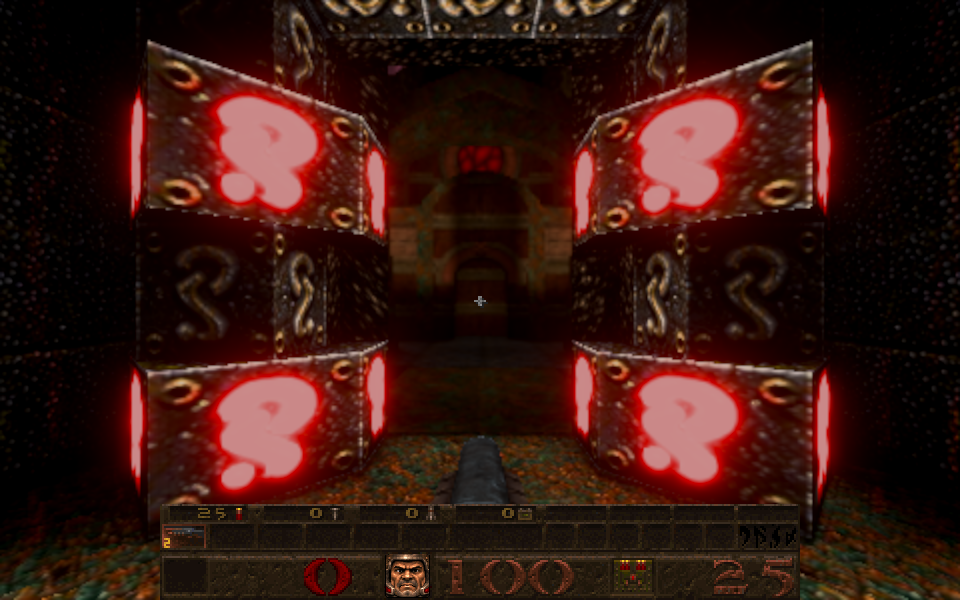
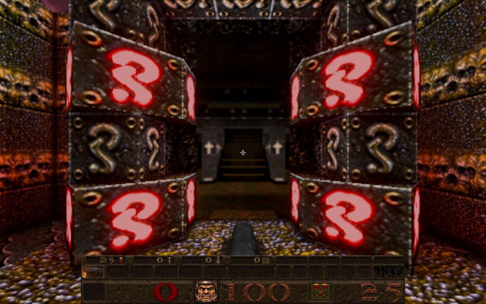
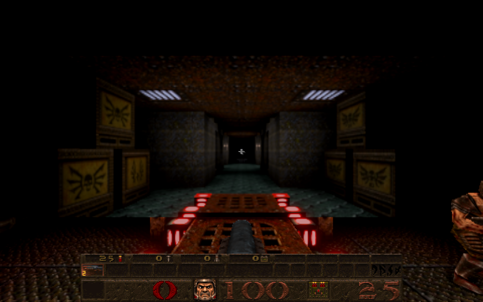
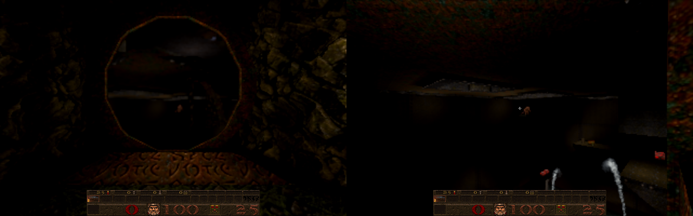
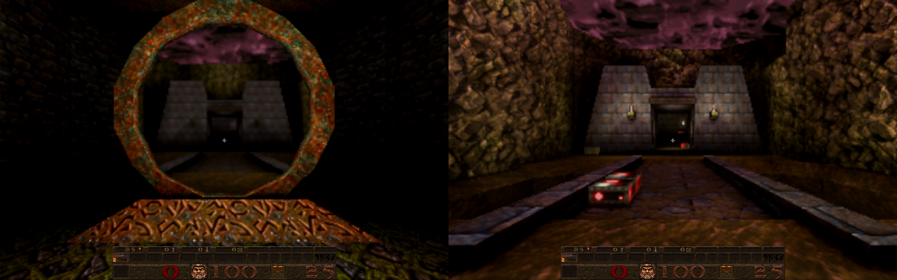
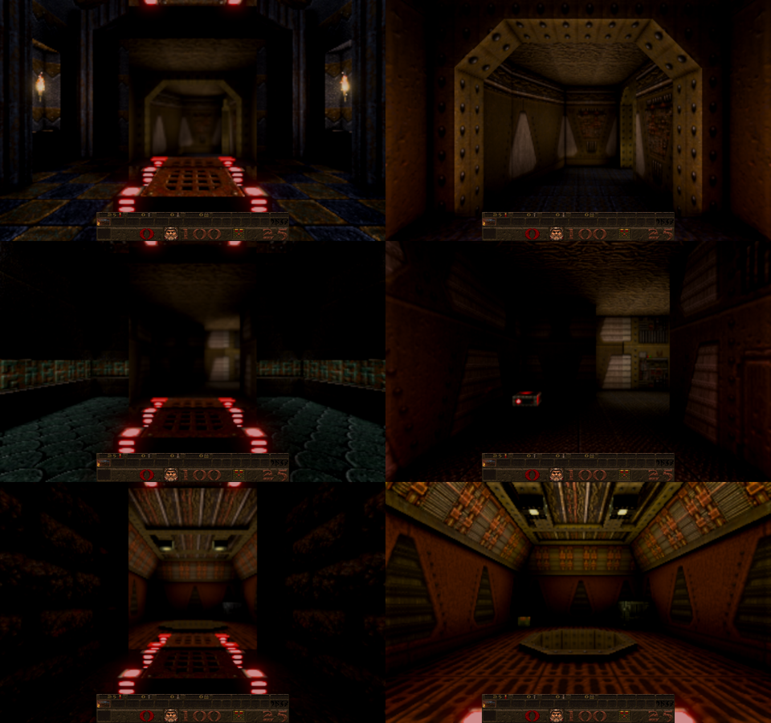

# Teleporter-pad exits show the next level

Card [B2] (owner request, 9 October 2026). The end-of-level portals of Episode 3, and the slipgate exits of E1M8 and E1M4's secret exit, did not show the next level: they were classed as teleporter pads (a trigger with a teleporter or slipgate surface within 48 units), which by design teleport at once and had no window. Now each one's slipgate surface is **a window onto the next level's start**, the way the doorway exits of Episode 1 are. The pad still teleports exactly as before; the window is a picture only.

| E1M8 to E1M5 | E3M2 to E3M3 | E3M1 to E3M2 |
| --- | --- | --- |
|  |  |  |

E1M4's secret ring (left) next to the view from E1M8's arrival point (right), and E2M3's secret ring next to E2M7's:

The start map's episode gates (left) next to each episode's arrival view (right): E2M1, E3M1, E4M1:

## The first version was wrong (owner report, 9 Oct 2026)

The first delivery (`a2e089e`) was reported by the owner at E1M4's secret exit: the ring showed a camera view back into E1M4, not E1M8; the picture did not fit the ring (cut on the right); and the picture bled out at the bottom left and right. The causes, all fixed:

* **A camera view into the same level.** E1M4's ring has a `trigger_teleport` next to its `trigger_changelevel`, so the ring's `*teleport` surfaces were also made an in-level camera portal (`R_BuildPortals`, `src/newer/render/gl_portal.js`), drawn over the window. The whole gate is now left out: any face with the exit's trigger as near as its teleporter's, and every parallel face of the gate within 8 units of one (E3M6's gate has two planes 4 units apart, a teleport trigger behind one; its back plane was still rendering a hidden view of E3M6 every frame). When no window is built (seamless travel off, a game with other players, the next level unreadable) such a gate keeps the plain teleporter swirl. A teleporter surface with a level exit's trigger (`trigger_changelevel`) at least as near as its own teleporter trigger is now left to the next level's window.
* **The wrong shape.** The window was the face's bounding rectangle, so a round ring showed the picture in its corners (the bleeding) and the rectangle came from a single strip of the face (the cut). The window is now the slipgate surface's own polygons, laid 1 unit in front of it (`opening.polygons`, drawn by `R_AddLevelPortal`).
* **A window on the wrong face.** A face is used only from the side the trigger reaches out on (a wall slipgate: its front; a ring the trigger passes through: both sides, each its own window). (Found while reworking: a version taking every face put a second E1M8 window on the slipgate's back, inside the wall.)
* **Part of a gate.** E4M1's exit is a low pad, and the compiler cut its gate in two at z 160; the upper piece missed the trigger and was dropped, leaving a waist-high strip of window under plain slipgate texture (found in review: the first sweep of this rework passed it). A piece joined to a piece that meets the trigger is now part of the face.
* **Gates with none.** The start map's episode gates have four small slipgate-textured corner pieces on a plane 16 units in front of the gate; merged, their outline looked doorway-sized and "in front", so the gate itself was dropped. A face must now fill at least half of its own outline.

## How

`SV_PadWindows` (`src/newer/gameplay/sv_seamless.js`), called for every pad exit when a level starts, returns the exit's windows:

* Candidates: upright, axis-aligned teleporter or slipgate surfaces whose plane is within 24 units of the exit's trigger, seen from the trigger's side, which overlap the trigger across and up or touch a piece that does. Coplanar pieces facing the same way are merged into one face (turbulent surfaces come cut into strips).
* Kept: doorway-sized (48 high, 40 wide at least) and filling half their outline; the outermost (no other such face of the gate within 32 units in front); and the largest facing each way.
* Each window looks from the next level's arrival point the way a player walking through would face, using the same transform as the doorway crossings (`R_CrossingTransform`, `openingOf`), so the renderer's existing level views draw it. It is a crossing flagged `viewOnly`: the crossing check skips it, so walking into it never starts a seamless crossing (the pad's own teleport fires first anyway).
* An exit with no gate face gets no window: E1M6, E4M2, E4M3, E4M4, E4M8 and E4M5's exit to E4M6 leave through a thin trigger in a corridor or on the floor, with nothing to draw in.

## Checks

* Real browser (owned data, the Newer Game), every exit of the start map and all four episodes swept: the player placed in front of each window, and for each window the view at the destination's arrival point taken for comparison. Windows matching their destination: start to E2M1, E3M1 and E4M1; E1M1 to E1M2; E1M4's ring (both sides) to E1M8; E1M5 to E1M6; E1M7's ring (both sides) to the start map; E1M8 to E1M5; E2M1 to E2M2; E2M3's ring (both sides) to E2M7; E2M6 to the start map; E3M1 to E3M2, E3M2 to E3M3, E3M3 to E3M4, E3M4 to E3M5 and its ring to E3M7, E3M5 to E3M6, E3M6 to the start map, E3M7 to E3M5; E4M1 to E4M2; E4M5's ring to E4M8; E4M7 to the start map. Several are dark because their destination's start is dark (E1M8, E2M2, E3M7, E4M8), checked against the destination's own view. No camera portal remains at any level-exit gate (counted within 160 units of each window; E3M6 rechecked after the review's fix). The other exits are walk-through doorways, unchanged.
* `tests/pad_window_test.js` (4): E1M8 gets one window and E1M4's ring two facing opposite ways, each upright, doorway-sized, onto the right level, and lying in the gate surface's own shape on the window plane; E1M4's ordinary exit is unchanged; walking into a window does not queue a crossing; the renderer builds the view, and the window mesh it draws is the gate's polygons, vertex for vertex (fails if the rectangle is drawn); and, with the owned archive (`QUAKED_OWNED_PAK`; without it this test only logs that it was skipped, and still counts as passed), the stock start map's four episode gates each get a window (fails without the outline rule) and E4M1's window runs the gate's full height (fails without joining the pieces).
* `tests/gl_portal_test.js`: a `*teleport` surface at a level exit's trigger is not made a camera portal; one elsewhere, or one whose own trigger is nearer than an exit 10 units off, still is; and a two-plane gate like E3M6's has no camera portal on either plane (fails without spreading the exclusion over the gate).
* Independent review (read-only): found the E4M1 strip and the E3M6 portal, both fixed and covered above, and the missing mesh and exclusion tests, added.
* The seamless, portal, arch, respawn and related suites pass.

## Not checked

The pictures are from fixed standing points; the windows were not watched while walking up to them in every level. The mission packs' exits (not loadable yet).
