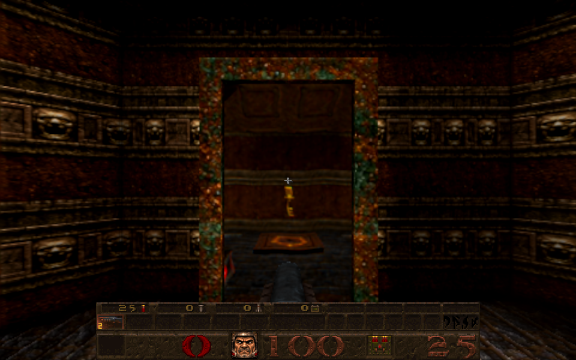

# Doors and false walls in a portal's preview

Card [15], first increment. A teleporter's window shows the receiver's view. Brush entities (doors, false walls and floors, lifts)
were only drawn when the **main** view's frustum reached them, so one standing in the receiver's view but outside the main
view was missing from the picture, and whatever stood behind it showed through.

**Reproduced on E1M5** (the portal at 424, 2560, 440): its receiver is a small cell closed in by four doors (`*20` to `*23`); the doors
were in the client's entity list but never added to the scene, so the window showed a Shambler 400 units away behind the door. Now the
window shows the door, with the key standing in the cell:

## The change

`R_DrawBrushModel` (`src/gl_rsurf.js`) now also draws a brush entity that the main frustum culls when it lies in a leaf the receiver
of a **visible** camera portal can see (`R_BoxInPortalReceiver` in `src/gl_portal.js`: the portal's source leaf is in the main view,
and the box's centre or one of its eight corners is in one of the receiver's leaves). Each camera still culls it by its own frustum, so
it costs nothing where it is not seen. Position and state update every frame as for any drawn door, so a door that opens opens in
the preview. No entity is hidden by class or by scene; the arch surface removal for seamless doorways is separate and untouched.

## Checks

* `tests/portal_receiver_cull_test.js` (1): a box in a receiver leaf with the portal in view is kept; one in no receiver leaf is
  not; a thin box with one corner in a receiver leaf is kept; a portal not in the main view, and portals switched off, keep nothing.
* `gl_portal_test`, `gl_rsurf_test` and `arch_depth_test` pass.
* Real browser, E1M5: before, doors `*20` to `*23` were not in the scene and the Shambler showed; after, all four are in the scene and
  the window shows the door.
* A before/after scan of all 22 windows of the `start` map at Nightmare changed no picture noticeably.

## Not done or not checked

The **START Nightmare false-floor tunnel** in the card was not reproduced: no window in the start map showed a difference with the
change, so either the scene needs a particular state or it is a different cause. The brush-entity fix is general and would cover a
false floor that is a brush entity, but that is not shown. No mutation checks beyond the unit test, no independent review, and no
paired captures after a barrier opens.
