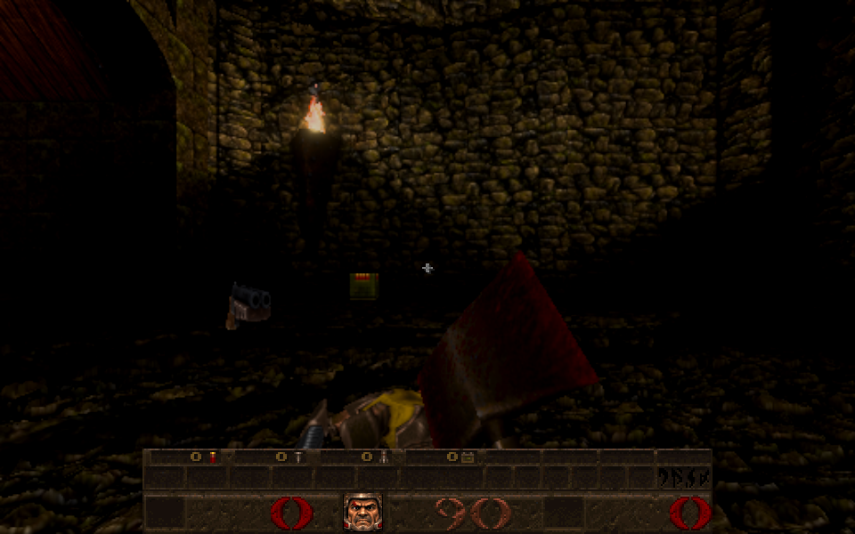
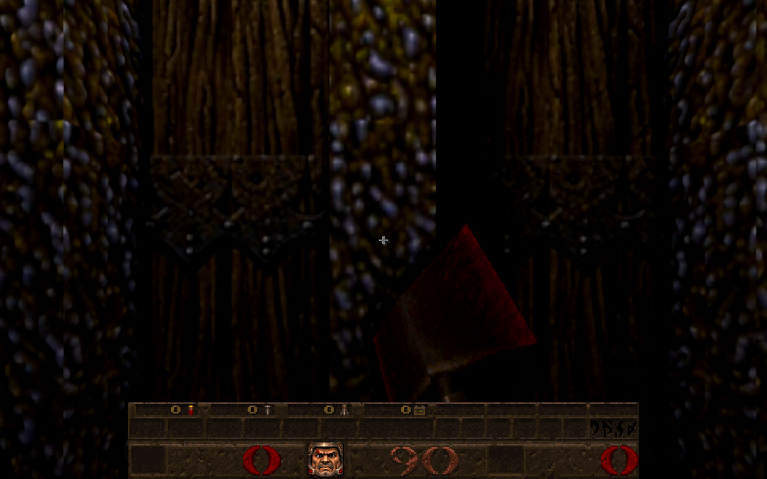

# A respawn faces into the level

Card [35]. A Newer Game respawn used to end facing the way the player faced when they died. It now ends **facing forward into the level**: away from the way back to the previous level when the level was entered through one (open, or already shut by an earlier respawn, see [respawn-return-closed-2026-10-09.md](respawn-return-closed-2026-10-09.md)), otherwise along the level's own start orientation (`info_player_start`). Pitch and roll end level.

| After the respawn (E1M3, entered from E1M2) | Turned round: the shut way back behind |
| --- | --- |
|  |  |

*(The player had died on the start spot, facing 37 degrees and looking 20 degrees down; their body and the dropped shotgun are in the picture. Final angles 0, -90, 0, the same as the way back's facing into the level.)*

## How

* **The fall is unchanged; the turn happens during the rise.** The clockwise respawn falls about the facing at death, cuts to the start at the contact and rises ([clockwise-respawn-2026-10-04.md](clockwise-respawn-2026-10-04.md)). During the rise the facing now eases (the motion's own quintic) from the facing at death to the facing into the level, by the shorter way round, starting from zero turn at the contact. So the transported camera is continuous across the cut exactly as before, and it is upright and facing into the level when control returns (`facingAt` in `src/respawn_motion.js`).
* **No snap at the hand-off.** The client is told its final view angle in one byte (Quake's `MSG_WriteAngle`: whole degrees, then 360/256-degree steps, toward zero), so an arbitrary yaw would jump by up to 1.4 degrees when the rise hands over to the ordinary view. The target is therefore rounded to the nearest yaw a byte carries exactly (within 0.7 degrees of the true facing), the rise eases to that, and the final server angle is a whole-degree value that encodes to the same byte (`SV_RespawnWireAngle`). The client is left on the very yaw the rise ended on.
* **The target** is worked out when the death begins and kept in the respawn sequence (`riseAngles`), so a game saved mid-death rises to the same facing; the save reader checks it, and a save from before this change (no target) rises as it fell. `SV_SeamlessEntryYaw` (`src/sv_seamless.js`) gives the facing away from a way back within 512 units of the respawn spot; `sv_main.js` connects it to the respawn (as for the guard and the way back, `sv_respawn.js` does not import the seamless and renderer modules). With no way back, the facing of the spawn spot the respawn point came from is used (found by position among `info_player_start`, `info_player_start2` and `testplayerstart`, since QuakeC can choose any of them), or the recorded start angles. Those are now read from the spot's angles as `PutClientInServer` set them (they were taken from `v_angle`, which is zero on a fresh level).
* The final server angles and view angle are set to the target with `fixangle`, as the old final angles were; input is released at the same moment as before.

## Checks

* `tests/respawn_return_closed_test.js` (2 new): arriving in E1M3 from E1M2, deaths facing 0, 90, 200 and 300 degrees (looking down 30) all rise facing away from the way back, level, with the start spot deliberately turned a quarter away so it is the way back that decides; half way through the rise the facing lies between the two the short way; the way back is shut after the first death and still gives the facing. A level with no way back rises along its start orientation; the target survives a save made mid-death; a malformed target makes the saved record invalid; an old record without one still loads.
* `tests/respawn_native_test.js`: the two camera tests that rebuild the expected transported camera independently now include the rise turn (their 123-degree case turns more than 30 degrees and levels a 25-degree pitch) and still find it continuous at the contact, with no hidden half-turn, under real physics frames.
* A third new test: for start spots facing 270, 30, 61.7, -133.3 and 179.99999999999997 degrees, the client, through the real server-to-client update, decodes exactly the yaw the rise ended on, which matches the last drawn rise pose; a forward exit never gives a facing.
* Mutation checks (9), each caught: the final facing ignored, no rounding to the wire, the final wire value not whole degrees, forward exits steering the facing, the whole turn at the cut, the hook not connected, the long way round, facing towards the doorway, the pitch not levelled.
* Independent review: no blocking finding. Fixed from it: the hand-off snap of up to 1.4 degrees (above), the start-angle source (`v_angle` instead of the spot's angles) and spawn-spot choice, a saved target's roll and pitch now validated, a misplaced comment, and the tests now check the release through the wire and a forward exit. Noted: the pose's `velocity` field leaves out the yaw rate of the turn (nothing reads it).
* All respawn, seamless, portal, face and cheat suites pass (122 tests).
* Real browser: E1M2 to E1M3, a death at the start facing 37 degrees: after the respawn the angles are 0, -90, 0 (the way back's facing into the level) and the closed doorway is behind; pictures above.

## Not checked

A level entered through a way back far (over 512 units) from its start spot uses the start orientation. Hub arches (stock teleports) and teleporter pads have no way back, so they use the start orientation too. How the turn feels during the rise is for the owner to judge.
