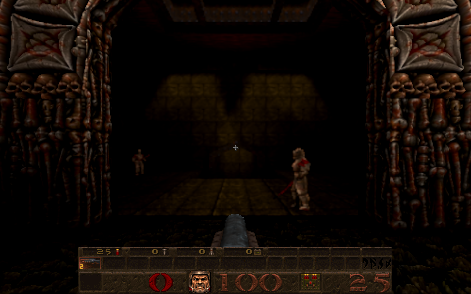
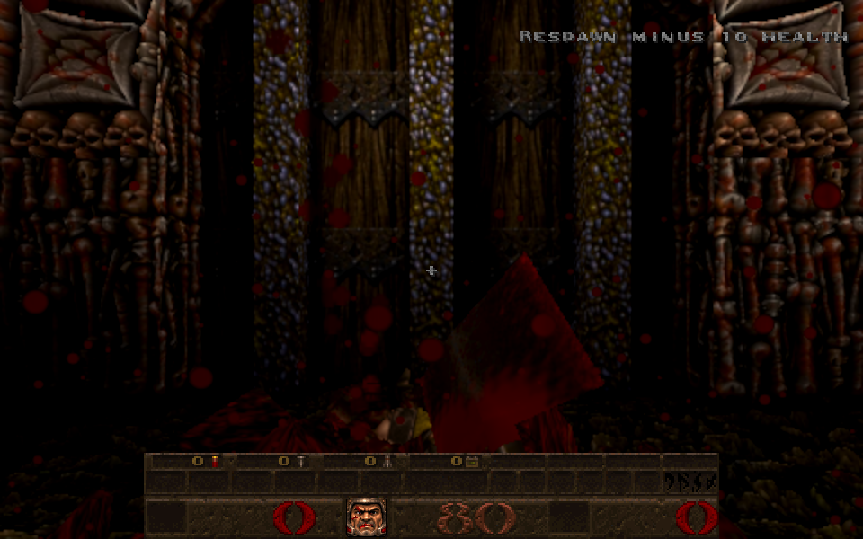

# The way back is shut once you respawn

Card [3]. When you cross from one Episode 1 level into the next, the doorway you came in by becomes a window back onto
the level you left, and you can walk back through it. **When a respawn lands, that way back shuts for good in this
level**: the window goes, the doorway shows the wall it always was, and walking into it does nothing. Forward exits,
teleporter pads and every other crossing are untouched. Newer Game, single player (the respawn system's own gate).

| Before the death | After the respawn |
| --- | --- |
|  |  |

(E1M2 to E1M3 in a real browser, Newer Game. After the respawn the lens carries blood from the death; the doorway is a
closed gate. The player stayed in E1M3 when walked into it.)

## How it works

* **Server** (`src/sv_seamless.js`). `SV_SeamlessCloseReturn()` flags every crossing with `back === true` as `closed` and
  clears the hidden arch surfaces (the only arch surfaces ever hidden are the way back's, so they are drawn again: the
  wall the brush always was; its collision was never removed). A closed crossing is skipped by `SV_SeamlessFrame` (so it
  cannot be crossed) and by `SV_WarmNearExits` (the level behind it is no longer prepared). The crossing **stays in the
  list**, flagged, so the numbers the renderer holds for the other crossings do not change.
* **Followers.** Monsters that were chasing the player when they crossed, and are still on their way through, would step
  out of a doorway that has just shut. Closing the way back puts them back in the level they came from (the same
  `SV_ReturnFollowers` as when the player walks back) and takes their figures out of the window.
* **When.** `contact()` in `src/sv_respawn.js` calls a hook the moment the respawn lands, just before the alert pass and
  the guard ([respawn-guard-2026-10-09.md](respawn-guard-2026-10-09.md)). `sv_main.js` sets the hook to
  `SV_SeamlessCloseReturn` at each level spawn, so `sv_respawn.js` does not import the seamless and renderer modules
  (importing them there changed module load order and broke loading `sv_respawn`, `sv_phys` or `cl_parse` on their own). So the way back is shut by the time the player is
  standing at the start of the level, where the doorway usually is.
* **Renderer.** `R_SyncLevelViews()` (`src/r_levelview.js`), called every frame from `gl_rmain.js`, drops the view and
  the window (`R_RemoveLevelPortal` in `src/gl_portal.js`) of any crossing the server has flagged, and detaches the
  monsters that were running in that view. `buildView` also refuses a flagged crossing, so a view still being built when
  the way back shuts never appears. Views now remember the crossing they belong to (`view.crossing`).
* **Shadows.** The wall is also put back into the shadow-casting geometry (`R_BuildWorldOccluder` in `src/gl_rsurf.js`
  rebuilds it whenever the hidden-arch revision changes), so the restored wall blocks sun, lamp and flashlight light like
  any other wall. Without this it was visible but cast no shadow.
* **What is not touched.** Forward exits (`back` is false), teleporter pads, other same-level teleporters, and the
  previous level itself (it is kept as it was left; going back to it some other way is not changed).
* **Reopening.** Nothing reopens it in this level. It was only ever created by a crossing arrival, so it does not come back
  after a saved game is loaded (a load is not a crossing arrival; this is as before the change), and walking out by a
  forward exit and into a level builds that level's own new way back, which shuts at the next respawn there.

## Checks

* `tests/respawn_return_closed_test.js` (6), real `progs.dat`, real server, stock maps (E1M2 to E1M3), the real level-view
  and portal modules: before a death the way back is open, crosses, and its arch is hidden; after a completed respawn it is
  flagged, the list keeps its length, no forward exit is flagged, the arch surfaces are visible again, shutting twice
  changes nothing, the shut way back is not warmed and walking into it does not cross, and a forward exit still crosses;
  a death in a level not entered by a crossing changes nothing; the next level has its own open way back which its respawn
  shuts, the earlier one staying shut; a follower that is still on its way when the player dies does not appear in the
  level (and is back in the previous level's snapshot), while without a death it does arrive; the renderer drops exactly that view, window and mesh, keeps the other windows, syncs idempotently, and a
  later set-up builds nothing for a shut crossing.
* Mutation checks (12), each failing a named test: the close not called, the hook not set, the followers not returned,
  the frame or the warm loop ignoring the flag, the arch not restored, the forward exits shut too, the view kept, the
  window kept, the build ignoring the flag, the sync using the wrong crossing index. One survives as equivalent: the
  detaching of running figures in the sync (the follower return already removes them).
* `arch_depth_test`, `gl_portal_test`, the `sv_portal_*` suites, `seamless_corpse_restore_test` and the respawn suites
  pass unchanged.
* Browser (Chrome for Testing, real game loop, E1M2 to E1M3): before the death the scene had two level windows, two views and
  the arch hidden; after the respawn one window, one view, no hidden arch, the flag set, the shadow geometry 96 vertices
  larger (the wall is back in it), and a walk into the doorway left the player in E1M3. The two screenshots above are from that run.

## Not checked

Episode 2 to 4 levels (no owned pak in the browser run); the hub archways, which are stock teleports and have no way back;
whether the closed doorway looks right in every level's start room (only the E1M3 start was photographed). A way back that
is shut cannot be reopened without leaving and re-entering through a crossing: that policy is the owner's to change.
