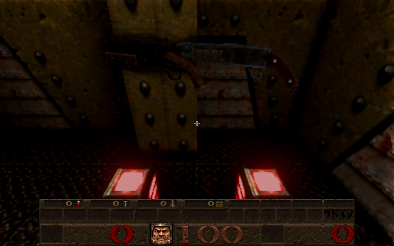

# Shotgun pickups: a wider super shotgun, and the basic shotgun's own drop

Card [12] (owner request). Newer Game; Classic keeps the native MDLs.

* **Super shotgun pickup** (`progs/g_shot.mdl`, role `g_shot`): twice as wide across its barrels (the native Y axis, 4.2 to
  8.3 units) with its length and height unchanged. The fitted art is widened about its middle after the ordinary native fit
  (`TRANSVERSE` in `tools/import_weapons.py`, recorded as `transverseScale: 2` in `newer/weapons/index.json`). The held super
  shotgun is untouched.
* **Basic shotgun drop**: Quake never had a pickup model for the basic shotgun, and the respawn drops (`src/sv_respawn.js`)
  used the super shotgun's for both. The basic shotgun's drop is now skin 1 of `progs/g_shot.mdl` (`RESPAWN_WEAPONS` in
  `src/respawn_record.js`; set when dropped and again when a saved drop is restored). Newer Game draws that skin as a new role,
  `g_shot1` (`R_WeaponRole` in `src/r_weapons.js`): the basic shotgun's own supplied art fitted to the pickup MDL's native box.
  The native MDL has one skin, so with the Newer weapons off it shows as before. Picking it up gives the weapon and shells its
  drop record says, as before. No new model is precached.
* **How the art was made**: the supplied archives are not all in this checkout (`shotgun.zip` is; `supershotgun.zip` and others
  are not), so `tools/import_weapons.py --derive-pickups` derives both from the baked files: the held shotgun's rest pose is taken back through its own rigid barrel frame to the plain
  per-axis fit of the supplied mesh, and fitted to the pickup box (an affine copy of the source, so the same as fitting the
  source; review confirmed it against `shotgun.zip` to 2e-6 units); the super shotgun pickup is refitted to its box and widened.
  The manifest records `g_shot1`'s mapping from the supplied mesh (this fit composed with the held shotgun's), the same as a
  full import writes. Running it again gives the same files. A full import
  (`tools/import_weapons.py`, with the archives) does the same through `NATIVE_OF` and `TRANSVERSE`.

## Checks

* `tests/shotgun_pickups_test.js` (3): the super shotgun pickup's length and height equal its native box and its width is
  twice it; the basic pickup is the shotgun's art (every vertex, UV and triangle of the held art) filling the native box;
  real death drops on E1M1 (`SV_RespawnDropInventory`): the basic shotgun as `g_shot.mdl` skin 1, the super shotgun skin 0, the
  shells shared with none lost, and a restored save sets the skins again; the renderer's role for skin 1 is `g_shot1`, for skin
  0 `g_shot`, and other pickups ignore the skin.
* `tests/weapon_modes_test.js` draws every role through the real renderer: `g_shot1` as `g_shot.mdl` skin 1, which must give the
  shotgun art's 745 vertices (fails if the renderer ignores the skin). `held_framing`, `weapon_modes` and `shotgun_source` updated
  for the fourteenth role and the card's new rule (`shotgun_source` still fails one test it failed before, an interpolation
  midpoint). `tests/weapons_test.js` updated likewise, but it stops earlier on a missing supplied archive, so its pickup checks
  do not run here.
* Independent review: the first delivery broke `weapon_modes` and `held_framing` (both green before) while I reported the weapon
  suites passing; it also found the draw line untested and a mod's real second skin would have been taken over. Fixed: the
  tests above, and a skin only names another role when the MDL does not have that skin.
* Browser, E1M1: both drops, the roles `g_shot1` and `g_shot` loaded and drawn (picture above).

## Not checked

A map pickup of the super shotgun in a real level from the side (the drop shows the width); picking the drops up in the browser
(the pickup code is unchanged and covered by the respawn suites).
