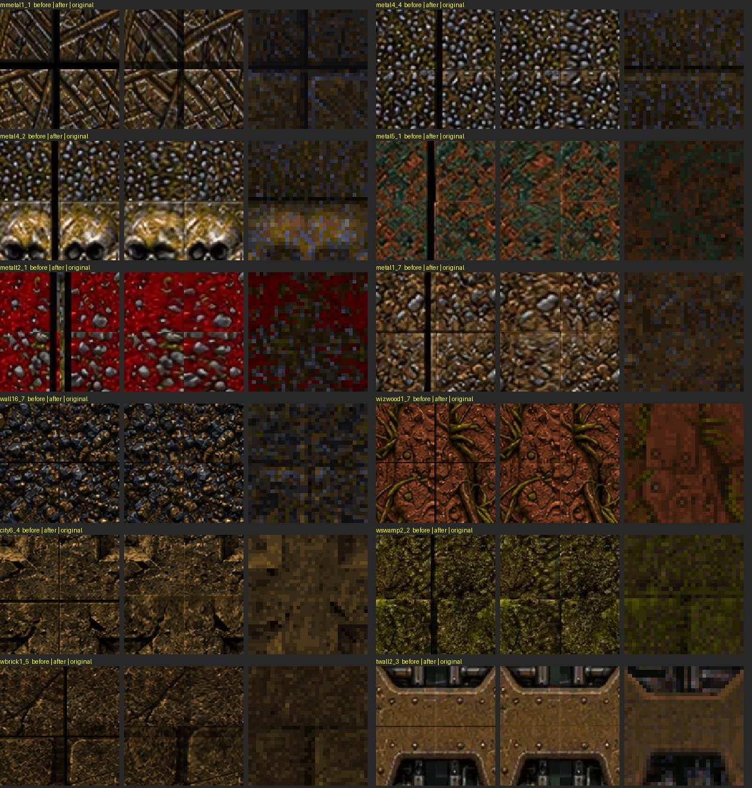

# Texture seam lines

Many of Newer Game's high-resolution wall textures had a thin dark line along one or more edges, left by the AI upscaler. A wall texture repeats, so each line showed as a grid of dark lines across every surface using that texture. Every replacement has now been checked edge by edge against the original Quake texture it replaces.

**Result:** 233 edges were repaired across 128 textures, and 85 of their height maps were repaired too. 15 textures with dark edges were reviewed and left alone because those edges are part of the artwork.



Each group in the image shows the meeting point of four repeats, centred: before the repair, after it, and the original Quake texture. The image is a sample of the 128 textures; `tools/texture_sheets/seam_fixes.json` lists every repair.

## How a line is found

`tools/texture_sheets/fix_seams.py` reads each original texture from the miptex lumps in `pak0.pak`. It then compares the outer few pixel rows of each replacement edge with the rows just inside them, and with the same edge of the original.

- **Original edge not dark.** Any edge row under 0.8 of the brightness just inside counts as a line.
- **Original has a groove.** Many panels and bricks really are darker at the edge, and these grooves are artwork. The replacement's groove counts as a line only if it is clearly darker than the original's: under 0.8 of it averaged over one original texel, or under half of it in a single row. A sharper groove is fine; a black one is not.
- **Only lines at the edge.** The dark rows must start within two original texels of the edge and end within three and a half. A wider dark area, such as a screen or a slot, is artwork.
- **Alignment tolerance.** The original is searched one texel further than the replacement, so small alignment differences between the two do not count as lines.

## How a line is removed

Repairs never move the texture as a whole, so its size, alignment, UVs and everything away from the edge stay exactly as they were.

- **Black core.** Where the line has a near-black core, those pixels carry no picture at all. The rows just past the whole line are stretched outward over it, within a zone up to four times the line's width (at most a sixth of the texture). The zone's inner end meets the untouched texture exactly, so there is no step and no mirror image.
- **Dimmed only.** Where the line is only dimmed, the picture is still there. Each dark pixel is brightened, but never past the pixels just inside it at the same place. Nothing is moved, and pixels that are not dark stay exactly as they were.
- **Grooves.** Where the original has a groove, the result keeps the original's darkness rather than erasing it. `mmetal1_1`'s black cross, for example, is now a dark groove like the original's.
- **Height maps.** A height map is repaired the same way, but only where it shows the line itself and never under an original groove. Some heights are hand-authored relief: `city5_1`'s exposed brick, for example, is meant to be low.

The tool runs at most two passes. The second finishes pixels that the first could only partly brighten. Each repair is recorded in `seam_fixes.json` with the edge, its width, the rows it changed in the texture and the height map, and the groove scale it used.

**Encoding.** Lossless files (39, including the 26 City/Wizard textures) are byte-for-byte unchanged outside their repaired rows. The others were stored lossy, so saving them again at the same quality (92) shifts other pixels by re-encoding noise only: on average under 2.5 of 255 levels, and file sizes are unchanged.

The texture catalogue's `version` is now `2026100204`, so browsers fetch the repaired pictures.

## Left alone, by review

Detection proposes candidates, and every proposed texture was then checked by eye: before, after and original at the corner where four repeats meet. In earlier trials the repair damaged some artwork: mirrored rivets, stretched light-fixture trims, a distorted planet screen. Those textures are listed in `AUTHORED` in the tool, each with its reason:

- **Planet screens** (`+0planet` to `+3planet`): the black background is part of the screen, and the original has it too.
- **`sliplite`:** the replacement is a different design whose frame is drawn.
- **Panel seams and frames:** `rock0sid`, `rockettop`, `plat_top1`, `plat_top2`, `key03_3`, `light1_4`, `+0_box_side` and `+1_box_side`. Their dark edges are drawn, and the originals have them; repairing them stretched rivets and bolts.
- **`tlight11`:** the light fixture's rim is drawn.
- **`door05_2`:** the wide gap between the arches is painted black, where the original is dark brown. That is a style difference, not a seam line. It could be repainted if you want it brown.

The seven custom crate pictures (`crate_*`) have no original. Each is a single crate face whose dark frame is designed, not a repeating wall, so they are not checked.

After the repairs, the sensitive detector still flags 10 edges, all reviewed:
- `shot1sid` (top), `+0light01`, `+1light01` and `+2light01` (right);
- `crate0_top` (left and right) and `crate1_top` (right);
- `city6_4` (top) and `citya1_1` (left and right).

Each reads 0.75–0.8 of its surroundings. That is ordinary light variation near the edge, with no visible line.

## Re-running

```sh
python3 tools/texture_sheets/fix_seams.py           # repair (needs Pillow and numpy)
python3 tools/texture_sheets/fix_seams.py --check   # list flagged edges only
```

Run it after any tool that regenerates replacements, such as `update_level_sheets.py` or `update_wizard.py`. Where there is no line, it changes nothing.

The older `fix_edges.py` cut borders away and rescaled the whole texture. It is superseded, because rescaling moves the alignment.

## Verification

**Seam tests: 5/5** (`tests/texture_seams_test.py`).
- **No clear line remains.** No edge of any checked replacement has a clear line under a stricter bar: under 0.7 where the original's edge is not dark, or under 0.75 of an original groove. All 293 replacements that have an original and are not reviewed exceptions are checked.
- **The check catches the lines.** The same bar fails on 100 of the 128 repaired textures before the repair, including every clear case named above. The rest had fainter lines that only the more sensitive detector finds.
- **Repairs stay in place.** Each repair changed only the rows it recorded; sizes are unchanged. Lossless files are identical outside those rows, and lossy files differ only by re-encoding noise.
- **Nothing else changed.** Only the repaired textures (and heights, where repaired) changed. Every authored exception and every crate picture is byte-identical, and the catalogue changed only its version.

**City/Wizard asset tests: 3/3** (`tests/level_texture_assets_test.py`).
- **Exact pixels:** the 26 registered textures still match their recorded crops exactly outside the recorded repair rows.
- **Height checks:** the `city5_1` layered-relief check passes, because its authored brick heights are not touched.
- **File boundary:** that update's own file-boundary check now compares its own commit (`9a71a46`), not the working tree.

Results: [texture-seams-tests-2026-10-02.txt](evidence/texture-seams-tests-2026-10-02.txt).

**Renderer: 31/31 JavaScript checks** pass ([texture-seams-runtime-tests-2026-10-02.txt](evidence/texture-seams-runtime-tests-2026-10-02.txt)). They cover the installed WebPs reaching the real texture objects with the same 64-unit UV period, crafted normals, the Newer pack loader, visual options, crate variants, the world and surfaces.

**Known pre-existing failure.** `tests/verify_wizard_assets.py` checks the 2026-10-01 wizard sheet, which the 2026-10-02 sheet superseded. It already failed at `d780a96` (all 12 wizard textures differ) and is unchanged here.

## Try it

Reload Newer Game; the catalogue version makes the browser fetch the new pictures. Look at large walls and floors of repeating texture. These maps show the most, according to the map texture lists in `pak0.pak`:

- **E1M5:** `mmetal1_1`, `metal1_7`, `metal4_4` and `city6_4`.
- **E1M6:** `mmetal1_1`, `metal4_2` and `metalt2_1`.
- **E1M3:** `wall16_7`, `wizwood1_7`, `wswamp2_2` and `wbrick1_5`.
- **The start map:** `metal5_1` and `wbrick1_5`.

In the console, use `map e1m5`, for example. There should be no dark grid where repeats meet.

This was checked in texture comparisons and renderer tests. I have not looked at it in a running game, so whether any seam is still visible in play is for the owner to judge.
