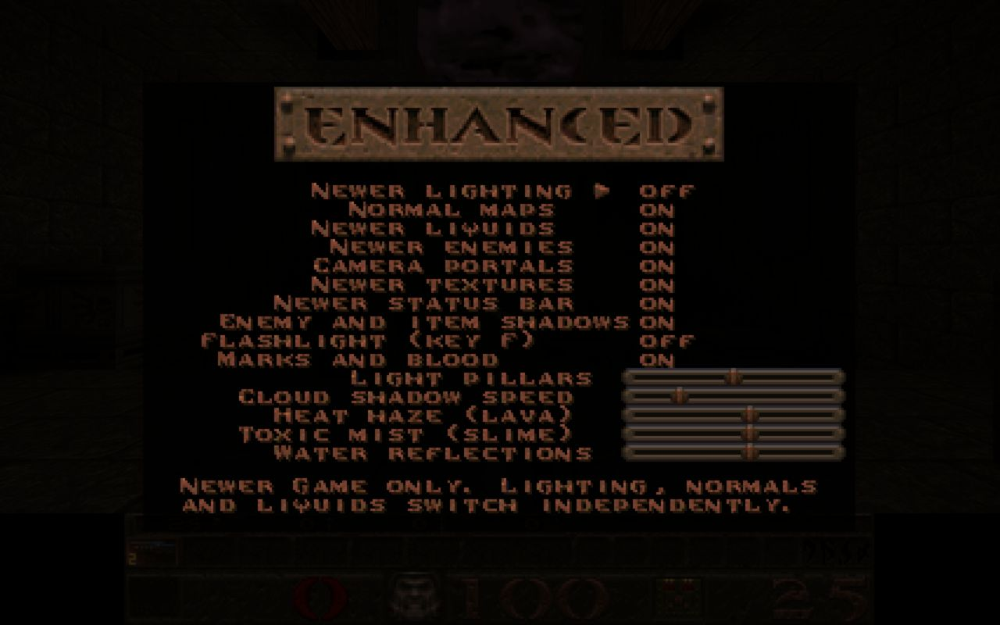

# Independent Newer Game visual options

Owner request (2026-10-01): switching advanced lighting off also removed normal maps and enhanced liquids. Each visual option must switch independently, with a working trial, verification and owner acceptance before calling it accepted delivery.

## Try it

Reload the local game (hard refresh if the browser retains older modules), start **Newer Game**, then open **Options > Newer Game features**. The first three controls are:

| Control | Console variable | Effect |
| --- | --- | --- |
| Newer lighting | `r_newer_lighting` | Advanced direct/sun lighting, glow, bounce, shafts, bloom and grading |
| Normal maps | `r_newer_normals` | World surface normals and height-based parallax |
| Newer liquids | `r_newer_water` | Water/slime transparency, absorption, caustics, reflections and lava heat haze |

All default on. Enter or left/right switches a checkbox; touch selects its row. Changes apply at the next rendered frame without a map reload. Lighting off leaves the other two settings intact and uses the original baked light treatment; normal-map parallax remains visible without advanced relighting. Normal maps off gives flat surface normals while leaving lighting and liquids alone. Liquids off restores the existing opaque surface path without removing normal maps or lighting. Lava stays opaque in either case. The existing reflection/heat-haze/mist sliders remain separate controls. Flashlight and enhanced enemy/item shadows retain their lighting dependency. New Game and the classic half of the title comparison keep the original look.

Suggested acceptance: at a brick wall and a pool, disable lighting while leaving the other two on; switch normal maps off/on and liquids off/on in turn; re-enable lighting; check that only the selected visual treatment changes. Confirm the result with the owner. Owner acceptance is pending; the owner authorized commit and push on 2026-10-01; no packed release was requested.



## Implementation and boundaries

The caller remains `R_RenderView` -> `R_PostBegin` -> world/material rendering -> `R_PostFinish`. The existing multiple-render-target pipeline is shared by the three options; it runs if Newer Game is active, any of them is enabled, and the renderer supports the existing HDR targets. No additional renderer or alternate material system was introduced.

`R_PostActive` describes shared pipeline availability. `R_NewerLightingActive` describes advanced lighting. `R_WaterActive` additionally checks the liquid switch. Detail-material assignment has its own transition state so static materials refresh even when the shared pipeline stays active. Normal-map generation/cache, animated-texture refresh, dispose handlers, and crafted height-map loading remain in the existing paths.

The shared composite still derives geometry normals for caustics and reflections with lighting off. Its advanced direct/bounce lighting and colour-grade/tone-map blocks are gated separately. Lighting-off exposure/brightness/contrast are neutral; shadow, shaft and bloom passes are skipped. Emissive boosts, lightmap curves, dynamic-lightmap attenuation, and real/portal-preview flame brightness follow lighting state. Cached portal flame previews recalculate their light each draw. The classic-pass uniform still suppresses relief and the altered baked-light treatment in the classic comparison.

Unsupported renderers, tiny/disabled views and New Game deactivate shared rendering, normals and enhanced liquids through the existing fallback. With all three options off, the direct scene path runs. Settings for other Newer Game features are preserved. Existing untracked artwork and patch files were left intact.

## Verification

- Independent planning traced the original coupling and identified shared-target versus lighting-state consumers before implementation.
- **46/46 tests passed** using Node 24.13.0 with a temporary `Deno.test`/`Deno.readFile` compatibility harness and actual Three.js **0.183.0**, matching `index.html`. Deno was unavailable on this machine. The focused files were `gl_post`, `gl_rsurf`, generated/crafted normals, `r_anim`, `menu`, `r_flashlight`, level entities, level graph and `visual_options`. [Recorded output](evidence/visual-options-tests-2026-10-01.txt).
- New public-interface tests use registered cvars, `Cvar_SetValue`, actual Three.js materials, `R_PostBegin`, `R_RefreshDetail`, `R_PostFinish`, and menu command/key handling. They cover all eight combinations twice, existing-material/cache transitions, animated textures, emissive state, classic mode, unsupported/small/disabled fallback, and neutral lighting-off uniforms/skipped passes. The pass-count test uses a renderer double; it does not prove GPU pixel output.
- Independent review ran the two new tests separately (**2/2 passed**), found the portal-preview flame coupling, and passed the corrected final delta with no remaining actionable findings.
- A fresh local browser origin avoided retained older modules. The current build rendered the title comparison and `e1m2`; live menu lighting and normal/liquid switches were exercised and the lighting-off/on/on state was captured at a desktop viewport. No shader compilation errors were observed. One browser log reported a generic Chromium `UnknownError` during the trial; no application stack or shader diagnostic was supplied. This is recorded separately from the test result.
- `git diff --check` passed. A test geometry fixture gained `morphAttributes: {}` because real Three.js Mesh construction inspects it; behavior assertions remain unchanged.

For the same focused tests with Deno and real Three.js:

```sh
deno test --allow-read --import-map=tests/render_imports.json \
  tests/gl_post_test.js tests/gl_rsurf_test.js \
  tests/gl_normals_test.js tests/gl_normals_crafted_test.js \
  tests/r_anim_test.js tests/menu_test.js tests/r_flashlight_test.js \
  tests/r_levelents_test.js tests/r_levelgraph_test.js tests/visual_options_test.js
```

The test import map pins the runtime used by the browser; the server's shim import map remains unchanged. The Deno command above is provided for reproduction and was not executed here. This is a focused implementation/browser trial, not an exhaustive pixel comparison across maps, GPUs, VR or mobile devices. Owner visual acceptance remains the next action; no unattended follow-up job or release campaign was created.
