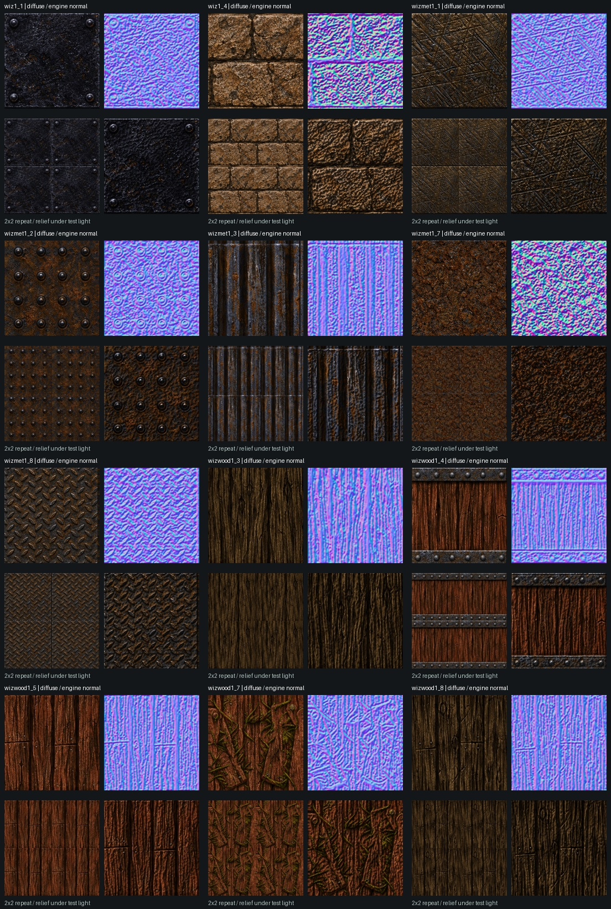

# Owner's wizard texture replacement — 2026-10-01

The supplied sheet contains the twelve textures from the original `wizard_1.png` atlas. They were independently identified against the actual textures in `pak0.pak`, then replaced through the existing named texture manifest and loader. This is a local, verified asset update; owner appearance acceptance is pending. The owner authorized committing and pushing the reviewed work on 2026-10-01; no packed release was requested.

## Exact mapping

Positions read left to right, top to bottom. Each name is both the BSP texture key in `newer/textures/index.json` and the diffuse filename below `newer/textures/`; its crafted height is `normals/<name>.webp` in the same folder. No texture-name aliases or renderer branches were added.

| Sheet position | Texture key / diffuse file | Identifying motif |
| --- | --- | --- |
| Row 1, column 1 | `wiz1_1` / `wiz1_1.webp` | Dark square metal panel, four corner rivets |
| Row 1, column 2 | `wiz1_4` / `wiz1_4.webp` | Two courses of rough stone blocks |
| Row 1, column 3 | `wizmet1_1` / `wizmet1_1.webp` | Scratched bronze metal |
| Row 1, column 4 | `wizmet1_2` / `wizmet1_2.webp` | Rusted panel with 4 × 4 studs |
| Row 1, column 5 | `wizmet1_3` / `wizmet1_3.webp` | Vertical ribbed metal |
| Row 2, column 1 | `wizmet1_7` / `wizmet1_7.webp` | Rough rusted metal |
| Row 2, column 2 | `wizmet1_8` / `wizmet1_8.webp` | Diamond tread plate |
| Row 2, column 3 | `wizwood1_3` / `wizwood1_3.webp` | Dark vertical wood grain |
| Row 2, column 4 | `wizwood1_4` / `wizwood1_4.webp` | Red wood with riveted straps at top/bottom |
| Row 2, column 5 | `wizwood1_5` / `wizwood1_5.webp` | Red boards with staggered nailed joints |
| Row 3, column 1 | `wizwood1_7` / `wizwood1_7.webp` | Vine-covered red boards |
| Row 3, column 2 | `wizwood1_8` / `wizwood1_8.webp` | Dark boards with staggered nailed joints |

The engine binding is `R_NewerTexturesFrame` / `R_NewerTexturesForModel` -> `R_NewerTextureUpgrade` (`src/r_newertextures.js`). It keeps the original texture object and swaps only its GPU pixels and matching height data. `R_NormalMapFor` (`src/gl_normals.js`) regenerates normals from that height; material detail uses the same diffuse UVs and offset. BSP texture sizes remain **64 × 64**, replacement diffuse/height images remain **256 × 256**. World texture coordinates therefore keep the existing scale and brush alignment.

## Crop, spacing and alignment

[The source PNG](../tools/texture_sheets/sources/wizard-2026-10-01.png) is byte-identical to the supplied image, SHA-256 `40f1300b891b52d40247ea4bb817193ad9e595090226fc88faf2b5f637cc88cc`. The [reproduction recipe](../tools/texture_sheets/sources/wizard-2026-10-01.json) records all twelve exclusive-right/bottom crop boxes, names, descriptions, output size and UV corrections.

The atlas is 1619 × 971 with uneven gutters and extended padding. Uniform scaling of the original 360 × 216 atlas would include adjacent art and partial courses. Individual bounds preserve the corner frame, complete brick courses, sixteen studs, plank joints and both wood straps. Cuts omit black gutters, the stone's extra partial course, the rust tile's bottom atlas rim, and narrow dark bleed around the ribbed/banded/jointed textures. All diffuse files are **losslessly encoded WebP after crop/resizing and the recorded alignment corrections**. The art was not regenerated or repainted.

The existing `fix_offsets.measure` registration was checked against freshly reconstructed Quake originals, then the existing `align_frames.shifted` helper applied three measured periodic corrections. Values are in original 64-pixel texture units:

| Texture | Applied x/y shift | Original-layout correlation before/after |
| --- | --- | --- |
| `wiz1_4` | −2.10 / −0.35 | 0.532 / 0.633 |
| `wizmet1_3` | −1.85 / +2.20 | 0.267 / 0.740 |
| `wizwood1_8` | +2.40 / +0.11 | 0.109 / 0.441 |

Lower-confidence grain matches were left alone. Periodic padding preserves the sampled repeat while shifting; normal heights were generated **after** final alignment. Two-by-two repeats and direct/normal/test-light previews were visually reviewed. The supplied framed plate and strapped wood intentionally repeat their borders/straps; inherent variations in the source grain remain. This does not claim every supplied tile is an artist-authored seamless material.



## Normal maps and caching

`tools/craft_normals.py` regenerated only these twelve height maps from their final diffuse images, retaining the existing per-material profile, strength and cap. Stored normal assets are **grayscale heights**, as expected by this renderer; tangent vectors are built at runtime with wrapped sampling and the engine's two-pass height smoothing. Previews above use the actual JavaScript generator, including that smoothing, rather than the offline script's simplified normal preview. No normal convention, UV, shader, material profile or normal-toggle behavior changed.

Manifest mappings and normal metadata retain their exact previous contents. Only its cache version changed from `2026093051` to `2026093054`, so diffuse and height URLs invalidate together. Other texture files were preserved. No `newer.pak` exists in this checkout: the current game reads these loose assets. A distribution using a pack must rebuild it using the existing `tools/build_newer_pak.py` command before publishing; a pack release was not part of this request.

## Verification and how to try

- **51 asset checks passed** with `tests/verify_wizard_assets.py`: exact source hash, all crop/resize/shift outputs, diffuse/height dimensions, all encoded height regenerations, unchanged mappings/normal profiles, cache version, and real BSP name/dimension bindings. [Recorded hashes and map usage](evidence/wizard-textures-2026-10-01.json).
- **12/12 actual browser loads and 144 checks passed** in `tests/wizard_texture_trial.html`. It invokes the real `R_NewerTextureUpgrade` and `R_NormalMapFor` with real Three.js 0.183.0, reads the actual WebPs, checks classic-pixel retention, stale-normal disposal, matching height file/size/profile, generated dimensions, UV offsets, repeat wrapping, upward unit vectors and matching parallax alpha. Maximum normal unit-length quantization error was below 0.0066. [Browser evidence](evidence/wizard-browser-loader-2026-10-01.json), [browser screenshot](images/wizard-browser-loader-2026-10-01.jpg).
- **11/11 focused tests passed** for generated/crafted normals and independent visual controls through the temporary Node 24.13.0 Deno compatibility runner with the pinned Three.js runtime. Deno was unavailable. [Test output](evidence/wizard-normal-tests-2026-10-01.txt).
- Independent planning/review verified all twelve original names, exact source reuse, every final diffuse/height output, crop landmarks and the improved three alignment measurements. No blocking findings remained.
- The running browser rendered `e1m3` with Newer lighting and normal maps enabled after the title demo released its temporary rendering mode. No shader compilation errors were observed. Two generic Chromium `UnknownError` logs without an application stack were recorded separately from the passed loader checks. [Level screenshot](images/wizard-e1m3-2026-10-01.jpg). This is a focused runtime sample, not exhaustive visual qualification of every brush/map, VR or device.
- `git diff --check` passed; the earlier visual-options changes and unrelated untracked work were preserved.

Hard-refresh the game and start **Newer Game** with **Newer textures** and **Normal maps** on. These textures occur in `start`, `e1m2`, `e1m3` and `e1m4`; the evidence file lists each texture's actual maps. Check the individual assets and their repeats at `/tests/wizard_texture_trial.html` on the same local server. Please confirm the appearance with the owner, particularly stone edges, rib spacing and joined boards. Owner acceptance is the next action; no unattended work was submitted or represented as queued.

Reproduce the asset update using Python with Pillow/NumPy:

```sh
python3 tools/texture_sheets/update_wizard.py
python3 tests/verify_wizard_assets.py
```

The updater crops from the preserved source, applies recorded shifts once to fresh cuts, regenerates the corresponding heights and increments the cache version. Re-running it produces the same image pixels; its cache version advances. Run the two normal-test files and `visual_options_test.js` with Deno's real Three.js import map when Deno is available, or open the browser trial page directly. The browser verifier requires its game-root `<base>` because the production loader resolves loose asset URLs relative to the page. Do not point it at a different deployed project or modify production renderer state to work around a test path.
